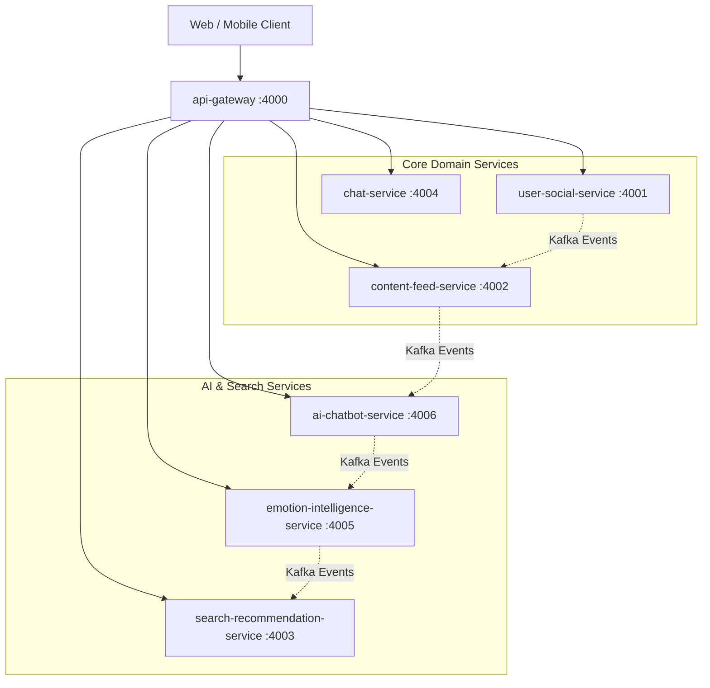

# SE121 Microservices Monorepo

Enterprise microservices platform for social, recommendation, chatbot, media, and AI-assisted user experiences, consolidated into 7 core services.



## 📐 Architecture Documentation

For a comprehensive technical overview of the system architecture, including service landscape, communication patterns, data flows, scalability considerations, and deployment architecture, see:

**→ [docs/architecture/architecture.md](docs/architecture/architecture.md)**

This document is suitable for technical interviews, portfolio presentations, and system design discussions.

### Architecture Notes

- The repository includes both standard NestJS services and specialized AI / assistant services.
- The main service boundaries are documented per app; this root README only captures the monorepo-level view.
- OpenAPI is currently published for the assistant gateway flow only.
- Observability is tool-driven at the infrastructure level; centralized tracing and metrics are configured but not fully enabled.

## Tech Stack

| Layer                    | Observed stack                     | Notes                                                                                                               |
| ------------------------ | ---------------------------------- | ------------------------------------------------------------------------------------------------------------------- |
| Runtime                  | Node.js 18+, Python 3.10+          | Root workspace engine constraint in `package.json` and AI requirements.                                             |
| Backend                  | NestJS 11.x                        | Primary framework for Node.js services.                                                                             |
| AI / Python              | FastAPI / Python                   | `ai-chatbot-service` hosts AI analysis and LLM RAG chatbot assistant workloads.                                     |
| Language                 | TypeScript 5.9.2, Python 3.10+      | Shared by the NestJS workspace packages and Python packages.                                                        |
| Workspace                | Turborepo 2.5.6                    | Orchestrates build, lint, test, and dev tasks.                                                                      |
| Package manager          | npm 10.9.2                         | npm workspaces are enabled at the root.                                                                             |
| Messaging                | Kafka, RabbitMQ                    | Event streaming and async queueing. Producers: `user-social-service`, `content-feed-service`, `ai-chatbot-service`, `emotion-intelligence-service`. |
| Cache / pub-sub          | Redis 7                            | Cache, session state, and pub/sub.                                                                                  |
| Data stores              | PostgreSQL, MongoDB, Elasticsearch | PostgreSQL for profiles/relations/metadata, MongoDB for posts/messages/feeds, Elasticsearch for search capabilities. |
| Infrastructure           | Docker Compose                     | Local runtime dependencies are provisioned from the root.                                                           |
| API documentation        | OpenAPI 3.0.3                      | Present for the assistant gateway contract.                                                                         |
| Auth / external services | Clerk, Cloudinary, Firebase        | Present in the repo and service documentation.                                                                      |

### Data stores — per-service (detailed)

Below is a practical per-service mapping to the primary data stores used in this workspace.

- **PostgreSQL (via Drizzle ORM)**: `user-social-service` (profiles, social relations), `search-recommendation-service` (recommendations and music catalog metadata via pgvector).
- **MongoDB (via Mongoose)**: `content-feed-service` (posts, feeds), `chat-service` (messages, outbox), `emotion-intelligence-service` (emotion snapshots, history).
- **Elasticsearch**: `search-recommendation-service` (full-text search indexing and assistant document indexing).
- **Redis**: caching, pub/sub, and ZSETs used by `content-feed-service`, `chat-service`, `emotion-intelligence-service`, `search-recommendation-service`, and `api-gateway`.
- **RabbitMQ / Kafka**: message brokers used for queues and event streams across all 7 services.

## Monorepo Structure

```text
.
├── apps/
│   ├── ai-chatbot-service/             # FastAPI - AI Emotion analysis & RAG chatbot
│   ├── api-gateway/                    # NestJS - HTTP/WebSocket gateway entrypoint
│   ├── chat-service/                   # NestJS - 1-on-1 and group messaging service
│   ├── content-feed-service/           # NestJS - Posts, comments, reactions, feed, media, notifications, logs
│   ├── emotion-intelligence-service/   # NestJS - Emotion profile tracking, dashboard & risk advisor
│   ├── search-recommendation-service/  # NestJS - Search, pgvector recommendations, music catalog
│   └── user-social-service/            # NestJS - Profiles, social graph, community groups
├── docs/
│   ├── architecture/
│   └── README_STANDARDS.md
├── openapi/
├── packages/
│   ├── common/                         # Shared infrastructure helpers (Kafka, Redis, RabbitMQ)
│   ├── dtos/                           # Shared DTOs and Kafka Event Contracts
│   ├── eslint-config/                  # Shared ESLint configuration
│   └── typescript-config/              # Shared TSConfig configuration
├── tools/
├── docker-compose.yml
├── turbo.json
└── package.json
```

## Microservice Catalog

| Service | Port | Description | README |
| --- | --- | --- | --- |
| **api-gateway** | 4000 | HTTP/WebSocket entry point and routing gateway | [apps/api-gateway/README.md](apps/api-gateway/README.md) |
| **user-social-service** | 4001 | User profiles, social relation graph, and groups (PostgreSQL) | [apps/user-social-service/README.md](apps/user-social-service/README.md) |
| **content-feed-service** | 4002 | Posts, comments, feeds, media, notifications, and logs (MongoDB) | [apps/content-feed-service/README.md](apps/content-feed-service/README.md) |
| **search-recommendation-service** | 4003 | Elasticsearch search, semantic recommendations, and music catalog | [apps/search-recommendation-service/README.md](apps/search-recommendation-service/README.md) |
| **chat-service** | 4004 | 1-on-1 and group chats, audio/video calling, and outbox delivery | [apps/chat-service/README.md](apps/chat-service/README.md) |
| **emotion-intelligence-service** | 4005 | Emotion snapshots, history, analysis dashboard, and risk scoring | [apps/emotion-intelligence-service/README.md](apps/emotion-intelligence-service/README.md) |
| **ai-chatbot-service** | 4006 | FastAPI emotion analysis (text + images) & LLM RAG chatbot assistant | [apps/ai-chatbot-service/README.md](apps/ai-chatbot-service/README.md) |

## Shared Packages

| Package | Role | README |
| --- | --- | --- |
| `@repo/common` | Cross-service transport, caching, and infrastructure helpers | [packages/common/README.md](packages/common/README.md) |
| `@repo/dtos` | Shared DTO and contract definitions | [packages/dtos/README.md](packages/dtos/README.md) |
| `@repo/eslint-config` | Shared lint policy | [packages/eslint-config/README.md](packages/eslint-config/README.md) |
| `@repo/typescript-config` | Shared TypeScript compiler baselines | [packages/typescript-config/README.md](packages/typescript-config/README.md) |

## Local Development Setup

### Prerequisites

- Node.js 18 or newer
- npm 10.9.2 or newer
- Docker and Docker Compose
- Python 3.10+ (for `ai-chatbot-service`)

### Common Commands

| Command | Purpose |
| --- | --- |
| `npm install` | Install workspace dependencies. |
| `docker-compose up -d` | Start local infrastructure (Kafka, Redis, RabbitMQ, Elasticsearch, Kibana). |
| `npm run start:dev` | Start all 7 services in development mode in parallel. |
| `npm run build` | Build all workspace projects. |
| `npm run lint` | Run lint across the workspace. |
| `npm run check-types` | Run TypeScript checks across the workspace. |

## Observability Stack

The repository exposes several local observability and operations tools through Docker Compose.

| Tool | Port | Purpose | Status |
| --- | --- | --- | --- |
| **Grafana** | 3000 | Metrics, tracing & log dashboard | Available |
| **Prometheus** | 9090 | Time-series metrics collection | Available |
| **Jaeger** | 16686 | Distributed request tracing (OTLP receiver on 4317) | Available |
| **Loki** | 3100 | Log aggregation backend | Available |
| **Promtail** | — | Container log shipper to Loki | Available |
| **RabbitMQ Management UI** | 15672 | Queue and exchange inspection | Available |
| **Kafka UI** | 8080 | Topic and consumer group inspection | Configured |
| **Kibana** | 5601 | Elasticsearch log and document visualization | Configured |
