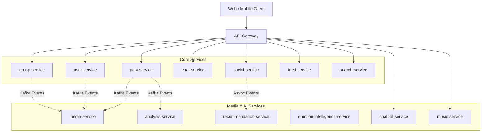

# SE121 Microservices Monorepo

Enterprise microservices platform for social, recommendation, chatbot, media, and AI-assisted user experiences.



## 📐 Architecture Documentation

For a comprehensive technical overview of the system architecture, including service landscape, communication patterns, data flows, scalability considerations, and deployment architecture, see:

**→ [docs/architecture/architecture.md](docs/architecture/architecture.md)**

This document is suitable for technical interviews, portfolio presentations, and system design discussions.

### Architecture Notes

- The repository includes both standard NestJS services and specialized AI / assistant services.
- The main service boundaries are documented per app; this root README only captures the monorepo-level view.
- OpenAPI is currently published for the assistant gateway flow only.
- Observability is tool-driven at the infrastructure level; centralized tracing and metrics are not documented in the repository yet.

## Tech Stack

| Layer                    | Observed stack                     | Notes                                                                                                                                                                                                                                                                                                                                                               |
| ------------------------ | ---------------------------------- | ------------------------------------------------------------------------------------------------------------------------------------------------------------------------------------------------------------------------------------------------------------------------------------------------------------------------------------------------------------------- |
| Runtime                  | Node.js 18+                        | Root workspace engine constraint in `package.json`.                                                                                                                                                                                                                                                                                                                 |
| Backend                  | NestJS 11.x                        | Primary framework for most services.                                                                                                                                                                                                                                                                                                                                |
| AI / Python              | FastAPI / Python                   | `analysis-service` and `recommendation-service` provide AI workloads.                                                                                                                                                                                                                                                                                               |
| Language                 | TypeScript 5.9.2                   | Shared by the NestJS workspace packages.                                                                                                                                                                                                                                                                                                                            |
| Workspace                | Turborepo 2.5.6                    | Orchestrates build, lint, test, and dev tasks.                                                                                                                                                                                                                                                                                                                      |
| Package manager          | npm 10.9.2                         | npm workspaces are enabled at the root.                                                                                                                                                                                                                                                                                                                             |
| Messaging                | Kafka, RabbitMQ                    | Event streaming and async queueing. Producers: `analysis-service`, `group-service`, `post-service`, `user-service`. Consumers: TODO (many services consume Kafka events; list per-service in their READMEs).                                                                                                                                                        |
| Cache / pub-sub          | Redis 7                            | Cache, session state, and pub/sub.                                                                                                                                                                                                                                                                                                                                  |
| Data stores              | PostgreSQL, MongoDB, Elasticsearch | PostgreSQL is the primary relational store for `post-service`, `group-service`, `media-service`, `social-service`, `chatbot-service` (and others as documented in service READMEs). MongoDB is used where noted in service READMEs. Elasticsearch exists in compose for search use-cases, but `logging-service` does not use Elasticsearch for audit/activity logs. |
| Infrastructure           | Docker Compose                     | Local runtime dependencies are provisioned from the root.                                                                                                                                                                                                                                                                                                           |
| API documentation        | OpenAPI 3.0.3                      | Present for the assistant gateway contract.                                                                                                                                                                                                                                                                                                                         |
| Auth / external services | Clerk, Cloudinary                  | Present in the repo and service documentation.                                                                                                                                                                                                                                                                                                                      |

## Monorepo Structure

```text
.
├── apps/
│   ├── api-gateway/
│   ├── analysis-service/
│   ├── chat-service/
│   ├── chatbot-service/
│   ├── emotion-intelligence-service/
│   ├── feed-service/
│   ├── group-service/
│   ├── logging-service/
│   ├── media-service/
│   ├── music-service/
│   ├── notification-service/
│   ├── post-service/
│   ├── recommendation-service/
│   ├── search-service/
│   ├── social-service/
│   └── user-service/
├── docs/
├── openapi/
├── packages/
│   ├── common/
│   ├── dtos/
│   ├── eslint-config/
│   └── typescript-config/
├── tools/
├── docker-compose.yml
├── turbo.json
└── package.json
```

## Microservice Catalog

The table below lists every app currently present in the workspace. Service-specific details belong in each app's README.

| Service                      | Role                                                          | README                                                                                     |
| ---------------------------- | ------------------------------------------------------------- | ------------------------------------------------------------------------------------------ |
| api-gateway                  | HTTP entry point and request routing                          | [apps/api-gateway/README.md](apps/api-gateway/README.md)                                   |
| user-service                 | User profile and account operations                           | [apps/user-service/README.md](apps/user-service/README.md)                                 |
| post-service                 | Post lifecycle, reactions, and related content operations     | [apps/post-service/README.md](apps/post-service/README.md)                                 |
| feed-service                 | Feed generation and ranking                                   | [apps/feed-service/README.md](apps/feed-service/README.md)                                 |
| social-service               | Social domain, relationship management (Postgres)             | [apps/social-service/README.md](apps/social-service/README.md)                             |
| chat-service                 | 1-on-1 messaging and outbox delivery                          | [apps/chat-service/README.md](apps/chat-service/README.md)                                 |
| group-service                | Group and community management (Postgres)                     | [apps/group-service/README.md](apps/group-service/README.md)                               |
| search-service               | Search indexing and retrieval                                 | [apps/search-service/README.md](apps/search-service/README.md)                             |
| logging-service              | Audit/admin and user activity logs (not system log pipeline)  | [apps/logging-service/README.md](apps/logging-service/README.md)                           |
| notification-service         | Notification delivery and preference handling                 | [apps/notification-service/README.md](apps/notification-service/README.md)                 |
| media-service                | Media upload and processing (Postgres-backed metadata)        | [apps/media-service/README.md](apps/media-service/README.md)                               |
| analysis-service             | AI emotion analysis and risk signals (AI service)             | [apps/analysis-service/README.md](apps/analysis-service/README.md)                         |
| emotion-intelligence-service | Uses results from `analysis-service` (consumer of AI outputs) | [apps/emotion-intelligence-service/README.md](apps/emotion-intelligence-service/README.md) |
| recommendation-service       | Runtime recommendation and ranking (AI service)               | [apps/recommendation-service/README.md](apps/recommendation-service/README.md)             |
| music-service                | Uses AI analysis outputs to support discovery (consumer)      | [apps/music-service/README.md](apps/music-service/README.md)                               |
| chatbot-service              | Assistant that calls AI via API key (Postgres metadata)       | [apps/chatbot-service/README.md](apps/chatbot-service/README.md)                           |

## Shared Packages

| Package                 | Role                                                         | README                                                                       |
| ----------------------- | ------------------------------------------------------------ | ---------------------------------------------------------------------------- |
| @repo/common            | Cross-service transport, caching, and infrastructure helpers | [packages/common/README.md](packages/common/README.md)                       |
| @repo/dtos              | Shared DTO and contract definitions                          | [packages/dtos/README.md](packages/dtos/README.md)                           |
| @repo/eslint-config     | Shared lint policy                                           | [packages/eslint-config/README.md](packages/eslint-config/README.md)         |
| @repo/typescript-config | Shared TypeScript compiler baselines                         | [packages/typescript-config/README.md](packages/typescript-config/README.md) |

## Local Development Setup

### Prerequisites

- Node.js 18 or newer.
- npm 10.9.2 or compatible npm version.
- Docker and Docker Compose.
- Python runtime for the Python-based services where needed.

### Common Commands

| Command                | Purpose                                                  |
| ---------------------- | -------------------------------------------------------- |
| `npm install`          | Install workspace dependencies.                          |
| `docker-compose up -d` | Start local infrastructure.                              |
| `npm run start:dev`    | Start the workspace in development mode in parallel.     |
| `npm run dev:test`     | Alternate development entry point from the root scripts. |
| `npm run build`        | Build all workspace projects.                            |
| `npm run lint`         | Run lint across the workspace.                           |
| `npm run check-types`  | Run TypeScript checks across the workspace.              |

### Targeted Workspace Commands

| Command                          | Purpose                                                             |
| -------------------------------- | ------------------------------------------------------------------- |
| `npm run recommend:dev`          | Start the recommendation-related service set.                       |
| `npm run recommend:dev:gateway`  | Start the gateway plus recommendation-related services.             |
| `npm run assistant:dev`          | Start the assistant-related service set.                            |
| `npm run group`                  | Start the group gateway/service combination.                        |
| `npm run recommend:report:live`  | Run the live recommendation report workflow from `social-service`.  |
| `npm run recommend:compare:live` | Run the live recommendation compare workflow from `social-service`. |

## Docker Setup

The root `docker-compose.yml` is the visible local infrastructure definition in the repository.

| Component     | Port(s)     | Purpose                                         |
| ------------- | ----------- | ----------------------------------------------- |
| Zookeeper     | 2181        | Kafka coordination.                             |
| Kafka         | 9092, 9093  | Event streaming.                                |
| Kafka UI      | 8080        | Kafka inspection.                               |
| Redis         | 6379        | Cache and state.                                |
| RabbitMQ      | 5672, 15672 | Queueing and management UI.                     |
| Elasticsearch | 9200        | Search indexing (where used by search-service). |
| Kibana        | 5601        | Elasticsearch visualization.                    |

TODO:

- Application Dockerfiles were not found in the current repository scan.
- Production Compose overrides and container build conventions are not documented yet.

## Messaging (& transport) notes

- Kafka producers: `analysis-service`, `group-service`, `post-service`, `user-service`, and others as documented per-service.
- Kafka consumers: All services document their consumed topics in their respective README files.
- RabbitMQ usage: `chat-service`, `emotion-intelligence-service`, `group-service`, `post-service`, `social-service`, `notification-service`, and others as documented per-service.

See individual service READMEs for complete Kafka/RabbitMQ integration details.

## CI/CD Overview

The repository has a GitHub Actions workflow at [.github/workflows/ci.yml](.github/workflows/ci.yml), but the active job steps are currently commented out.

Current status:

- Checkout is configured.
- Node.js setup is present but disabled.
- Dependency installation is present but disabled.
- Turbo lint/test/build execution is present but disabled.

TODO:

- Enable the actual CI pipeline after the workspace commands are finalized.
- Add release and deployment jobs once the target environment is defined.

## Observability Stack

The repository exposes several local observability and operations tools through Docker Compose.

| Tool                   | Purpose                       | Status                       |
| ---------------------- | ----------------------------- | ---------------------------- |
| Kafka UI               | Topic and consumer inspection | Available                    |
| RabbitMQ Management UI | Queue and exchange inspection | Available                    |
| Kibana                 | Elasticsearch visualization   | Available (search use-cases) |

NOTE: Neo4j is no longer used in the current topology; social domain moved to Postgres. Remove Neo4j references from service READMEs if present.

TODO:

- Centralized metrics collection is not documented in the repository.
- Distributed tracing is not documented in the repository.
- Standardized dashboards beyond the tools above are not defined yet.

## Deployment Overview

Current deployment signals in the repository are local-first.

Implemented or documented:

- Docker Compose is the local infrastructure entry point.
- Service-level README files describe runtime and environment expectations where available.

TODO:

- No Terraform manifests were found in the repository scan.
- No Azure deployment definitions were found in the repository scan.
- No application Dockerfiles were found in the repository scan.
- Production deployment topology and rollout strategy are not documented yet.

## Documentation and Service References

### Standards and Architecture Docs

- [README standards](docs/README_STANDARDS.md)
- [Social / recommendation / chatbot architecture report](docs/REPORT_SOCIAL_RECOMMENDATION_CHATBOT_2026-04-20.md)
- [Assistant OpenAPI specification](openapi/api-gateway-chatbot.openapi.yaml)

### Service READMEs

- [api-gateway](apps/api-gateway/README.md)
- [analysis-service](apps/analysis-service/README.md)
- [chat-service](apps/chat-service/README.md)
- [chatbot-service](apps/chatbot-service/README.md)
- [emotion-intelligence-service](apps/emotion-intelligence-service/README.md)
- [feed-service](apps/feed-service/README.md)
- [group-service](apps/group-service/README.md)
- [logging-service](apps/logging-service/README.md)
- [media-service](apps/media-service/README.md)
- [music-service](apps/music-service/README.md)
- [notification-service](apps/notification-service/README.md)
- [post-service](apps/post-service/README.md)
- [recommendation-service](apps/recommendation-service/README.md)
- [search-service](apps/search-service/README.md)
- [social-service](apps/social-service/README.md)
- [user-service](apps/user-service/README.md)

### Operational Docs

- [Clerk demo commands](tools/clerk-demo/COMMANDS.md)

## Maintenance Notes

- Keep this README focused on the monorepo-level view.
- Put transport details, environment variables, and troubleshooting into the service README for each app.
- Add new services and packages to the tables above when they are introduced.
- Mark missing documentation explicitly as TODO instead of inventing runtime behavior.
