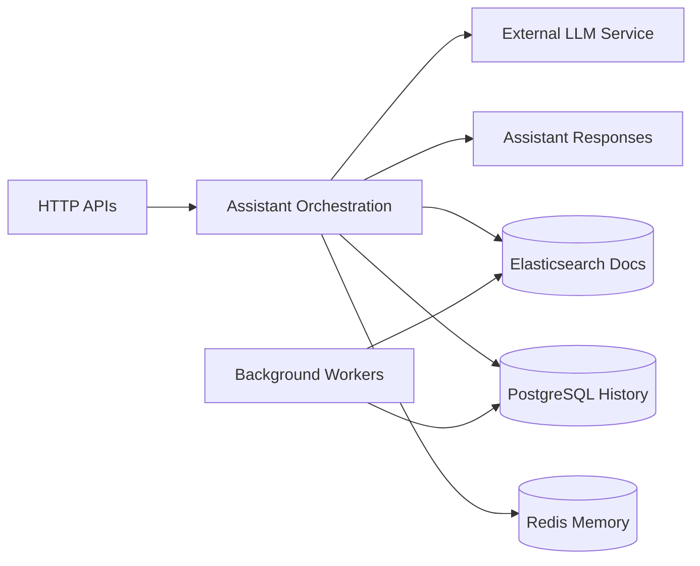

# chatbot-service

The chatbot service is the internal FastAPI assistant backend. It verifies an internal service key, resolves assistant context, applies guardrails, calls Groq for generation, and optionally persists history in PostgreSQL while caching session memory in Redis.

## Responsibilities

- Serve assistant response, history, and history-clear HTTP endpoints.
- Enforce internal-only access using the `X-Internal-Key` header.
- Build prompts from conversation history, memory, and RAG context.
- Query and optionally persist assistant history in PostgreSQL.
- Warm and query the assistant RAG index in Elasticsearch.

## Runtime Profile

| Item            | Value               |
| --------------- | ------------------- |
| Service type    | FastAPI / Python    |
| Port(s)         | `PORT` or `4015`    |
| Transport(s)    | HTTP                |
| Primary storage | Optional PostgreSQL |
| Shared packages | None                |

## Interfaces

### HTTP API

- `POST /assistant/respond` returns a generated assistant reply.
- `GET /assistant/history/{user_id}` returns paged assistant history.
- `DELETE /assistant/history/{user_id}` clears assistant history.
- `GET /health` returns `ok` for basic liveness.
- `GET /ready` returns readiness only when `GROQ_API_KEY` is set.

### Internal Auth

- `X-Internal-Key` is required on the assistant endpoints through `verify_internal_key`.
- Requests without the configured internal key are rejected with `403 Forbidden`.

### Async Infrastructure

- Redis stores session memory and history caches.
- PostgreSQL is optional and only initialized when `CHATBOT_DB_ENABLED=true`.
- Elasticsearch backs the assistant document RAG index.

## Internal Flow



- HTTP requests flow through the assistant orchestration layer before generation.
- Redis, PostgreSQL, and Elasticsearch provide session memory, history, and retrieval context.
- Background workers keep the retrieval corpus warm and the persistent history available.
- Output is produced through the external LLM service and returned as assistant responses.

## Dependencies

- `INTERNAL_SERVICE_KEY` for internal auth.
- `GROQ_API_KEY` and `GROQ_MODEL` for generation.
- `DATABASE_URL` and `CHATBOT_DB_ENABLED` for optional PostgreSQL persistence.
- `CHATBOT_REDIS_URL` and related Redis settings for session memory.
- `ES_NODE` and `RAG_*` settings for assistant document retrieval.
- `ASSISTANT_DOCS_DIR` for local document ingestion.

## Health and Readiness

- `GET /health` always returns `{"status":"ok"}`.
- `GET /ready` fails with `503` until `GROQ_API_KEY` is configured.
- When ready, the endpoint also returns the active Groq model name.

## Observability

- Uses `uvicorn.error` logging throughout the request pipeline.
- Logs startup warmup, RAG activity, guardrail decisions, and assistant generation failures.
- The history store and RAG service both emit lifecycle logs during startup and shutdown.
- No Prometheus or tracing exporter was verified.

## Environment Variables

| Variable                        | Purpose                                               |
| ------------------------------- | ----------------------------------------------------- |
| `PORT`                          | HTTP listener port, defaults to `4015`.               |
| `HOST`                          | HTTP bind host, defaults to `0.0.0.0`.                |
| `RELOAD`                        | Enables Uvicorn reload mode in development.           |
| `INTERNAL_SERVICE_KEY`          | Shared secret required by `X-Internal-Key`.           |
| `GROQ_API_KEY`                  | Required for readiness and model access.              |
| `GROQ_MODEL`                    | Groq model id, defaults to `llama-3.3-70b-versatile`. |
| `DATABASE_URL`                  | PostgreSQL connection string.                         |
| `CHATBOT_DB_ENABLED`            | Enables PostgreSQL persistence when `true`.           |
| `CHATBOT_REDIS_URL`             | Redis connection string for session memory.           |
| `ES_NODE`                       | Elasticsearch endpoint for assistant docs.            |
| `ASSISTANT_DOCS_DIR`            | Local docs directory for RAG ingestion.               |
| `RAG_INDEX_NAME`                | Elasticsearch index name for assistant docs.          |
| `RAG_DOCS_ENABLED`              | Enables assistant document retrieval.                 |
| `RAG_WARMUP_ON_STARTUP`         | Warming toggle for the assistant docs index.          |
| `CHATBOT_MAX_CONCURRENT_LLM`    | Semaphore cap for concurrent LLM generations.         |
| `CHATBOT_HISTORY_QUEUE_SIZE`    | Queue size for persisted history work.                |
| `CHATBOT_HISTORY_WRITE_WORKERS` | Worker count for history persistence.                 |

## Development

```bash
pip install -r requirements.txt
python -m app.main
uvicorn app.main:app --reload --port 4015
python -m unittest discover -s tests -p "test_*.py"
python -m ruff check app tests
python -m ruff format app tests
python -m app.tools.index_assistant_docs --force
```

The service package also exposes helper scripts in `package.json` for `db:migrate`, `db:current`, `db:history`, `db:revision`, `rag:index-docs`, and `loadtest:assistant`.

## Docker and Deployment

- No service-specific Dockerfile was found in the repository scan.
- The app initializes its DB session, history store, and optional RAG warmup during lifespan startup.

## Scaling Considerations

- Concurrent generation is bounded by `CHATBOT_MAX_CONCURRENT_LLM`.
- Redis-backed memory avoids repeated history reconstruction on every turn.
- RAG warmup and document indexing can become the dominant startup cost.
- PostgreSQL persistence is optional, so deployments can run read-only assistant mode when needed.

## Troubleshooting

- If `/ready` returns `503`, verify `GROQ_API_KEY`.
- If assistant endpoints return `403`, verify the `X-Internal-Key` header value.
- If history persistence is disabled, check `CHATBOT_DB_ENABLED` and `DATABASE_URL`.
- If RAG responses look stale, re-index assistant docs with `python -m app.tools.index_assistant_docs --force`.
