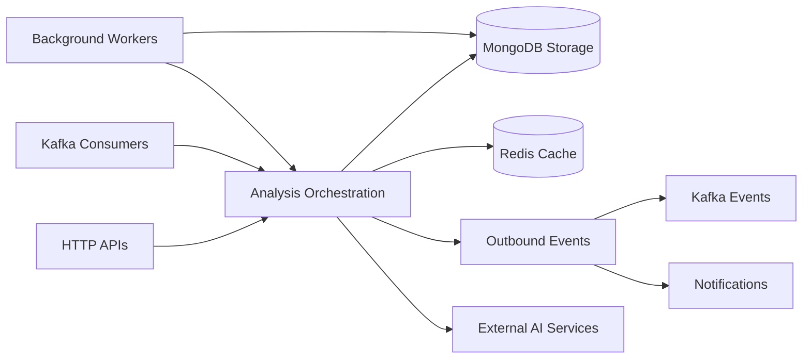

# analysis-service

FastAPI-based AI analysis service for emotion detection, moderation, music analysis, and analysis-event processing. The service loads local AI models at startup, exposes internal HTTP endpoints for analysis and dashboard queries, and publishes results through MongoDB-backed outbox events and Kafka.

## Responsibilities

- Analyze text, images, and music for emotion and moderation signals.
- Serve internal dashboard, history, summary, detail, and music-analysis HTTP endpoints.
- Consume analysis events from Kafka and persist snapshots, moderation records, and retry tasks in MongoDB.
- Publish emotion and moderation results through an outbox pattern to Kafka topics.
- Keep model health and startup readiness visible through the health endpoint.

## Runtime Profile

| Item            | Value            |
| --------------- | ---------------- |
| Service type    | FastAPI / Python |
| Port(s)         | `PORT` or `4011` |
| Transport(s)    | HTTP, Kafka      |
| Primary storage | MongoDB          |
| Shared packages | None             |

## Interfaces

### HTTP API

- `GET /` returns the service name, version, and running status.
- `GET /health` returns model readiness, uptime, and per-model load state.
- `GET /emotion/dashboard` returns the community emotion dashboard for a date range.
- `GET /emotion/history` returns paged analysis history for a user and preset range.
- `GET /emotion/summary` returns the top emotion and distribution for a range.
- `GET /emotion/summary/daily-trend` returns the daily emotion trend for a user.
- `GET /emotion/summary/by-hour` returns the hourly emotion distribution for a user.
- `GET /emotion/detail/{analysisId}` returns a single analysis record.
- `POST /musics/analyze` analyzes music emotion from a URL.
- `POST /test/text/sentiment`, `POST /test/post`, `POST /test/update-post`, `POST /test/before_save`, and `POST /test/music/from-url` are mounted test utilities.

### Auth

- `GET /emotion/*` and `POST /musics/analyze` require the `X-Internal-Key` header.
- `X-Internal-Key` is validated against `INTERNAL_SERVICE_KEY`.
- The test routes and health routes are not wrapped with the internal-key dependency.

### Kafka and Async Processing

- Kafka consumer group is started from `app.core.lifespan` and consumes the `analysis-events` topic.
- The analysis outbox writes result events to `emotion-result-events` and `moderation-rejected-events`.
- The startup lifecycle also runs an outbox batch processor and a retry worker.

### Enabled vs Disabled Routers

- `health`, `music`, `test`, and `analyze` routers are mounted by `app.main`.
- `image` and `moderation` routers exist in source but are commented out in `app.main`, so they are not exposed at runtime.

## Internal Flow



- HTTP and Kafka requests converge on the analysis orchestration layer.
- MongoDB stores analysis state, while Redis supports cached lookups and fast state.
- Background workers handle scheduled and retry-style processing around the core flow.
- Output leaves the service through Kafka events and notification side effects.

## Dependencies

- MongoDB via `MONGO_URL` and `MONGO_DB`.
- Redis via `REDIS_HOST` and `REDIS_PORT`.
- Kafka via `KAFKA_BROKERS` and `KAFKA_CLIENT_ID`.
- `INTERNAL_SERVICE_KEY` for protected analysis and music endpoints.
- `EMOTION_MODEL_VERSION` and `MODERATION_MODEL_VERSION` for persisted result metadata.
- `EMOTION_DAILY_CRON_HOUR_UTC` and `EMOTION_DAILY_CRON_MINUTE_UTC` for daily aggregation work.
- `PROFILE_BATCH_SIZE`, `SNAPSHOT_BATCH_SIZE`, and `EMOTION_PROFILE_EMA_ALPHA` for background processors.

## Health and Readiness

- `GET /health` reports `healthy` only when the core models are initialized and the text-emotion model is loaded.
- The response includes model-specific load flags, uptime, and a `ready` boolean.
- `GET /` is a simple running-status check but does not report model readiness.

## Observability

- Startup and shutdown use structured logging from `app.core.lifespan`.
- The health endpoint exposes model readiness and uptime directly.
- The orchestration layers log moderation decisions, retryable failures, and outbox processing state.
- `logging.basicConfig` is enabled for the process logger.

## Environment Variables

| Variable                        | Purpose                                                                     |
| ------------------------------- | --------------------------------------------------------------------------- |
| `HOST`                          | HTTP bind host, defaults to `0.0.0.0`.                                      |
| `PORT`                          | HTTP port, defaults to `4010` in config and `4011` in the provided scripts. |
| `MONGO_URL`                     | MongoDB connection string.                                                  |
| `MONGO_DB`                      | MongoDB database name, defaults to `analysis_service`.                      |
| `REDIS_HOST`                    | Redis host.                                                                 |
| `REDIS_PORT`                    | Redis port, defaults to `6379`.                                             |
| `KAFKA_BROKERS`                 | Kafka broker list.                                                          |
| `KAFKA_CLIENT_ID`               | Kafka client id.                                                            |
| `INTERNAL_SERVICE_KEY`          | Shared secret for internal analysis and music endpoints.                    |
| `EMOTION_MODEL_VERSION`         | Version recorded on emotion aggregates.                                     |
| `MODERATION_MODEL_VERSION`      | Version recorded on moderation results.                                     |
| `EMOTION_DAILY_CRON_HOUR_UTC`   | UTC hour for daily aggregation.                                             |
| `EMOTION_DAILY_CRON_MINUTE_UTC` | UTC minute for daily aggregation.                                           |
| `EMOTION_PROFILE_EMA_ALPHA`     | Smoothing factor for profile updates.                                       |

## Development

```bash
pip install -r requirements.txt
python download_models.py
python -m app.main
uvicorn app.main:app --host 0.0.0.0 --port 4011 --workers 1
curl http://localhost:4011/health
```

The package scripts also define:

- `npm run install` to install Python dependencies.
- `npm run download-models` to fetch model files.
- `npm run start:dev` to start the app module with the service environment.
- `npm run start:prod` to run Uvicorn on port `4011`.
- `npm run health` to probe the health endpoint.

There is no dedicated automated test runner defined in `package.json` or `requirements.txt`.

## Docker and Deployment

- No service-specific Dockerfile was found in the repository scan.
- The service is designed to run directly from Python source with local model files downloaded into the workspace.
- First startup may take longer because the model loader initializes multiple AI subdomains.

## Scaling Considerations

- Model loading is the main cold-start cost.
- Kafka producer, consumer, outbox processor, and retry worker all start during lifespan startup.
- MongoDB collections used for snapshots, moderation, tasks, and outbox records should be indexed for write-heavy workloads.
- Redis and Kafka share the background processing load, so broker latency affects end-to-end throughput.

## Troubleshooting

- If startup fails, verify `INTERNAL_SERVICE_KEY`, `MONGO_URL`, `KAFKA_BROKERS`, and `KAFKA_CLIENT_ID`.
- If `/health` reports `initializing`, confirm that the local AI models were downloaded and loaded.
- If protected endpoints return `403`, verify the `X-Internal-Key` header.
- If outbox events are not emitted, inspect the MongoDB outbox collection and the Kafka broker settings.
