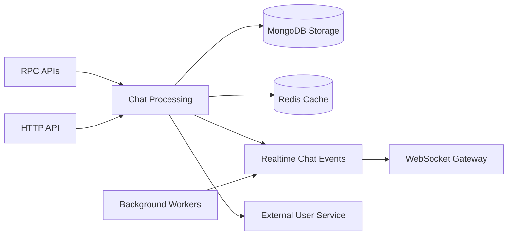

# chat-service

The chat service owns private conversations, messages, reactions, presence state, and the outbox flow that feeds the realtime gateway. It stores chat data in MongoDB, caches conversation/message slices in Redis, and publishes chat events through a Redis stream that the gateway consumes.

## Responsibilities

- Serve conversation and message RPC handlers for the rest of the platform.
- Maintain message and conversation documents in MongoDB.
- Keep chat list/detail caches and presence state in Redis.
- Publish realtime chat events for the gateway WebSocket layer.
- Coordinate outbox-backed retries for non-stream events.

## Runtime Profile

| Item            | Value                        |
| --------------- | ---------------------------- |
| Service type    | NestJS                       |
| Port(s)         | `PORT` or `4010` for TCP     |
| Transport(s)    | TCP, Redis, Kafka            |
| Primary storage | MongoDB                      |
| Shared packages | `@repo/common`, `@repo/dtos` |

## Interfaces

### HTTP API

- `GET /` is implemented by `AppController` and returns the app service greeting.
- No health-specific HTTP route was verified.

### TCP / RPC

- Conversation handlers: `getConversations`, `getConversationById`, `createConversation`, `updateConversation`, `hideConversation`, `unhideConversation`, `leaveConversation`, `deleteConversation`, and `markConversationAsRead`.
- Message handlers: `getMessages`, `sendMessage`, `deleteMessage`, and `getMessageById`.

### Events

- Redis stream events published by `ChatStreamProducerService`: `message.created`, `message.deleted`, `conversation.created`, `conversation.updated`, `conversation.memberJoined`, `conversation.memberLeft`, `conversation.deleted`, `conversation.read`, `conversation.hidden`, and `conversation.unhidden`.
- The gateway’s chat stream consumer reads those events from `chat:events` and broadcasts them to WebSocket rooms.
- Generic outbox events are persisted in MongoDB and forwarded by the scheduled outbox processor.

### Async Infrastructure

- Redis caches conversation and message details, list pages, and presence-related state.
- The outbox processor runs every 5 seconds and retries failed records with exponential backoff.
- Chat stream state is tracked in Redis stream consumer groups, not in a message broker.

## Internal Flow



- RPC and HTTP requests converge on the chat processing layer.
- Conversation and message state lives in MongoDB with Redis used for cached reads and realtime coordination.
- Output leaves the service as realtime chat events that the gateway fans out to clients.
- The service also depends on the user-service for profile metadata.

## Dependencies

- MongoDB collections for conversations, messages, reactions, and outbox records.
- Redis for cache, presence, and chat stream publication.
- The user-service RPC client through `USER_SERVICE` for user metadata.
- `@repo/common` Kafka producer helpers and shared exception handling.

## Health and Readiness

- No dedicated health or readiness endpoint is implemented.
- The only verified HTTP route is `GET /`.

## Observability

- Uses the shared `ExceptionsFilter` in the TCP microservice bootstrap.
- Emits debug and error logs from the chat stream producer, presence layer, and outbox processor.
- The outbox processor records retries, lease refreshes, and skipped legacy chat events.
- No metrics or tracing exporter was verified.

## Environment Variables

| Variable                        | Purpose                                                       |
| ------------------------------- | ------------------------------------------------------------- |
| `PORT`                          | TCP listener port, defaults to `4010`.                        |
| `REDIS_HOST`                    | Redis host for caches, presence, and chat stream publication. |
| `REDIS_PORT`                    | Redis port, defaults to `6379`.                               |
| `MACHINE_ID`                    | Snowflake-style machine id used in message identifiers.       |
| `PRESENCE_OFFLINE_THRESHOLD_MS` | Presence offline threshold.                                   |
| `OUTBOX_LEASE_MS`               | Lease window for the outbox processor.                        |
| `HOSTNAME`                      | Worker identity fallback for the outbox processor.            |
| `GATEWAY_INSTANCE_ID`           | Gateway instance identity used by the Redis stream consumer.  |
| `CHAT_STREAM_BATCH_SIZE`        | Redis stream batch size.                                      |
| `CHAT_STREAM_BLOCK_MS`          | Redis stream blocking wait time.                              |
| `CHAT_STREAM_CLAIM_IDLE_MS`     | Idle time before stale stream entries are claimed.            |
| `CHAT_STREAM_CLAIM_INTERVAL_MS` | Interval for stale claim sweeps.                              |
| `CHAT_STREAM_MAX_RETRIES`       | Retry cap for stream processing.                              |
| `CHAT_STREAM_DLQ_MAXLEN`        | Dead-letter stream cap.                                       |
| `CHAT_CONV_VERSION_TTL_SEC`     | Conversation version TTL in Redis.                            |
| `CHAT_MSG_VERSION_TTL_SEC`      | Message version TTL in Redis.                                 |

## Development

```bash
npm install
npm run start:dev
npm run build
npm run test
npm run test:e2e
npm run lint
```

## Docker and Deployment

- No service-specific Dockerfile was found in the repository scan.
- The service depends on the root Compose stack for MongoDB and Redis locally.

## Scaling Considerations

- Redis cache and stream consumer groups keep the realtime path decoupled from MongoDB reads.
- The outbox worker uses lease-based locking and exponential retry to avoid duplicate publish storms.
- Presence tracking depends on Redis fan-out and the heartbeat interval settings.

## Troubleshooting

- If message RPCs fail, verify the TCP port and downstream MongoDB connectivity.
- If realtime updates stop, check the Redis stream group and the gateway consumer settings.
- If presence becomes stale, verify the heartbeat interval and Redis connectivity.
- If user metadata lookups fail, verify the `USER_SERVICE` client wiring.
