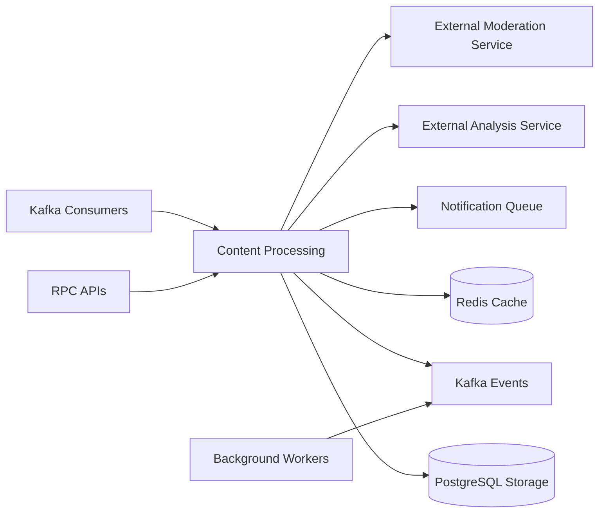

# post-service

Post lifecycle, reactions, comments, shares, moderation, and reporting for the content domain. The service runs as a NestJS hybrid bootstrap with TCP and Redis microservices plus a separate Kafka worker; the current bootstrap does not start an HTTP listener.

## Responsibility

- Own post, reaction, comment, share, moderation, and report workflows.
- Persist content data in PostgreSQL through TypeORM.
- Buffer engagement stats in Redis and flush them to Kafka on a schedule.
- React to emotion and moderation outcomes to keep post state current.

## Architecture Role

- Write-path and query owner for the post domain.
- Kafka consumer for analysis and moderation results.
- Scheduled stats publisher that batches Redis counters into outbox records.
- Uses the shared exception filter across all runtime surfaces.

## Runtime Profile

| Item            | Value                        |
| --------------- | ---------------------------- |
| Service type    | NestJS                       |
| TCP port        | `TCP_PORT` or `4002`         |
| Transports      | TCP, Redis, Kafka            |
| Primary storage | PostgreSQL                   |
| Cache / buffer  | Redis                        |
| Shared packages | `@repo/common`, `@repo/dtos` |

## Interfaces

### RPC / Message Patterns

- Post: `create_post`, `find_post_by_id`, `get_my_posts`, `find_posts_by_user_id`, `get_group_posts`, `update_post`, `remove_post`, `get_posts_batch`, `get_post_edit_histories`, `create_post_in_group`, `approve_post_in_group`, `reject_post_in_group`
- Reaction: `react`, `dis_react`, `get_reactions`, `get_reacted_types_batch`
- Comment: `create_comment`, `find_comment_by_id`, `find_comments_by_query`, `update_comment`, `remove_comment`
- Share: `share_post`, `update_share_post`, `find_share_by_id`, `get_my_shares`, `find_shares_by_user_id`, `find_shares_by_post_id`, `remove_share`
- Moderation: `moderation.get-my-records`, `moderation.get-record-detail`, `moderation.admin.get-records`, `moderation.create-appeal`, `moderation.admin.review-appeal`, `moderation.admin.get-appeals`, `moderation.admin.restore-content`
- Report: `create_report`, `resolve_report_target`, `reject_report`, `get_post_dashboard`, `get_reports`, `get_content_entry`, `get_content_chart`, `get_content_report_chart`

### Kafka Events Consumed

- `EMOTION_RESULT`
- `MODERATION_REJECTED`
- `TEST_FAULT`

### Health and Readiness

- No dedicated HTTP health endpoint is started by `src/main.ts`.
- No explicit health message pattern was found in the current bootstrap.

## Internal Flow



- Kafka and RPC requests converge on content processing.
- PostgreSQL stores posts and related content, while Redis supports cached counters and lookups.
- Background workers publish outbound events after aggregating activity.
- The service depends on analysis and moderation flows for downstream content handling.

## Dependencies and Env Vars

- `POSTGRES_URL` for the PostgreSQL connection.
- `POST_REDIS_HOST` and `POST_REDIS_PORT` for Redis.
- `TCP_PORT` for the TCP listener, defaulting to `4002`.
- `KAFKA_BROKERS`, `KAFKA_CLIENT_ID`, and `KAFKA_GROUP_ID` for the Kafka worker.

## Observability

- `ExceptionsFilter` is applied in the bootstrap.
- `Logger` is used in the consumer and moderation handlers.
- The stats batch job logs when Redis counters are flushed to Kafka.
- Outbox records provide an auditable handoff for Kafka and RabbitMQ side effects.

## Development

```bash
npm install
npm run build
npm run start
npm run start:dev
npm run start:prod
npm run test
npm run test:e2e
npm run test:cov
npm run lint
npm run format
```
