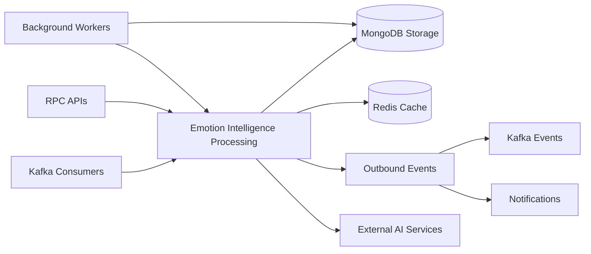

# emotion-intelligence-service

NestJS microservice for emotion dashboards, risk evaluation, feedback, snapshot ingestion, and AI-generated support advice. The service runs as a TCP microservice plus a separate Kafka ingestion worker, stores its data in MongoDB, and uses Redis, scheduled jobs, and event emitters to keep user emotion state current.

## Responsibilities

- Serve emotion dashboard, analytics, feedback, seed, and profile-risk RPC handlers.
- Consume `EMOTION_RESULT` events from Kafka and persist emotion snapshots.
- Recompute profile and risk state from snapshot updates and emit `risk.detected` events.
- Generate support advice with Groq when a risk event is detected.
- Cache dashboard responses and dirty-user state in Redis.

## Runtime Profile

| Item            | Value                        |
| --------------- | ---------------------------- |
| Service type    | NestJS                       |
| Port(s)         | `PORT` or `4013` for TCP     |
| Transport(s)    | TCP, Kafka, Redis, RabbitMQ  |
| Primary storage | MongoDB                      |
| Shared packages | `@repo/common`, `@repo/dtos` |

## Interfaces

### HTTP API

- No HTTP server is started by `src/main.ts`.
- `AppController` has a `GET /` handler in source, but it is not exposed by the current microservice bootstrap.

### TCP / RPC

- `dashboard.get_summary`
- `dashboard.get_trend`
- `dashboard.get_distribution`
- `dashboard.get_insights`
- `dashboard.get_history`
- `emotion-feedback.create`
- `emotion-feedback.get_by_target`
- `emotion-admin.feedback.list`
- `emotion-admin.feedback.accuracy`
- `emotion-admin.dashboard.overview`
- `emotion-admin.profile.risk-users`
- `emotion-analytics.get_by_target`
- `get_emotion_ranking_features`
- `get_user_emotion_signal`
- `seed.run`

### Kafka and Event Patterns

- Kafka consumer topic: `EMOTION_RESULT` from the shared DTO topic enum.
- The ingestion controller accepts `AnalysisEventType.CREATED` and `AnalysisEventType.UPDATED` payloads from that topic.
- `snapshot.updated` and `snapshot.batch.updated` are internal event-emitter events that trigger risk evaluation.
- `risk.detected` is emitted when the warning processor decides a user should receive advice.

### Async Infrastructure

- Redis stores dirty-user sets for profile and snapshot recomputation.
- Cron jobs are enabled through `ScheduleModule` for snapshot and profile processing.
- EventEmitter is used for internal snapshot and risk events.
- RabbitMQ is used through `NotificationModule.registerAsync` inside `AiModule` to send advice notifications.

## Internal Flow



- Kafka and RPC requests converge on the emotion intelligence processing layer.
- MongoDB stores emotion state, while Redis supports cached lookups and fast state.
- Background workers handle scheduled and retry-style processing around the core flow.
- Results leave the service through Kafka events and notification side effects.

## Dependencies

- MongoDB via `MONGODB_URI`.
- Redis via `REDIS_HOST` and `REDIS_PORT`.
- Kafka via `KAFKA_BROKERS`, `KAFKA_CLIENT_ID`, and `KAFKA_GROUP_ID`.
- RabbitMQ via `RABBITMQ_USER`, `RABBITMQ_PASS`, `RABBITMQ_HOST`, and `RABBITMQ_PORT`.
- Groq via `GROQ_API_KEY` and `GROQ_MODEL`.
- Shared DTOs for dashboard, feedback, risk, and event payloads.

## Health and Readiness

- No dedicated health endpoint is implemented in the current bootstrap.
- There is no HTTP readiness endpoint because the service does not start an HTTP adapter.

## Observability

- `ExceptionsFilter` is applied to both the TCP and Kafka microservices.
- Nest `Logger` is used across ingestion, dashboard, risk, and AI flows.
- The AI service logs fallback advice, Groq failures, and notification emission failures.
- Dashboard responses are cached in Redis for 60 to 120 seconds depending on the query type.

## Environment Variables

| Variable                            | Purpose                                                   |
| ----------------------------------- | --------------------------------------------------------- |
| `PORT`                              | TCP listener port, defaults to `4013`.                    |
| `REDIS_HOST`                        | Redis host.                                               |
| `REDIS_PORT`                        | Redis port, defaults to `6379`.                           |
| `MONGODB_URI`                       | MongoDB connection string.                                |
| `KAFKA_BROKERS`                     | Kafka broker list.                                        |
| `KAFKA_CLIENT_ID`                   | Kafka client id.                                          |
| `KAFKA_GROUP_ID`                    | Kafka consumer group id.                                  |
| `PROFILE_PROCESSING_WINDOW_MINUTES` | Window used by profile processing.                        |
| `PROFILE_BATCH_SIZE`                | Batch size for profile processing.                        |
| `SNAPSHOT_BATCH_SIZE`               | Batch size for snapshot processing.                       |
| `RECOMMENDATION_EMOTION_TOPIC`      | Topic used when publishing recommendation emotion events. |
| `EMOTION_PROFILE_EMA_ALPHA`         | Smoothing factor for profile calculations.                |
| `GROQ_API_KEY`                      | Optional Groq API key for AI advice generation.           |
| `GROQ_MODEL`                        | Groq model name, defaults to `llama-3.3-70b-versatile`.   |

## Development

```bash
npm install
npm run build
npm run start:dev
npm run start:prod
npm run test
npm run test:e2e
npm run test:cov
npm run seed:emotion
npm run lint
npm run format
```

## Docker and Deployment

- No service-specific Dockerfile was found in the repository scan.
- The service expects MongoDB, Redis, Kafka, and RabbitMQ to be available from the local Compose stack.
- The AI advice path degrades to fallback advice when `GROQ_API_KEY` is missing or Groq rate-limits requests.

## Scaling Considerations

- The Kafka ingestion worker and the TCP RPC surface scale independently.
- Redis cache keys help avoid repeated dashboard recomputation.
- Risk evaluation uses in-memory deduplication and time-based throttling to avoid repeated notifications.
- MongoDB collections for snapshots, profiles, risk state, feedback, and tasks should stay indexed as volume grows.

## Troubleshooting

- If startup fails, verify MongoDB, Redis, Kafka, and RabbitMQ settings first.
- If risk advice falls back to the default text, verify `GROQ_API_KEY` and the Groq model name.
- If dashboard RPCs return stale data, clear or inspect the Redis dashboard cache keys.
- If no risk notifications are emitted, check the `snapshot.updated` event path and the warning processor logs.<p align="center">
<a href="http://nestjs.com/" target="blank"></a>
</p>

[circleci-image]: https://img.shields.io/circleci/build/github/nestjs/nest/master?token=abc123def456
[circleci-url]: https://circleci.com/gh/nestjs/nest

  <p align="center">A progressive <a href="http://nodejs.org" target="_blank">Node.js</a> framework for building efficient and scalable server-side applications.</p>
    <p align="center">
<a href="https://www.npmjs.com/~nestjscore" target="_blank"></a>
<a href="https://www.npmjs.com/~nestjscore" target="_blank"></a>
<a href="https://www.npmjs.com/~nestjscore" target="_blank"></a>
<a href="https://circleci.com/gh/nestjs/nest" target="_blank"></a>
<a href="https://discord.gg/G7Qnnhy" target="_blank"></a>
<a href="https://opencollective.com/nest#backer" target="_blank"></a>
<a href="https://opencollective.com/nest#sponsor" target="_blank"></a>
  <a href="https://paypal.me/kamilmysliwiec" target="_blank"></a>
    <a href="https://opencollective.com/nest#sponsor"  target="_blank"></a>
  <a href="https://twitter.com/nestframework" target="_blank"></a>
</p>
  <!--[](https://opencollective.com/nest#backer)
  [](https://opencollective.com/nest#sponsor)-->

## Description

[Nest](https://github.com/nestjs/nest) framework TypeScript starter repository.

## Project setup

```bash
$ npm install
```

## Compile and run the project

```bash
# development
$ npm run start

# watch mode
$ npm run start:dev

# production mode
$ npm run start:prod
```

## Run tests

```bash
# unit tests
$ npm run test

# e2e tests
$ npm run test:e2e

# test coverage
$ npm run test:cov
```

## Deployment

When you're ready to deploy your NestJS application to production, there are some key steps you can take to ensure it runs as efficiently as possible. Check out the [deployment documentation](https://docs.nestjs.com/deployment) for more information.

If you are looking for a cloud-based platform to deploy your NestJS application, check out [Mau](https://mau.nestjs.com), our official platform for deploying NestJS applications on AWS. Mau makes deployment straightforward and fast, requiring just a few simple steps:

```bash
$ npm install -g @nestjs/mau
$ mau deploy
```

With Mau, you can deploy your application in just a few clicks, allowing you to focus on building features rather than managing infrastructure.

## Resources

Check out a few resources that may come in handy when working with NestJS:

- Visit the [NestJS Documentation](https://docs.nestjs.com) to learn more about the framework.
- For questions and support, please visit our [Discord channel](https://discord.gg/G7Qnnhy).
- To dive deeper and get more hands-on experience, check out our official video [courses](https://courses.nestjs.com/).
- Deploy your application to AWS with the help of [NestJS Mau](https://mau.nestjs.com) in just a few clicks.
- Visualize your application graph and interact with the NestJS application in real-time using [NestJS Devtools](https://devtools.nestjs.com).
- Need help with your project (part-time to full-time)? Check out our official [enterprise support](https://enterprise.nestjs.com).
- To stay in the loop and get updates, follow us on [X](https://x.com/nestframework) and [LinkedIn](https://linkedin.com/company/nestjs).
- Looking for a job, or have a job to offer? Check out our official [Jobs board](https://jobs.nestjs.com).

## Support

Nest is an MIT-licensed open source project. It can grow thanks to the sponsors and support by the amazing backers. If you'd like to join them, please [read more here](https://docs.nestjs.com/support).

## Stay in touch

- Author - [Kamil Myśliwiec](https://twitter.com/kammysliwiec)
- Website - [https://nestjs.com](https://nestjs.com/)
- Twitter - [@nestframework](https://twitter.com/nestframework)

## License

Nest is [MIT licensed](https://github.com/nestjs/nest/blob/master/LICENSE).
