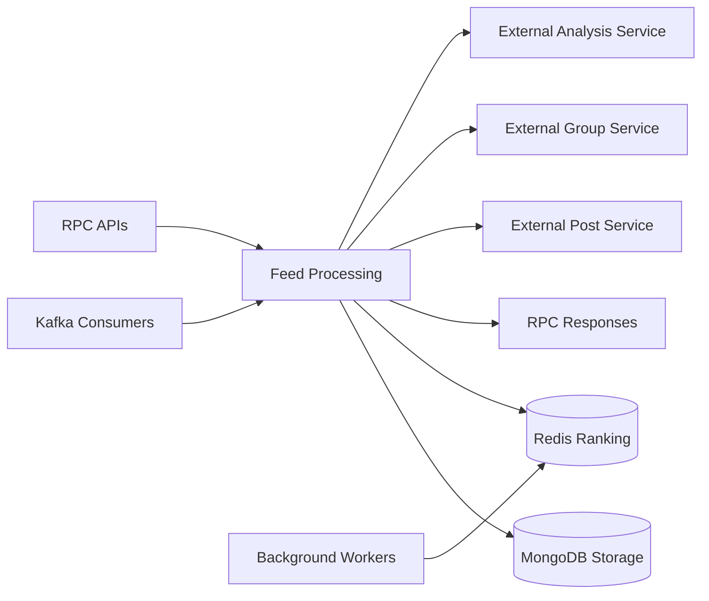

# feed-service

Feed generation, trending ranking, and Kafka ingestion for the content timeline. The service runs as TCP and Kafka microservices with Redis-backed ranking state and MongoDB snapshots; no HTTP listener is started in the current bootstrap.

## Responsibility

- Build personalized and trending feeds from snapshot data.
- Ingest post, share, stats, emotion, and interaction events.
- Keep Redis ranking keys and MongoDB snapshots in sync.
- Re-rank content using emotion features and affinity context.

## Architecture Role

- Read-side service for feed delivery and trending.
- Kafka consumer for content and analysis events.
- Redis score maintainer for trending and emotion-specific ZSETs.
- Uses scheduled workers to keep feed scores fresh and bounded.

## Runtime Profile

| Item                  | Value                        |
| --------------------- | ---------------------------- |
| Service type          | NestJS                       |
| TCP port              | `PORT` or `4003`             |
| Transports            | TCP, Kafka, Redis            |
| Primary storage       | MongoDB (`feed_service`)     |
| Cache / ranking store | Redis                        |
| Shared packages       | `@repo/common`, `@repo/dtos` |

## Interfaces

### RPC / Message Patterns

- `get_my_feed`
- `get_trending`

### Kafka Events Consumed

- `EventTopic.POST`
- `EventTopic.SHARE`
- `EventTopic.STATS`
- `EventTopic.TEST_FAULT`
- `EventTopic.EMOTION_RESULT`
- `EventTopic.INTERACTION`

### Health and Readiness

- No dedicated HTTP health endpoint is started by `src/main.ts`.
- No explicit health message pattern was found in the current bootstrap.

## Internal Flow



- Kafka and RPC requests converge on feed processing.
- MongoDB stores snapshots and feed items, while Redis holds ranking state.
- Background workers refresh ranking data so feed responses stay current.
- The feed layer depends on post, group, and analysis services for enrichment.

## Dependencies and Env Vars

- `MONGODB_URI` for the MongoDB connection.
- `REDIS_HOST` and `REDIS_PORT` for the Redis cache and ranking store.
- `PORT` for the TCP listener, defaulting to `4003`.
- `KAFKA_BROKERS`, `KAFKA_CLIENT_ID`, `KAFKA_GROUP_ID`, and `KAFKA_FROM_BEGINNING` for Kafka consumption.
- `POST_SERVICE_HOST` and `POST_SERVICE_PORT` for reaction lookups.
- `GROUP_SERVICE_HOST` and `GROUP_SERVICE_PORT` for group enrichment and candidate queries.
- `EMOTION_INTELLIGENCE_SERVICE_HOST` and `EMOTION_INTELLIGENCE_SERVICE_PORT` for emotion features.

## Observability

- `ExceptionsFilter` is applied to both microservices in `src/main.ts`.
- `Logger` is used in ingestion, consumer, ranking, and trending code paths.
- `KafkaConsumerHelper` and `KafkaDLQService` provide idempotency and failure routing.
- Cron jobs keep trending data fresh and expose operational logging when score sets are recomputed.

## Development

````bash
npm install
npm run build
npm run start
npm run start:dev
npm run start:prod
npm run test
npm run test:e2e
npm run test:cov
npm run seed:direct
npm run lint
npm run format
```<p align="center">
  <a href="http://nestjs.com/" target="blank"></a>
</p>

[circleci-image]: https://img.shields.io/circleci/build/github/nestjs/nest/master?token=abc123def456
[circleci-url]: https://circleci.com/gh/nestjs/nest

  <p align="center">A progressive <a href="http://nodejs.org" target="_blank">Node.js</a> framework for building efficient and scalable server-side applications.</p>
    <p align="center">
<a href="https://www.npmjs.com/~nestjscore" target="_blank"></a>
<a href="https://www.npmjs.com/~nestjscore" target="_blank"></a>
<a href="https://www.npmjs.com/~nestjscore" target="_blank"></a>
<a href="https://circleci.com/gh/nestjs/nest" target="_blank"></a>
<a href="https://discord.gg/G7Qnnhy" target="_blank"></a>
<a href="https://opencollective.com/nest#backer" target="_blank"></a>
<a href="https://opencollective.com/nest#sponsor" target="_blank"></a>
  <a href="https://paypal.me/kamilmysliwiec" target="_blank"></a>
    <a href="https://opencollective.com/nest#sponsor"  target="_blank"></a>
  <a href="https://twitter.com/nestframework" target="_blank"></a>
</p>
  <!--[](https://opencollective.com/nest#backer)
  [](https://opencollective.com/nest#sponsor)-->

## Description

[Nest](https://github.com/nestjs/nest) framework TypeScript starter repository.

## Project setup

```bash
$ npm install
````

## Compile and run the project

```bash
# development
$ npm run start

# watch mode
$ npm run start:dev

# production mode
$ npm run start:prod
```

## Run tests

```bash
# unit tests
$ npm run test

# e2e tests
$ npm run test:e2e

# test coverage
$ npm run test:cov
```

## Deployment

When you're ready to deploy your NestJS application to production, there are some key steps you can take to ensure it runs as efficiently as possible. Check out the [deployment documentation](https://docs.nestjs.com/deployment) for more information.

If you are looking for a cloud-based platform to deploy your NestJS application, check out [Mau](https://mau.nestjs.com), our official platform for deploying NestJS applications on AWS. Mau makes deployment straightforward and fast, requiring just a few simple steps:

```bash
$ npm install -g @nestjs/mau
$ mau deploy
```

With Mau, you can deploy your application in just a few clicks, allowing you to focus on building features rather than managing infrastructure.

## Resources

Check out a few resources that may come in handy when working with NestJS:

- Visit the [NestJS Documentation](https://docs.nestjs.com) to learn more about the framework.
- For questions and support, please visit our [Discord channel](https://discord.gg/G7Qnnhy).
- To dive deeper and get more hands-on experience, check out our official video [courses](https://courses.nestjs.com/).
- Deploy your application to AWS with the help of [NestJS Mau](https://mau.nestjs.com) in just a few clicks.
- Visualize your application graph and interact with the NestJS application in real-time using [NestJS Devtools](https://devtools.nestjs.com).
- Need help with your project (part-time to full-time)? Check out our official [enterprise support](https://enterprise.nestjs.com).
- To stay in the loop and get updates, follow us on [X](https://x.com/nestframework) and [LinkedIn](https://linkedin.com/company/nestjs).
- Looking for a job, or have a job to offer? Check out our official [Jobs board](https://jobs.nestjs.com).

## Support

Nest is an MIT-licensed open source project. It can grow thanks to the sponsors and support by the amazing backers. If you'd like to join them, please [read more here](https://docs.nestjs.com/support).

## Stay in touch

- Author - [Kamil Myśliwiec](https://twitter.com/kammysliwiec)
- Website - [https://nestjs.com](https://nestjs.com/)
- Twitter - [@nestframework](https://twitter.com/nestframework)

## License

Nest is [MIT licensed](https://github.com/nestjs/nest/blob/master/LICENSE).
