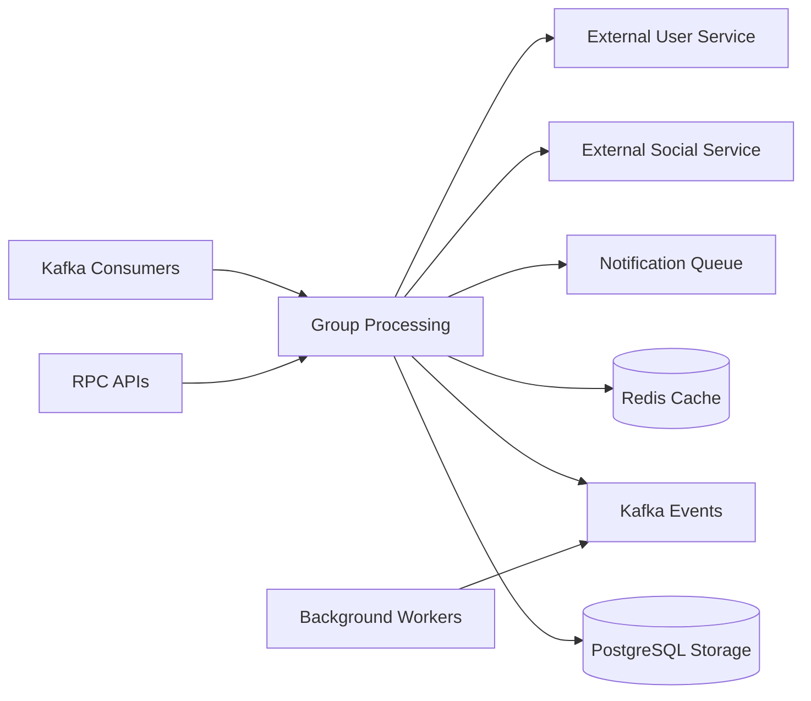

# group-service

Group management, membership, invites, moderation, and group recommendation support. The service runs as TCP and Kafka microservices with PostgreSQL and Redis; no HTTP listener is started in the current bootstrap.

## Responsibility

- Manage groups, settings, members, join requests, and invitations.
- Serve group dashboards, logs, reports, and recommendation candidates.
- Publish group lifecycle and media-related outbox events.
- Consume group moderation events from Kafka and route them into logs and notifications.

## Architecture Role

- Group-domain authority for membership and permissions.
- Recommendation source for candidate groups and common-group analytics.
- Outbox producer for Kafka and RabbitMQ side effects.
- Kafka consumer for group post moderation outcomes.

## Runtime Profile

| Item            | Value                        |
| --------------- | ---------------------------- |
| Service type    | NestJS                       |
| TCP port        | `PORT` or `4008`             |
| Transports      | TCP, Kafka, Redis            |
| Primary storage | PostgreSQL                   |
| Cache           | Redis                        |
| Shared packages | `@repo/common`, `@repo/dtos` |

## Interfaces

### RPC / Message Patterns

- Group core: `health_check`, `find_group_by_id`, `get_my_groups`, `recommend_groups`, `get_invited_groups`, `create_group`, `update_group`, `delete_group`, `get_group_user_permissions`, `get_group_info_batch`
- Group settings: `get-group-setting`, `update-group-setting`
- Membership and invites: `leave-group`, `remove-member`, `ban-member`, `unban-member`, `change-member-role`, `change-member-permission`, `get-member-by-filter`, `get_group_member_user_ids`, `get_common_group_counts_batch`, `get_common_group_names_batch`, `get_group_recommendation_candidates`, `invite_user_to_group`, `accept_group_invite`, `decline_group_invite`, `request_to_join_group`, `approve_group_join_request`, `reject_group_join_request`, `cancel_group_join_request`, `filter_group_join_requests`
- Logs and reports: `get-group-logs`, `get_group_dashboard`, `create_group_report`, `get_group_reports`, `get_top_reported_groups`, `ignore_group_report`, `ban_group`, `unban_group`, `get_group_by_admin`, `get_group_report_chart`

### Kafka Events Consumed

- `EventTopic.GROUP`

### Health and Readiness

- `health_check` is available as an RPC message pattern and returns `{ status: 'ok' }`.
- No HTTP health endpoint is exposed by the current bootstrap.

## Internal Flow



- Kafka and RPC requests converge on group processing.
- PostgreSQL stores group and membership data, while Redis supports cached lookups.
- Background workers publish outbound events and notification work.
- Group flows depend on the social and user services for graph and profile enrichment.

## Dependencies and Env Vars

- `GROUP_DATABASE_URL` for PostgreSQL.
- `POST_REDIS_HOST` and `POST_REDIS_PORT` for Redis.
- `PORT` for the TCP listener, defaulting to `4008`.
- `KAFKA_BROKERS`, `KAFKA_CLIENT_ID`, and `KAFKA_GROUP_ID` for Kafka.
- `RABBITMQ_USER`, `RABBITMQ_PASS`, `RABBITMQ_HOST`, and `RABBITMQ_PORT` for notification publishing.

## Observability

- `Logger` is used in the consumer and service layers.
- `ScheduleModule` supports recurring jobs in the event layer.
- Group logs and outbox rows make moderation and notification side effects auditable.
- Redis cache invalidation keeps hot group data and recommendation lookups observable through cache hits and misses.

## Development

```bash
npm install
npm run build
npm run start
npm run start:dev
npm run start:prod
npm run test
npm run test:e2e
npm run test:cov
npm run lint
npm run format
```
