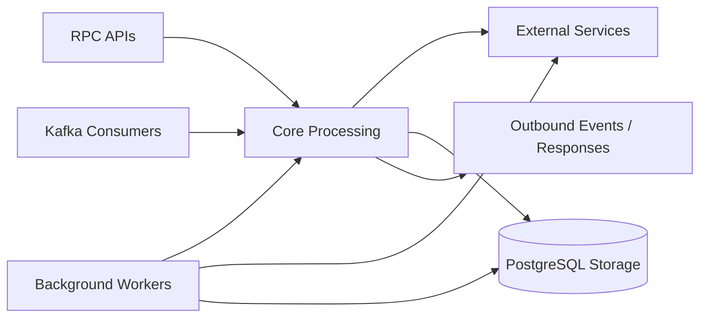

# media-service

Media upload orchestration, webhook ingestion, media persistence, and media-lifecycle event handling. The service runs as a hybrid NestJS runtime with HTTP, TCP RPC, and Kafka consumers backed by PostgreSQL.

## Responsibility

- Accept media upload RPC requests and forward binary data to Cloudinary.
- Validate media type, MIME type, and size before upload.
- Ingest Cloudinary upload webhooks and upsert media records.
- Consume media lifecycle events to assign content ownership or delete assets.
- Run scheduled cleanup for orphaned media records and cloud assets.

## Architecture Role

- Media-domain boundary for upload and metadata state transitions.
- Kafka consumer for media lifecycle events (`EventTopic.MEDIA`).
- HTTP webhook receiver for asynchronous Cloudinary callbacks.
- TCP RPC surface for upstream services that need upload processing.

## Runtime Profile

| Item                | Value                        |
| ------------------- | ---------------------------- |
| Service type        | NestJS                       |
| HTTP port           | `HTTP_PORT` or `4200`        |
| TCP port            | `PORT` or `4004`             |
| Transports          | HTTP, TCP, Kafka             |
| Primary storage     | PostgreSQL                   |
| External dependency | Cloudinary                   |
| Shared packages     | `@repo/common`, `@repo/dtos` |

## Interfaces

### RPC / Message Patterns

- `upload`

### HTTP APIs

- `POST /webhook/cloudinary`

### Kafka Consumers

- Topic: `EventTopic.MEDIA`
- Handled media event types:
  - `MediaEventType.DELETE_REQUESTED`
  - `MediaEventType.CONTENT_ID_ASSIGNED`

## Kafka Events Consumed / Produced

### Consumed

- `EventTopic.MEDIA`

### Produced

- No domain outbound Kafka event producer is implemented in this service source.
- `KafkaDLQService` is wired for failure routing by the shared Kafka consumer helper path.

## Health and Readiness

- No dedicated health or readiness endpoint is implemented.
- No explicit `health_check` RPC message pattern exists.
- Runtime readiness depends on successful startup of PostgreSQL connectivity, Kafka consumer bootstrap, and Cloudinary configuration.

## Internal Flow



- Upload requests are validated, uploaded, and returned immediately through RPC.
- Webhook and Kafka paths converge on media state updates in PostgreSQL.
- Cleanup workers remove stale unbound media from both Cloudinary and storage.

## Dependencies and Env Vars

- `POSTGRES_URL` for PostgreSQL connection.
- `HTTP_PORT` for HTTP webhook listener.
- `PORT` for TCP listener.
- `KAFKA_BROKERS`, `KAFKA_CLIENT_ID`, `KAFKA_MEDIA_ID` for Kafka consumer runtime.
- `CLOUDINARY_NAME`, `CLOUDINARY_API_KEY`, `CLOUDINARY_API_SECRET` for Cloudinary API access.
- `MEDIA_CLEANUP_CRON` for orphan cleanup schedule (defaults to every 10 minutes).
- `MEDIA_ORPHAN_TTL_MINUTES` for orphan age threshold (defaults to 30 minutes).

Shared Docker infrastructure in the monorepo compose file provides Kafka and Redis, while PostgreSQL and Cloudinary are expected from external/local environment configuration.

## Observability

- `ExceptionsFilter` is applied globally in bootstrap.
- `Logger` is used in webhook, Kafka consumer, and cleanup worker paths.
- Kafka consumption runs through `KafkaConsumerHelper` with idempotency support (`PostgresProcessedEvent`) and DLQ plumbing.
- Cleanup logs include orphan count, per-item deletion success, and warning logs on failures.

## Development

```bash
npm install
npm run build
npm run start
npm run start:dev
npm run start:prod
npm run test
npm run test:e2e
npm run test:cov
npm run lint
npm run format
```
