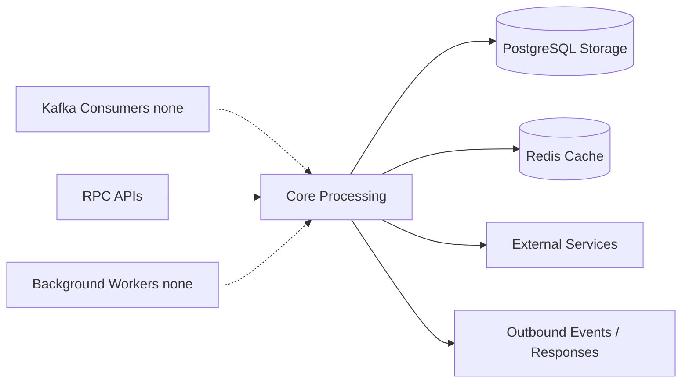

# music-service

Music catalog and emotion-aware recommendation service. The service runs as a NestJS TCP microservice, persists music features in PostgreSQL, and queries emotion intelligence over TCP with Redis-backed caching.

## Responsibility

- Manage music feature metadata (catalog CRUD and listing).
- Provide user-targeted music recommendations from emotional state.
- Query emotion signals from emotion-intelligence-service and cache them in Redis.
- Map emotion vectors into valence/arousal space and rank tracks by distance.

## Architecture Role

- Music-domain authority for track feature records.
- Recommendation endpoint for other services through TCP RPC.
- Consumer of emotion intelligence data via inter-service TCP client.
- Read-heavy ranking layer over stored music feature vectors.

## Runtime Profile

| Item            | Value                               |
| --------------- | ----------------------------------- |
| Service type    | NestJS                              |
| TCP host        | `MUSIC_SERVICE_HOST` or `localhost` |
| TCP port        | `MUSIC_SERVICE_PORT` or `4014`      |
| Transports      | TCP (server), TCP (outgoing client) |
| Primary storage | PostgreSQL                          |
| Cache           | Redis                               |
| Shared packages | `@repo/common`, `@repo/dtos`        |

## Interfaces

### RPC / Message Patterns

- Catalog:
  - `create_music_feature`
  - `update_music_feature`
  - `delete_music_feature`
  - `get_music_feature`
  - `list_music_features`
- Recommendation:
  - `get_music_recommendations`

### HTTP APIs

- `AppController` defines `GET /` in source, but current bootstrap creates only a TCP microservice and does not start an HTTP listener.

## Kafka Events Consumed / Produced

### Consumed

- None.

### Produced

- None.

## Health and Readiness

- No dedicated health or readiness endpoint is exposed in current runtime.
- No `health_check` RPC pattern is implemented.
- Service readiness depends on PostgreSQL connectivity and successful TCP dependency calls to emotion-intelligence-service.

## Internal Flow



- Catalog RPC handlers perform CRUD and listing against PostgreSQL-backed music features.
- Recommendation RPC resolves user emotion signals (cache first, service fallback), maps to valence/arousal, then queries and ranks candidate tracks.
- Responses are returned via TCP RPC without Kafka or scheduled worker stages.

## Dependencies and Env Vars

- `MUSIC_DATABASE_URL` for PostgreSQL.
- `MUSIC_SERVICE_HOST`, `MUSIC_SERVICE_PORT` for TCP listener binding.
- `REDIS_HOST`, `REDIS_PORT` for emotion-signal cache.
- `EMOTION_INTELLIGENCE_SERVICE_HOST`, `EMOTION_INTELLIGENCE_SERVICE_PORT` for outgoing TCP client requests.

Shared Docker infrastructure in the monorepo compose file provides Redis and Kafka services. Music-service itself currently uses Redis and PostgreSQL, with PostgreSQL provided outside the shared compose file.

## Observability

- `ExceptionsFilter` is applied globally to the TCP microservice.
- `EmotionSignalService` logs debug/warn events for cache hits, downstream fetches, and fallback cases.
- No scheduler/worker module is configured in current source.

## Development

```bash
npm install
npm run build
npm run start
npm run start:dev
npm run start:prod
npm run test
npm run test:e2e
npm run test:cov
npm run lint
npm run format
```
