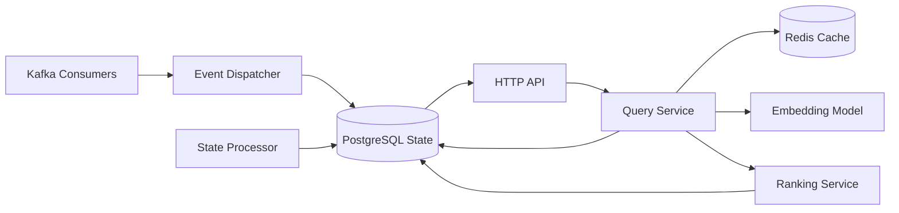

# recommendation-service

Social recommendation and discovery service using semantic embeddings and graph-aware ranking. The service runs as a Python FastAPI HTTP API with Kafka consumers for event-driven state management, powered by PostgreSQL and Redis caching.

## Responsibility

- Compute and maintain user profile embeddings via Kafka event handlers.
- Maintain social graph state (friendships, blocks, mutual connections) via Kafka events.
- Store and update emotion profile data for ranking refinement.
- Provide semantic recommendation queries over user profiles with multi-factor ranking.
- Cache query results and model embeddings in Redis for low-latency responses.
- Validate readiness of embedding models and fallback to global recommendations if degraded.

## Architecture Role

- Recommendation-domain authority for semantic discovery and ranking.
- Kafka consumer for profile embeddings, social graph, and emotion profile events.
- HTTP REST API for other services querying recommendations for a viewer.
- Multi-tier ranking integrating semantic similarity, graph proximity, and emotion affinity.
- Session-based pagination with cursor support for result continuity.

## Runtime Profile

| Item            | Value                                          |
| --------------- | ---------------------------------------------- |
| Service type    | FastAPI (Python)                               |
| HTTP port       | `PORT` or `4016` (default `4011`)              |
| HTTP host       | `HOST` or `0.0.0.0`                            |
| Transports      | HTTP, Kafka                                    |
| Primary storage | PostgreSQL                                     |
| Cache           | Redis                                          |
| Embedding model | Hugging Face (`intfloat/multilingual-e5-base`) |

## Interfaces

### HTTP APIs

- `GET /health` — Health check endpoint (always returns `200 OK`).
- `GET /ready` — Readiness probe (returns `200 OK` if embedding model is loaded; `503` if not ready and `RECOMMENDATION_ALLOW_DEGRADED_QUERY=false`).
- `POST /recommend/query` (requires `INTERNAL_SERVICE_KEY` header) — Semantic recommendation query with pagination.
- `GET /recommend/query-cache` (requires `INTERNAL_SERVICE_KEY` header) — Query cache statistics.

### RPC / Message Patterns

- No RPC/TCP patterns (HTTP-only API service).

### Kafka Consumers

- Topic: `RECOMMENDATION_PROFILE_TOPIC` (defaults to `recommendation-profile-events`)
  - Event type: `recommendation.profile.embedding.requested` → store user profile embedding
- Topic: `RECOMMENDATION_GRAPH_TOPIC` (defaults to `recommendation-graph-events`)
  - Event types:
    - `recommendation.graph.friend-request-sent` → update graph state
    - `recommendation.graph.friend-request-canceled` → update graph state
    - `recommendation.graph.friend-request-accepted` → update graph state
    - `recommendation.graph.friend-request-declined` → update graph state
    - `recommendation.graph.friendship-removed` → update graph state
    - `recommendation.graph.user-blocked` → update graph state
    - `recommendation.graph.user-unblocked` → update graph state
    - `recommendation.graph.recommendation-dismissed` → update graph state
- Topic: `RECOMMENDATION_EMOTION_TOPIC` (defaults to `recommendation-emotion-events`)
  - Event type: `recommendation.emotion.profile-updated` → store emotion profile data

## Kafka Events Consumed / Produced

### Consumed

- `RECOMMENDATION_PROFILE_TOPIC`
- `RECOMMENDATION_GRAPH_TOPIC`
- `RECOMMENDATION_EMOTION_TOPIC`

### Produced

- No domain outbound Kafka event producer is implemented in this service source.

## Health and Readiness

- `GET /health` returns `{"status": "ok", "service": "recommendation-service"}` immediately.
- `GET /ready` returns `{"status": "ready", "service": "recommendation-service", "model": {...}}` when embedding model is loaded; returns `{"status": "not_ready", "reason": "Model loading"}` with HTTP `503` if model is not ready and `RECOMMENDATION_ALLOW_DEGRADED_QUERY=false`.
- Model loading occurs asynchronously during application startup and does not block initial readiness checks.

## Internal Flow



- Kafka events are dispatched to handler services (ProfileEmbeddingEventHandler, RecommendationGraphEventHandler, EmotionProfileEventHandler) which persist state in PostgreSQL.
- HTTP `/recommend/query` endpoints receive recommendation requests, cache lookups are checked in Redis first.
- Query service retrieves candidate profiles, applies semantic ranking using the embedding model, applies reranking with graph proximity and emotion affinity weights.
- Background state processor periodically refreshes global fallback candidates (top-K profiles) for degraded query paths.
- Responses include pagination cursors for session continuity.

## Dependencies and Env Vars

- `HOST`, `PORT` for HTTP listener binding (defaults: `0.0.0.0`, `4016`).
- `RELOAD` for development hot-reload (defaults: `false`).
- `INTERNAL_SERVICE_KEY` for HTTP header authentication (`Authorization: Bearer <key>`).
- `DATABASE_URL` for PostgreSQL connection (Alembic-managed schema with pgvector support).
- `RECOMMENDATION_MODEL_NAME` for Hugging Face embedding model (defaults: `intfloat/multilingual-e5-base`).
- `RECOMMENDATION_MAX_LENGTH` max token length for embedding (defaults: `256`).
- `RECOMMENDATION_BATCH_SIZE` for batch embedding (defaults: `16`).
- `RECOMMENDATION_MAX_CANDIDATES` max candidates per query (defaults: `100`).
- `RECOMMENDATION_QUERY_INSTRUCTION` semantic search instruction prompt.
- `RECOMMENDATION_ALLOW_DEGRADED_QUERY` allows querying without model (defaults: `true`).
- `RECOMMENDATION_WARMUP_VIEWER_IDS` comma-separated IDs to warm query cache on startup.
- `RECOMMENDATION_WARMUP_QUERY_LIMIT` batch size for cache warmup.
- `RECOMMENDATION_SCORE_FLOOR`, `RECOMMENDATION_SCORE_CEILING` candidate score thresholds.
- `RECOMMENDATION_STATE_PROCESSOR_INTERVAL_SECONDS` background state refresh interval (defaults: `30`).
- `RECOMMENDATION_GLOBAL_FALLBACK_TOP_K` fallback candidate pool size (defaults: `500`).
- `RECOMMENDATION_GLOBAL_FALLBACK_REFRESH_INTERVAL_SECONDS` fallback refresh interval (defaults: `900`).
- `RECOMMENDATION_QUERY_RERANK_TOP_K` reranking candidate limit (defaults: `25`).
- `RECOMMENDATION_QUERY_RERANK_TOP_K_CPU` CPU-only reranking candidate limit (defaults: `6`).
- `RECOMMENDATION_EMBEDDING_CACHE_MAX_ENTRIES` model output cache size (defaults: `5000`).
- `RECOMMENDATION_QUERY_CACHE_TTL_SECONDS` Redis cache entry TTL (defaults: `45`).
- `RECOMMENDATION_QUERY_CACHE_MAX_ENTRIES` Redis cache entry limit (defaults: `1000`).
- `RECOMMENDATION_QUERY_SESSION_TTL_SECONDS` session state TTL (defaults: `120`).
- `RECOMMENDATION_QUERY_SESSION_WINDOW_SIZE` session pagination window (defaults: `120`).
- `RECOMMENDATION_QUERY_CACHE_REDIS_HOST`, `RECOMMENDATION_QUERY_CACHE_REDIS_PORT`, `RECOMMENDATION_QUERY_CACHE_REDIS_DB` Redis connection (defaults: `localhost:6379:0`).
- `RECOMMENDATION_QUERY_CACHE_REDIS_PREFIX` Redis key prefix (defaults: `recommendation:query-cache`).
- `RECOMMENDATION_QUERY_MODEL_WEIGHT` semantic similarity weight (defaults: `0.7`).
- `RECOMMENDATION_QUERY_RETRIEVAL_WEIGHT` retrieval score weight (defaults: `0.3`).
- `RECOMMENDATION_QUERY_GRAPH_WEIGHT` social graph proximity weight (defaults: `0.15`).
- `RECOMMENDATION_QUERY_EMOTION_WEIGHT` emotion affinity weight (defaults: `0.1`).
- `RECOMMENDATION_EMOTION_SCORING_ENABLED` enable emotion-based ranking (defaults: `true`).
- `RECOMMENDATION_EMOTION_DATA_MAX_AGE_HOURS` emotion profile age limit (defaults: `168` hours = 7 days).
- `RECOMMENDATION_MUTUAL_FRIEND_CAP` max mutual friends to consider (defaults: `10`).
- `RECOMMENDATION_COMMON_GROUP_CAP` max common groups to consider (defaults: `5`).
- `KAFKA_BROKERS` Kafka broker addresses (comma-separated).
- `KAFKA_CLIENT_ID` Kafka client identifier.
- `KAFKA_GROUP_ID` Kafka consumer group identifier.
- `KAFKA_REQUIRED` whether Kafka is required for startup (defaults: `false`; if false, service runs without messaging).
- `KAFKA_TOPIC_INIT_RETRIES`, `KAFKA_TOPIC_INIT_RETRY_DELAY_SECONDS`, `KAFKA_TOPIC_INIT_WAIT_TIMEOUT_SECONDS` Kafka topic initialization behavior.
- `RECOMMENDATION_PROFILE_TOPIC`, `RECOMMENDATION_GRAPH_TOPIC`, `RECOMMENDATION_EMOTION_TOPIC` Kafka topic names.

Shared Docker infrastructure in the monorepo compose file provides Kafka and Redis. PostgreSQL is expected from external/local environment configuration.

## Observability

- Structured logging via Python `logging` module with `uvicorn.error` and application-specific loggers.
- Application logs query execution timing, cache hits/misses, model loading status, and messaging events.
- Lifespan logging tracks model warmup, database validation, messaging runtime initialization, and startup failures.
- Event dispatcher logs incoming events by type and extracts payload fields for context.
- Query service logs per-request details: viewerId, limit, cursor, source, result count, and pagination state.
- No explicit metrics or tracing instrumentation in current source.

## Development

```bash
# Virtual environment (PowerShell on Windows)
npm run venv

# Install dependencies
npm run install

# Model warmup (downloads embedding model from Hugging Face)
npm run model:warmup

# Development server (auto-reload)
npm run start:dev

# Build (compile Python modules)
npm run build

# Linting
npm run lint

# Code formatting
npm run format

# Database migrations
npm run db:upgrade
npm run db:revision -m "Migration name"

# Run tests
npm run test
```
