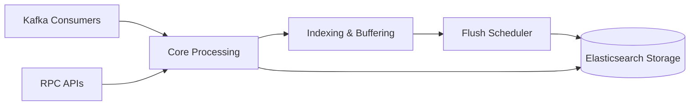

# search-service

Full-text search and content indexing service. The service runs as a NestJS hybrid microservice with TCP RPC and Kafka consumers, indexing posts, users, and groups into Elasticsearch with buffered batch flushing.

## Responsibility

- Maintain Elasticsearch indices for posts, users, and groups.
- Index new or updated content from domain services via Kafka events.
- Provide search query RPC endpoints for posts, users, and groups.
- Buffer and batch-flush documents to Elasticsearch every 5 seconds.
- Remove indexed documents when domain entities are deleted.

## Architecture Role

- Search-domain authority for full-text indexing and querying.
- Kafka consumer for content lifecycle events (`POST`, `USER`, `GROUP` topics).
- TCP RPC surface for upstream services requesting search results.
- Document lifecycle synchronization via event handlers and scheduled flushing.

## Runtime Profile

| Item            | Value                        |
| --------------- | ---------------------------- |
| Service type    | NestJS                       |
| TCP port        | `PORT` or `4009`             |
| Transports      | TCP, Kafka                   |
| Search storage  | Elasticsearch                |
| Shared packages | `@repo/common`, `@repo/dtos` |

## Interfaces

### RPC / Message Patterns

- `search_posts`
- `search_groups`
- `search_users`

### HTTP APIs

- None (TCP-only RPC service).

### Kafka Consumers

- Topic: `EventTopic.POST`
  - Handled event types:
    - `PostEventType.CREATED` → index post document
    - `PostEventType.UPDATED` → update indexed post
    - `PostEventType.REMOVED` → delete indexed post
- Topic: `EventTopic.GROUP`
  - Handled event types:
    - `GroupEventType.CREATED` → index group document
    - `GroupEventType.UPDATED` → update indexed group
    - `GroupEventType.REMOVED` → delete indexed group
- Topic: `EventTopic.USER`
  - Handled event types:
    - `UserEventType.CREATED` → index user document
    - `UserEventType.UPDATED` → update indexed user
    - `UserEventType.REMOVED` → delete indexed user

## Kafka Events Consumed / Produced

### Consumed

- `EventTopic.POST`
- `EventTopic.GROUP`
- `EventTopic.USER`

### Produced

- No domain outbound Kafka event producer is implemented in this service source.
- `KafkaDLQService` is wired for failure routing by the shared Kafka consumer helper path.

## Health and Readiness

- No dedicated health or readiness endpoint is implemented.
- No explicit `health_check` RPC message pattern exists.
- Runtime readiness depends on successful Elasticsearch client connection during bootstrap.

## Internal Flow



- Kafka events are routed through domain-specific consumer services (PostConsumerService, GroupConsumerService, UserConsumerService) to index/update/delete documents.
- RPC search queries access Elasticsearch directly via search services (PostSearchService, GroupSearchService, UserSearchService).
- IndexerService maintains an in-memory buffer per index, auto-flushing when buffer size exceeds 500 documents or every 5 seconds.
- Bulk API calls are sent to Elasticsearch for batched indexing.

## Dependencies and Env Vars

- `PORT` for TCP listener.
- `KAFKA_BROKERS` (comma-separated) for Kafka broker connection.
- `KAFKA_CLIENT_ID` for Kafka client identification.
- `KAFKA_SEARCH_ID` for Kafka consumer group identification.
- `ES_NODE` for Elasticsearch HTTP endpoint (defaults to `http://localhost:9200`).
- `ES_USER`, `ES_PASS` for Elasticsearch authentication (optional for dev; defaults to `elastic`/`password`).

Shared Docker infrastructure in the monorepo compose file provides Kafka. Elasticsearch is expected from external/local environment configuration.

## Observability

- `ExceptionsFilter` is applied globally in bootstrap (TCP and Kafka apps).
- `Logger` is used in Kafka consumer controller, indexing services, and flush scheduler.
- Kafka consumption runs through `KafkaConsumerHelper` with idempotency support and DLQ plumbing.
- Indexer logs document buffering, flushing decisions, and bulk API responses.
- Flush scheduler logs auto-flush events every 5 seconds.

## Development

```bash
npm install
npm run build
npm run start
npm run start:dev
npm run start:debug
npm run start:prod
npm run test
npm run test:watch
npm run test:cov
npm run test:e2e
npm run lint
npm run format
```
