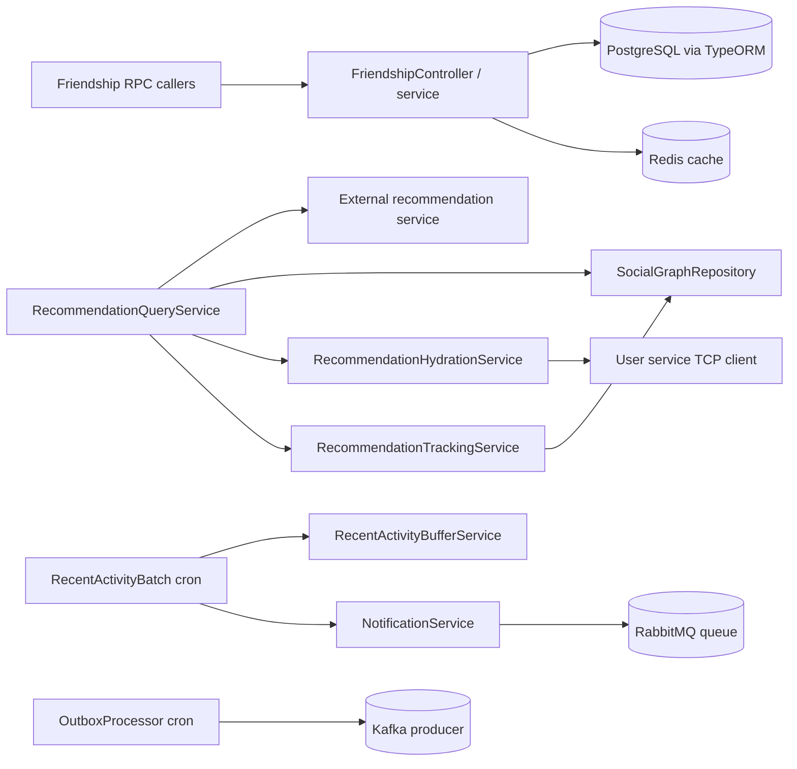

# social-service

Friendship graph, recommendations, blocks, and recent social activity delivery. The service runs as TCP and Redis microservices only; `AppController` contains a `GET /` handler in source, but the current bootstrap does not start an HTTP listener.

## Responsibility

- Manage friendship requests, accepted friendships, blocks, and recommendation dismissal.
- Serve friend lists, blocked users, and recommendation analytics.
- Enrich friend recommendations with user profile data.
- Emit social activity and recommendation events through the outbox pipeline.

## Architecture Role

- Social-graph authority for the user graph domain.
- Recommendation query facade over an external recommendation service and local graph state.
- Notification producer for recent friendship activity.
- Uses Redis for profile caching and recent-activity buffering.

## Runtime Profile

| Item                    | Value                        |
| ----------------------- | ---------------------------- |
| Service type            | NestJS                       |
| TCP port                | `PORT` or `4006`             |
| Transports              | TCP, Redis, outgoing HTTP    |
| Primary storage         | PostgreSQL                   |
| Cache / activity buffer | Redis                        |
| Shared packages         | `@repo/common`, `@repo/dtos` |

## Interfaces

### RPC / Message Patterns

- `get_relationship_status`
- `send_friend_request`
- `cancel_friend_request`
- `accept_friend_request`
- `decline_friend_request`
- `remove_friend`
- `get_friends_request`
- `get_friends`
- `get_blocked_users`
- `suggest_friends`
- `get_friend_recommendation_analytics`
- `get_global_friend_recommendation_analytics`
- `block_user`
- `dismiss_friend_recommendation`
- `unblock_user`
- `get_friend_ids`

### HTTP

- `AppController` defines `GET /` in source, but the current bootstrap does not call `listen()`, so it is not exposed.

### Health and Readiness

- No dedicated HTTP health endpoint is exposed.
- No explicit health message pattern was found in the current bootstrap.

## Internal Flow



- RPC requests converge on friendship processing.
- PostgreSQL stores graph and relationship state, while Redis keeps hot lookups cached.
- Background workers publish notifications and outbound events.
- The service depends on recommendation and user services for enrichment.

## Dependencies and Env Vars

- `SOCIAL_DATABASE_URL` for PostgreSQL.
- `REDIS_HOST` and `REDIS_PORT` for Redis.
- `PORT` for the TCP listener, defaulting to `4006`.
- `RECOMMENDATION_SERVICE_URL`, `RECOMMENDATION_INTERNAL_KEY`, and `RECOMMENDATION_SERVICE_TIMEOUT_MS` for recommendation lookups.
- `RABBITMQ_USER`, `RABBITMQ_PASS`, `RABBITMQ_HOST`, and `RABBITMQ_PORT` for notification publishing.

## Observability

- `Logger` is used in the recommendation, outbox, and batching flows.
- `ScheduleModule` drives the 5-second outbox processor and 30-second recent-activity flush.
- Redis snapshots, outbox rows, and retry queues make the notification path inspectable.
- The recommendation client logs request duration and failure reasons for external HTTP calls.

## Development

```bash
npm install
npm run build
npm run start
npm run start:dev
npm run start:prod
npm run test
npm run test:e2e
npm run test:cov
npm run test:recommend:e2e
npm run test:recommend:report
npm run test:recommend:live
npm run test:recommend:live:report
npm run test:recommend:live:compare
npm run lint
npm run format
```
