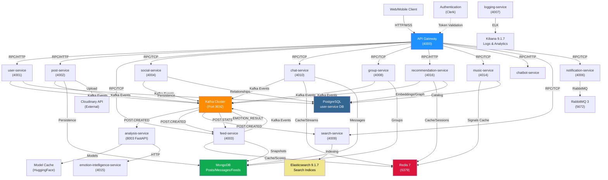
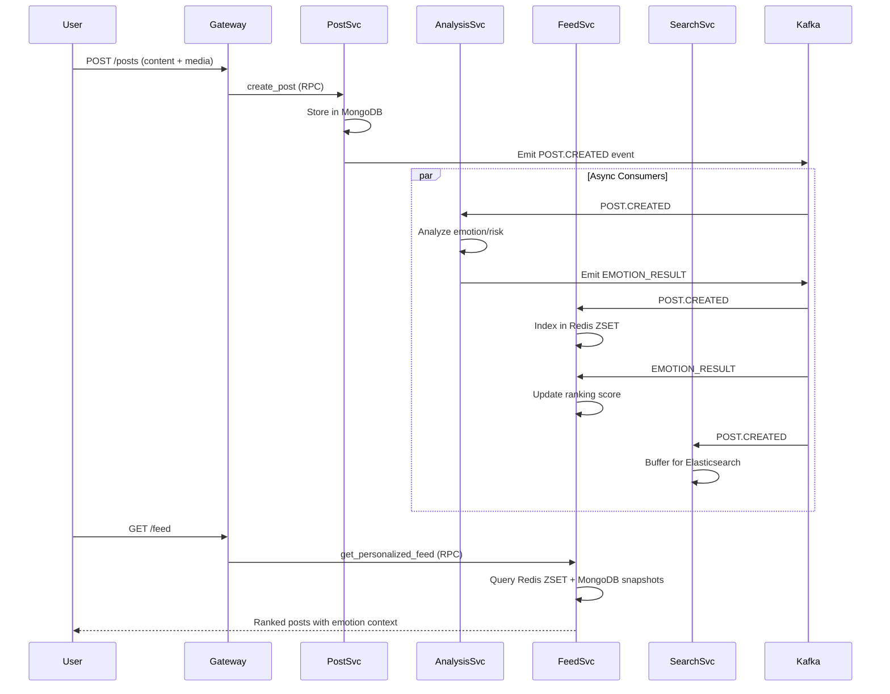
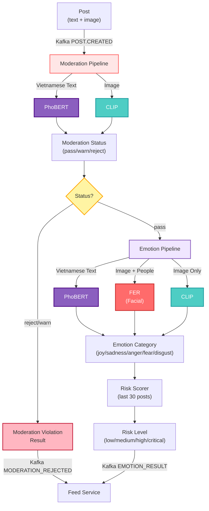

# SE121 Microservices Platform Architecture

**Document Version**: 1.0  
**Last Updated**: May 2026  
**Scope**: Event-driven microservices platform for social media with AI-powered emotion analysis and mental health support

---

## 1. System Overview

### Platform Purpose

SE121 is a **social networking platform with mental health awareness**, featuring:

- Real-time emotion analysis from text (Vietnamese) and images using AI models
- Personalized feed ranking based on emotional state and content safety filtering
- Graph-based social relationships and mutual discovery
- Real-time chat and notifications with outbox-pattern guarantees
- Semantic recommendation engine for meaningful connections
- Music recommendations based on emotional context
- Centralized emotion intelligence powering downstream personalization

### Architectural Style

**Event-Driven Microservices** with:

- **API Gateway** → TCP/HTTP microservices
- **Kafka** for asynchronous event streaming and eventual consistency
- **RabbitMQ** for task queueing and notification broadcasting
- **Redis** for distributed caching, pub/sub, and ranking ZSETs
- **Polyglot persistence**: PostgreSQL (user-service), MongoDB (posts/messages/feeds), Elasticsearch (search), pgvector (recommendation embeddings)
- **Multi-tier ranking** combining engagement signals, emotion context, and graph proximity

### Major Technologies

| Component          | Stack                                                                   |
| ------------------ | ----------------------------------------------------------------------- |
| **API Layer**      | NestJS 11.x (TypeScript), FastAPI (Python)                              |
| **Messaging**      | Kafka 7.6.1, RabbitMQ 3, Redis 7                                        |
| **Databases**      | PostgreSQL, MongoDB, Elasticsearch 9.1.7                                |
| **AI/ML**          | PyTorch, Transformers (PhoBERT), CLIP, FER, Hugging Face embeddings      |
| **Build & Deploy** | Turborepo 2.5.6, Docker Compose, npm workspaces                         |
| **Monitoring**     | ELK Stack (Elasticsearch + Kibana), Structured logging                  |

### Event-Driven Design Philosophy

1. **Service Independence**: Services emit domain events without coupling to consumers
2. **Eventual Consistency**: Async workflows via Kafka ensure system cohesion without synchronous dependencies
3. **Idempotent Processing**: Kafka consumers handle duplicate events gracefully using event journaling
4. **Outbox Pattern**: Critical services (chat-service) use Kafka outbox for guaranteed delivery
5. **Dead Letter Queues**: Failed events are routed to DLX exchanges for observability

---

## 2. High-Level Architecture

### System Diagram



### Gateway and Entry Points

- **API Gateway** (port 4000): HTTP/REST + WebSocket (Socket.io via Redis adapter)
- **Clerk Integration**: JWT-based authentication
- **CORS & Rate Limiting**: Global exception handling + request throttling
- **WebSocket Rooms**: Real-time updates via Redis pub/sub

### Microservices Tier

14 specialized services handling distinct domains:

- **Core**: user-service, post-service, social-service, chat-service, group-service, feed-service
- **AI/ML**: analysis-service, emotion-intelligence-service, chatbot-service, music-service, recommendation-service
- **Infrastructure**: search-service, notification-service, logging-service, media-service

### Message Bus

- **Kafka**: Event streaming with topics per domain (POST, USER, GROUP, etc.)
- **RabbitMQ**: Task queueing for notification delivery with exchanges and DLX

### Caching and Search

- **Redis**: ZSET-based ranking (trending scores), session state, emotion affinity, query caching
- **Elasticsearch**: Full-text search indices for posts, users, groups with bulk buffering

---

## 3. Service Landscape

| Service                          | Responsibility                                  | Transports       | Primary Storage   | Key Dependencies                            |
| -------------------------------- | ----------------------------------------------- | ---------------- | ----------------- | ------------------------------------------- |
| **api-gateway**                  | HTTP/WebSocket gateway, auth, routing           | HTTP, WebSocket  | —                 | Clerk, Redis (Socket.io adapter)            |
| **user-service**                 | Profile CRUD, admin management                  | TCP, Redis       | PostgreSQL        | —                                           |
| **post-service**                 | Post lifecycle, reactions, comments             | HTTP, TCP, Kafka | MongoDB           | Cloudinary, media-service                   |
| **feed-service**                 | Feed ranking, trending, emotion-aware filtering | TCP, Kafka       | MongoDB, Redis    | analysis-service, post-service              |
| **social-service**               | Social graph, friend/follower relationships     | TCP              | PostgreSQL        | —                                           |
| **chat-service**                 | 1-on-1 messaging with outbox pattern            | TCP, Kafka       | MongoDB           | —                                           |
| **group-service**                | Group/community management                      | TCP, Kafka       | MongoDB           | —                                           |
| **search-service**               | Full-text search indexing                       | TCP, Kafka       | Elasticsearch     | —                                           |
| **media-service**                | Media upload, webhook ingestion, cleanup        | HTTP, TCP, Kafka | PostgreSQL        | Cloudinary                                  |
| **notification-service**         | Push notifications, delivery                    | TCP, RabbitMQ    | RabbitMQ          | —                                           |
| **logging-service**              | Centralized log aggregation                     | HTTP, Kafka      | Elasticsearch     | —                                           |
| **analysis-service**             | AI emotion analysis (text + images)             | HTTP, TCP, Kafka | MongoDB, Redis    | HuggingFace models, PyTorch                 |
| **emotion-intelligence-service** | Emotion profiling, risk scoring                 | TCP              | PostgreSQL        | —                                           |
| **recommendation-service**       | Semantic recommendations, discovery             | HTTP, Kafka      | PostgreSQL, Redis | Hugging Face embeddings, pgvector           |
| **chatbot-service**              | Conversational AI responses                     | HTTP, TCP        | —                 | LLM APIs, analysis-service                  |
| **music-service**                | Music catalog, emotion-based recommendations    | TCP              | PostgreSQL, Redis | music-service, emotion-intelligence-service |

---

## 4. Communication Architecture

### Synchronous Communication (Request-Response)

**TCP Microservices Transport**:

```
Gateway → Service A (MessagePattern 'method_name') → Response
Gateway → Service B (MessagePattern 'method_name') → Response
Service A → Service B (TCP ClientProxy) → RPC Call
```

**Examples**:

- `gateway → user-service`: `get_user`, `update_profile`
- `feed-service → analysis-service`: `get_emotion_profile`
- `music-service → emotion-intelligence-service`: `get_user_emotions`

**HTTP APIs** (Hybrid services):

- `POST /webhook/cloudinary` in media-service
- `POST /recommend/query` in recommendation-service
- `POST /analyze` in analysis-service

### Asynchronous Communication (Event-Driven)

**Kafka Topics & Event Types**:

| Topic              | Source           | Consumers                                      | Event Types                      |
| ------------------ | ---------------- | ---------------------------------------------- | -------------------------------- |
| `POST`             | post-service     | feed-service, search-service, analysis-service | CREATED, UPDATED, REMOVED, STATS |
| `USER`             | user-service     | media-service, search-service                  | CREATED, UPDATED                 |
| `GROUP`            | group-service    | search-service                                 | CREATED, UPDATED, REMOVED        |
| `EMOTION_RESULT`   | analysis-service | feed-service                                   | COMPLETED                        |
| `MESSAGE`          | chat-service     | (outbox pattern)                               | CREATED                          |
| `RECOMMENDATION_*` | social-service   | recommendation-service                         | PROFILE, GRAPH, EMOTION events   |

**Guaranteed Delivery Pattern** (chat-service):

```
1. Business Logic → Message to Outbox Table (same transaction)
2. Kafka Event Producer reads Outbox
3. Publishes to Kafka
4. Consumer confirms → Mark as published
5. DLX handles failures
```

### RabbitMQ for Notifications

```
notification-service (RPC) ← Gateway
    ↓
RabbitMQ Exchange (notifications, broadcast)
    ↓
Queue (user-preference-aware delivery)
    ↓
External Services (Firebase, SMS, Email)
```

---

## 5. Core System Flows

### Post Lifecycle Flow



### Feed Generation Algorithm

```
Personalized Feed Scoring:
├─ Affinity Score (user's historical engagement with emotion types)
│  └─ Retrieved from Redis ZSET (30-day TTL)
├─ EmotionalState Factor (user's current emotion baseline)
│  └─ Retrieved from emotion-intelligence-service
├─ Freshness Score (exponential decay, 10-minute intervals)
│  └─ Cached in Redis ZSETs
├─ Content Safety Filter (for high-risk users)
│  └─ If riskScore > 0.7: boost positive × 2.5, suppress negative × 0.3
└─ Diversity Penalty (avoid repetitive content types)

Final Score = Affinity × EmotionalState × Freshness × SafetyMultiplier × Diversity

Trending Feed:
├─ Engagement Score (likes + 3×comments + 4×shares)
├─ Freshness Decay
├─ EmotionBoost (high-emotion content gets visibility boost)
└─ Quality Factor (post length, media, verified author)
```

### Analysis Pipeline



### Recommendation Query Flow

```
User Request: GET /recommend/query?viewerId=U123&limit=20
    ↓
1. Check Redis Query Cache (45s TTL)
    ├─ Hit → Return cached result
    ├─ Miss → Continue to 2

2. Semantic Retrieval (pgvector ANN)
    ├─ Get viewer profile embedding (cache 5000 embeddings)
    ├─ Query top-K similar profiles from PostgreSQL

3. Graph Filtering
    ├─ Exclude: viewer, blocked users, existing friends
    ├─ Boost: mutual friends (up to 10), common groups (up to 5)

4. Multi-factor Ranking
    ├─ Model Weight: 0.7 (semantic similarity)
    ├─ Retrieval Weight: 0.3 (pgvector score)
    ├─ Graph Weight: 0.15 (proximity features)
    ├─ Emotion Weight: 0.1 (emotional affinity)

5. Reranking (Top-25 candidates)
    ├─ Hugging Face embedding model
    ├─ Cross-encoder scoring

6. Pagination (Session-based)
    ├─ Store candidate window in Redis session (120s TTL)
    ├─ Return cursor for next page

7. Cache Result in Redis
    ├─ Key: recommendation:query-cache:{viewerId}:{limit}:{hash(filters)}
    └─ TTL: 45s
```

### Notification Propagation

```
1. Event Trigger
   ├─ post_commented (comment-service RPC)
   ├─ message_received (chat-service Kafka)
   ├─ friend_request_accepted (social-service Kafka)

2. Gateway/Service → notification-service (RPC)
   ├─ NotificationPayload (userId, type, metadata)

3. notification-service → RabbitMQ
   ├─ Publish to `notifications` exchange
   ├─ Route to user's queue (if user_preferences allow)

4. Consumer (Firebase, SMS, Email)
   ├─ Deliver notification
   ├─ Retry on failure (DLX)
   ├─ Store in RabbitMQ persistent queue

5. Observability
   ├─ logging-service ingests via Kafka
   └─ Kibana shows delivery status
```

---

## 6. Data Architecture

### PostgreSQL Domains

| Database                       | Service                      | Key Tables                                                                    | Pattern                                        |
| ------------------------------ | ---------------------------- | ----------------------------------------------------------------------------- | ---------------------------------------------- |
| `user_service`                 | user-service                 | users, profiles, admin_users                                                  | User profiles, identity                        |
| `recommendation_service`       | recommendation-service       | profile_embeddings, profile_events, pair_features, global_fallback_candidates | Embedding vectors (pgvector HNSW), graph state |
| `music_service`                | music-service                | music_features, music_tracks, user_playlists                                  | Music metadata, valence/arousal features       |
| `media_service`                | media-service                | media, orphan_tracking                                                        | Media metadata, cleanup state                  |
| `emotion_intelligence_service` | emotion-intelligence-service | emotion_profiles, risk_assessments, emotion_history                           | User emotional baselines, risk scores          |

**Key Indices**:

- `profile_embeddings.embedding_vector` (pgvector HNSW) for ANN search
- `music_features(valence, arousal)` for emotional clustering
- `emotion_profiles(user_id, created_at)` for temporal queries

### MongoDB Collections

| Database           | Service          | Collections                        | Use Case             |
| ------------------ | ---------------- | ---------------------------------- | -------------------- |
| `post_service`     | post-service     | posts, comments, reactions, shares | Content lifecycle    |
| `feed_service`     | feed-service     | feed_snapshots, trending_posts     | Feed state caching   |
| `chat_service`     | chat-service     | messages, conversations, outbox    | 1-on-1 messaging     |
| `group_service`    | group-service    | groups, members, group_posts       | Community management |
| `analysis_service` | analysis-service | emotion_history, analysis_results  | Model output storage |

**TTLs & Indexes**:

- `emotion_history` (90-day TTL on `created_at`)
- `feed_snapshots` (7-day TTL)
- `outbox` (30-day TTL) for failed message recovery

**Queries** (Cypher):

```cypher
-- Mutual friends count
MATCH (a:User {userId: $viewer})-[:FRIEND_WITH]-(mutual:User)-[:FRIEND_WITH]-(b:User {userId: $target})
RETURN count(DISTINCT mutual)

-- Graph proximity for ranking
MATCH path = (a:User {userId: $viewer})-[*1..3]-(b:User {userId: $candidate})
WHERE NOT (a)-[:BLOCKS]-(b)
RETURN CASE length(path) WHEN 1 THEN 10 WHEN 2 THEN 5 WHEN 3 THEN 2 END AS score
```

### Redis Cache Strategies

| Key Pattern                                    | Type | TTL         | Use Case                                      |
| ---------------------------------------------- | ---- | ----------- | --------------------------------------------- |
| `user:{userId}:emotion:affinity`               | ZSET | 30 days     | Historical engagement with emotion types      |
| `post:score`                                   | ZSET | 30 days     | Trending post scores (Engagement × Freshness) |
| `post:meta:{postId}`                           | HASH | 7 days      | Post metadata (counts, emotion label)         |
| `feed:{userId}:personal`                       | ZSET | 1 hour      | Personalized feed cache                       |
| `recommendation:query-cache:{viewerId}:{hash}` | JSON | 45 seconds  | Query result cache                            |
| `recommendation:session:{sessionId}`           | JSON | 120 seconds | Pagination session state                      |
| `emotion:profile:{userId}`                     | HASH | 24 hours    | Emotion baseline (valence, arousal, risk)     |
| `music:emotion-signals:{userId}`               | HASH | 15 minutes  | User emotion signals for music ranking        |

### Elasticsearch Indices

| Index    | Documents          | Mapping                                                       | Analyzer             |
| -------- | ------------------ | ------------------------------------------------------------- | -------------------- |
| `posts`  | Posts with content | `text` (analyzed), `userId`, `groupId`, `createdAt` (keyword) | Vietnamese tokenizer |
| `users`  | User profiles      | `username`, `bio`, `createdAt`                                | Standard             |
| `groups` | Groups             | `name`, `description`, `memberCount`                          | Standard             |

**Bulk Flush Strategy**:

- Buffer in-memory (500 doc limit per index)
- Auto-flush every 5 seconds via @Cron scheduler
- Bulk API for efficiency

---

## 7. Deployment Architecture

### Docker Compose Topology

```yaml
Services:
├─ zookeeper (Kafka orchestration)
├─ kafka (9092 external, 9093 internal)
├─ kafka-ui (port 8080, dev only)
├─ redis (6379)
├─ rabbitmq (5672 + 15672 management UI)
├─ elasticsearch (9200)
├─ kibana (5601)

Networks:
└─ app-network (bridge, all services connected)

Volumes:
├─ zookeeper_data, zookeeper_log
├─ kafka_data
├─ redis_data
├─ rabbitmq_data
└─ elastic_data
```

**Local Development Start**:

```bash
docker-compose up -d
npm install && npm run start:dev
```

**Production Considerations**:

- Multi-broker Kafka cluster (replication factor 3)
- PostgreSQL external (managed RDS or self-hosted)
- MongoDB external (MongoDB Atlas or self-hosted)
- Redis Cluster or Sentinel for HA
- Docker Swarm or Kubernetes orchestration

### CI/CD Workflows

Currently scaffolded but not fully enabled in `.github/workflows/`:

- **PR validation**: lint, type-check, test
- **Merge to main**: Build all services
- **Production deployment**: Automated to staging/prod environments

**Recommended Workflow**:

1. Feature branch → PR
2. Turbo cache-aware lint + test + build
3. Docker multi-stage build per service
4. Push to registry (Docker Hub, ECR)
5. Deploy to Kubernetes/Swarm

### Environment Separation

| Environment     | Configuration                                 | Deployment                  |
| --------------- | --------------------------------------------- | --------------------------- |
| **Development** | Docker Compose locally, `.env` files          | `npm run start:dev`         |
| **Staging**     | Kubernetes, external databases, `staging.env` | GitOps (ArgoCD)             |
| **Production**  | Kubernetes HA, encrypted secrets, `prod.env`  | GitOps with manual approval |

---

## 8. Observability

### Logging Architecture

**Strategy**: Centralized ELK Stack

```
Each Service
    ↓ (JSON logs via Logger)
Kafka (logging-service topic)
    ↓
Elasticsearch (indexed)
    ↓
Kibana UI (dashboards, alerts)
```

**Log Levels**:

- `error`: Failures, exceptions, data inconsistencies
- `warn`: Degraded mode, retries, fallbacks
- `info`: Request start/end, event processing, major state changes
- `debug`: Cache hits/misses, detailed method traces (dev only)

**Structured Logging**:

```json
{
  "timestamp": "2026-05-13T10:30:00Z",
  "service": "post-service",
  "level": "info",
  "message": "Post created",
  "userId": "U123",
  "postId": "P456",
  "emotion": "joy",
  "duration_ms": 250
}
```

### Metrics & Monitoring

**Application Metrics** (Inferred from architecture):

- Kafka consumer lag per topic
- Redis command latency (SET, ZRANGE, HGET)
- PostgreSQL query execution time (via slow query log)
- Elasticsearch bulk flush duration
- HTTP endpoint latency (Gateway)
- TCP RPC message latency (microservices)
- Model inference latency (analysis-service, recommendation-service)

**Infrastructure Metrics**:

- CPU, memory per service
- Disk I/O (Elasticsearch, database)
- Network throughput (Kafka, Redis)
- Database connection pool utilization

**Recommended Stack**:

- **Prometheus**: Scrape `/metrics` endpoints (add via NestJS interceptor)
- **Grafana**: Dashboards for latency, throughput, error rates
- **Alerts**: PagerDuty integration for critical thresholds

### Distributed Tracing

**Current State**: Not implemented  
**Recommendation**:

- Add **OpenTelemetry** instrumentation (NestJS, FastAPI)
- Trace context propagation across service boundaries
- **Jaeger** or **Tempo** for trace storage and visualization

---

## 9. Scalability Considerations

### Stateless Service Design

All microservices are **horizontally scalable**:

- No in-process state (session affinity not required)
- Shared state in Redis, databases, or Kafka
- Load balancing via Kubernetes Service or Nginx

**Example**: Run 5 instances of feed-service behind a load balancer

- Each instance independently queries PostgreSQL, MongoDB, Redis
- No sticky sessions or inter-replica coordination needed

### Kafka Scalability

| Challenge         | Mitigation                                                       |
| ----------------- | ---------------------------------------------------------------- |
| High event volume | Partition topics by `userId` or `postId` for parallel processing |
| Consumer lag      | Auto-scale consumers; monitor lag in Kafka UI                    |
| Message retention | Set topic retention to 7 days; archive to S3 if needed           |
| Broker failures   | Replication factor 3; leader election via quorum                 |

**Partitioning Strategy**:

- `POST` topic: 12 partitions (posts are independent)
- `USER` topic: 8 partitions (user events are independent)
- `EMOTION_RESULT` topic: 12 partitions (emotion analysis is parallelizable)

### Redis Considerations

| Concern                 | Mitigation                                                                     |
| ----------------------- | ------------------------------------------------------------------------------ |
| Memory pressure         | Implement ZSET eviction policy (`allkeys-lru`); monitor Redis INFO memory      |
| Connection limit        | Use connection pooling (NestJS Redis module); max 10K connections per instance |
| Single point of failure | Deploy Redis Cluster (3+ master nodes) or Sentinel (3+ sentinels)              |
| Slow commands           | Use ZRANGEBYSCORE with LIMIT instead of ZRANGE on large sets                   |

**ZSET Optimization**:

```
Instead of: ZRANGE post:score 0 -1 (all elements)
Use:        ZRANGE post:score 0 99 BYSCORE (top 100 by score)
```

### Database Scaling

**PostgreSQL**:

- Read replicas for feed-service and recommendation-service queries
- Write pool to primary for mutations
- Connection pooling (PgBouncer or Hikari)

**MongoDB**:

- Replica set (3 nodes) for HA
- Sharding by `postId` or `userId` for horizontal scaling
- Atlas auto-scaling if cloud-based

### Worker Scaling

- **analysis-service**: Batch inference; GPU if available
- **notification-service**: RabbitMQ consumers (auto-scale based on queue depth)
- **logging-service**: Elasticsearch ingest pipeline; auto-scale based on event rate

### Caching Strategy

1. **L1 Cache** (Application): Redis in-memory (45s TTL for queries)
2. **L2 Cache** (Database): PostgreSQL query cache (via materialized views)
3. **L3 Cache** (CDN): Cloudinary for media (implicit via CDN URLs)

**Cache Invalidation**:

- Kafka event consumer invalidates Redis keys
- Example: POST.UPDATED event → delete `post:meta:{postId}`

---

## 10. Architectural Decisions & Trade-offs

### Why Event-Driven over Orchestration?

**Decision**: Kafka-based async workflows over centralized orchestrator

**Rationale**:

- ✅ Loose coupling: Services don't know each other
- ✅ Natural scalability: Consumers scale independently
- ✅ Auditability: Event log is immutable history
- ❌ Trade-off: Eventual consistency (not strong ACID)
- ❌ Trade-off: Harder to trace complex flows (mitigate with distributed tracing)

### Why Multiple Databases?

**Decision**: PostgreSQL (user), MongoDB (posts), Elasticsearch (search)

**Rationale**:

- ✅ Optimized for access patterns (transactions, documents, relationships, full-text)
- ✅ Right tool per domain
- ❌ Trade-off: Operational complexity
- ❌ Trade-off: Distributed transactions require saga pattern

### Why Emotion-Aware Ranking?

**Decision**: Personalized feed integrates emotional state and content safety

**Rationale**:

- ✅ Core differentiator: Mental health support
- ✅ Content safety for at-risk users (riskScore-based filtering)
- ❌ Trade-off: Extra latency (emotion analysis ~500-850ms)
- ❌ Trade-off: Model complexity and infrastructure cost

### Why Semantic Recommendations?

**Decision**: Hugging Face embeddings + graph-aware ranking vs. collaborative filtering

**Rationale**:

- ✅ Cold-start problem solved (works for new users)
- ✅ Interpretable (graph proximity, emotion affinity explicitly weighted)
- ✅ Scales with semantic similarity (pgvector ANN)
- ❌ Trade-off: GPU/model infrastructure required
- ❌ Trade-off: Embedding model updates require recomputation

---

## 11. Operational Runbook Sketches

### Service Health Checks

```bash
# API Gateway
curl http://localhost:4000/health

# Individual services (tcp-only have no HTTP health)
curl http://localhost:4002/health        # post-service
curl http://localhost:4016/ready         # recommendation-service

# Kafka
docker exec kafka kafka-topics.sh --bootstrap-server localhost:9092 --list

# Redis
redis-cli PING

# Elasticsearch
curl http://localhost:9200/_cluster/health
```

### Kafka Topic Inspection

```bash
# Create test topic
docker exec kafka kafka-topics.sh \
  --bootstrap-server localhost:9092 \
  --create --topic test.events \
  --partitions 3 --replication-factor 1

# List consumer groups
docker exec kafka kafka-consumer-groups.sh \
  --bootstrap-server localhost:9092 \
  --list

# Check consumer lag
docker exec kafka kafka-consumer-groups.sh \
  --bootstrap-server localhost:9092 \
  --group feed-service-group \
  --describe
```

### Debugging Service Communication

```bash
# Tail logs for specific service
docker logs -f post-service

# Check Kibana for structured logs
# Go to http://localhost:5601 → Discover → search service:"post-service"

# Trace RPC calls
# Enable debug logging in NestJS app.module.ts and watch TCP packet flow
# tcpdump -i docker0 port 4002
```

---

## 12. Future Enhancements

1. **GraphQL API Layer**: Unified query interface over microservices
2. **OpenTelemetry + Jaeger**: Distributed tracing for observability
3. **Feature Flags**: Gradual rollout of ranking changes
4. **A/B Testing Framework**: Experimentation on feed algorithms
5. **Rate Limiting per User**: Token bucket algorithm in API Gateway
6. **Database Read Replicas**: Dedicated read pool for analytics queries
7. **ML Pipelines**: Continuous model retraining and evaluation
8. **Chaos Engineering**: Resilience testing with Gremlin or Chaos Mesh

---

## 13. Quick Reference

### Service Ports

| Service                      | Port | Protocol           |
| ---------------------------- | ---- | ------------------ |
| API Gateway                  | 4000 | HTTP/WSS           |
| user-service                 | 4001 | TCP                |
| post-service                 | 4002 | HTTP/TCP/Kafka     |
| feed-service                 | 4003 | TCP/Kafka          |
| social-service               | 4004 | TCP                |
| media-service                | 4005 | HTTP/TCP/Kafka     |
| notification-service         | 4006 | TCP                |
| logging-service              | 4007 | HTTP/Kafka         |
| group-service                | 4008 | TCP/Kafka          |
| search-service               | 4009 | TCP/Kafka          |
| chat-service                 | 4010 | TCP/Kafka          |
| emotion-intelligence-service | 4015 | TCP                |
| recommendation-service       | 4016 | HTTP/Kafka         |
| music-service                | 4014 | TCP                |
| chatbot-service              | 4013 | HTTP/TCP           |
| analysis-service             | 8003 | HTTP/FastAPI/Kafka |

### Key Environment Variables

```bash
# Gateway
GATEWAY_PORT=4000
CLERK_SECRET_KEY=sk_...

# Services
PORT=4001                           # Service-specific TCP port
KAFKA_BROKERS=localhost:9092
KAFKA_CLIENT_ID=service-name
KAFKA_GROUP_ID=service-name-group

# Databases
DATABASE_URL=postgresql://...
MONGO_URI=mongodb://...

# Cache & Search
REDIS_HOST=localhost
REDIS_PORT=6379
ES_NODE=http://localhost:9200

# External APIs
CLOUDINARY_NAME=...
CLERK_SECRET_KEY=...
```

### Build & Development Commands

```bash
# Install and build all services (monorepo)
npm install
npm run build

# Dev with Turbo (parallel services)
npm run start:dev

# Lint and type check
npm run lint
npm run check-types

# Format code
npm run format

# Start single service
cd apps/post-service
npm run start:dev

# Run tests
npx turbo test

# Start Docker infra
docker-compose up -d
docker-compose down
```

---

**Document Prepared For**: Technical Portfolio, Engineering Interviews, Architectural Reviews  
**Audience**: Backend engineers, system architects, technical recruiters, engineering teams

---

_For detailed service documentation, see individual service README files in `apps/{service}/README.md`_
