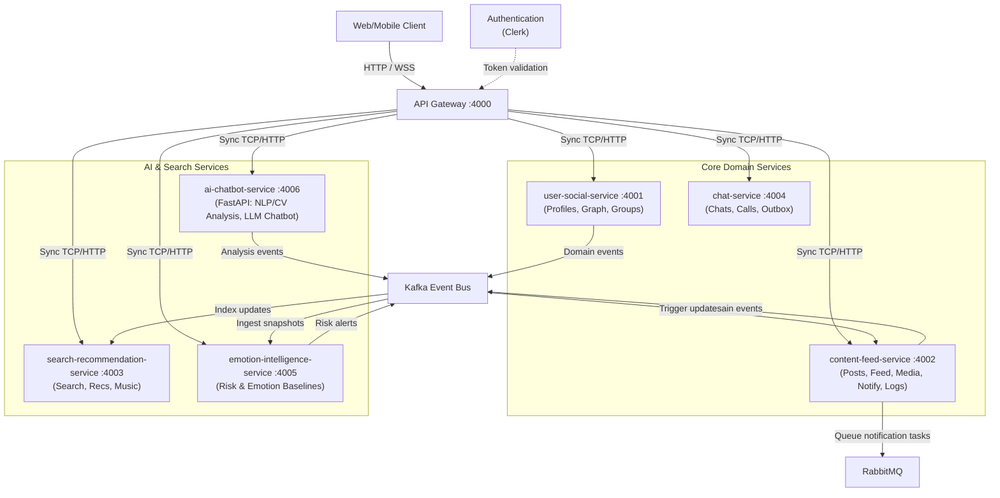

# SE121 Microservices Platform Architecture

**Document Version**: 2.0  
**Last Updated**: August 2026  
**Scope**: Consolidated event-driven microservices platform for social media with AI-powered emotion analysis and mental health support.

---

## 1. System Overview

### Platform Purpose

SE121 is a **social networking platform with mental health awareness**, featuring:

- Real-time emotion analysis from text (Vietnamese) and images using AI models.
- Personalized feed ranking based on emotional state and content safety filtering.
- Graph-based social relationships and mutual discovery.
- Real-time chat and notifications with outbox-pattern guarantees.
- Semantic recommendation engine for meaningful connections.
- Music recommendations based on emotional context.
- Centralized emotion intelligence powering downstream personalization.

### Architectural Style

**Event-Driven Microservices** with:

- **API Gateway** → TCP/HTTP microservices.
- **Kafka** for asynchronous event streaming and eventual consistency.
- **RabbitMQ** for task queueing and notification broadcasting.
- **Redis** for distributed caching, pub/sub, and ranking ZSETs.
- **Polyglot persistence**: PostgreSQL (user-social profiles & relations, recommendation embeddings, music), MongoDB (posts, chats, emotion intelligence snapshots), Elasticsearch (search & assistant RAG).

---

## 2. High-Level Architecture

### System Diagram

### Gateway and Entry Points

- **API Gateway** (port 4000): HTTP/REST + WebSocket (Socket.io via Redis adapter).
- **Clerk Integration**: JWT-based authentication.
- **WebSocket Rooms**: Real-time chat & presence updates via Redis pub/sub.

---

## 3. Service Landscape

The platform is consolidated into 7 core services:

| Service | Port | Responsibility | Transports | Primary Storage | Key Dependencies |
| --- | --- | --- | --- | --- | --- |
| **api-gateway** | 4000 | Entry point, auth verification, WebSocket namespace routing | HTTP, WebSocket | — | Clerk, Redis (Socket.io adapter) |
| **user-social-service** | 4001 | User profiles, social relation graph, and community groups | TCP | PostgreSQL (Drizzle) | Clerk |
| **content-feed-service** | 4002 | Posts, comments, reactions, feed ranking, media processing, and notifications | TCP, Kafka | MongoDB, Redis | Cloudinary, RabbitMQ |
| **search-recommendation-service** | 4003 | Elasticsearch indexing, pgvector semantic recommendation, and music recommendations | TCP, Kafka | Elasticsearch, PostgreSQL, Redis | pgvector, Elasticsearch |
| **chat-service** | 4004 | 1-on-1 & group messaging, presence, outbox delivery, and calls | TCP, Kafka | MongoDB, Redis | user-social-service |
| **emotion-intelligence-service** | 4005 | Ingests emotion snapshots, computes baselines, flags risks, triggers advice | TCP, Kafka | MongoDB, Redis | Groq API |
| **ai-chatbot-service** | 4006 | FastAPI-based AI analysis (PhoBERT/CLIP/FER) & LLM RAG chatbot assistant | HTTP, Kafka | Elasticsearch, MongoDB | PyTorch, Transformers, Groq |

---

## 4. Communication Architecture

### Synchronous Communication (Request-Response)

All internal Node-to-Node microservice communication happens via **TCP client proxies** (ports 4001 - 4005), while the Python AI backend uses **HTTP** (port 4006).

**Examples**:
- `gateway → user-social-service`: `createUser`, `updateUser`
- `content-feed-service → ai-chatbot-service`: `POST /analyze` (synchronous text/image moderation/emotion parsing)
- `search-recommendation-service → user-social-service`: `getProfileRecommendationCandidates`

### Asynchronous Communication (Event-Driven)

Kafka acts as the main event streaming spine, enabling decoupled data sync:
- `user-events` (emitted by `user-social-service`)
- `post-events` (emitted by `content-feed-service`)
- `emotion-result-events` (emitted by `ai-chatbot-service` or processed by `emotion-intelligence-service`)
- `recommendation-graph-events` (emitted to update graph models)

---

## 5. Core System Flows

### Post Lifecycle & Analysis Pipeline

1. **Post Creation**: Client uploads media & submits post to `api-gateway` which proxies to `content-feed-service` (TCP 4002).
2. **Persistence**: `content-feed-service` saves the draft to MongoDB.
3. **Synchronous/Asynchronous Moderation**: Content is routed to `ai-chatbot-service` (FastAPI 4006) for Vietnamese NLP emotion classification (PhoBERT) and image parsing (CLIP/FER).
4. **Result Propagation**: The emotion result is published to the `EMOTION_RESULT` Kafka topic.
5. **Feed Updates & Risk Alerting**:
   - `content-feed-service` consumes the result to adjust the post's feed scoring.
   - `emotion-intelligence-service` consumes it to update the user's emotional baseline snapshot. If high risk is detected, it triggers warning advice sent via RabbitMQ.
   - `search-recommendation-service` consumes it to update search indexes in Elasticsearch.

---

## 6. Data Architecture

### PostgreSQL Domains
- **user-social-service**: Profiles, social relation graph tables, and community groups.
- **search-recommendation-service**: Vector embedding table (pgvector) and music catalog metadata.

### MongoDB Collections
- **content-feed-service**: Posts, comments, reactions, shares, and feed snapshots.
- **chat-service**: Messages, conversations, and transaction outbox log.
- **emotion-intelligence-service**: Emotion history records and user profile risk records.

### Redis Caches
- **Gateway**: Socket.io adapter states & user presence status.
- **Feed**: Ranked post IDs per user (Redis ZSETs).
- **Search & Rec**: Hot query and candidate cache.

---

## 7. Operational & Quick Reference

### Service Ports

| Service / Tool | Port | Protocol | Type / Purpose |
| --- | --- | --- | --- |
| **api-gateway** | 4000 | HTTP/WSS | NestJS Gateway Entrypoint |
| **user-social-service** | 4001 | TCP | NestJS Profiles, Graph & Groups |
| **content-feed-service** | 4002 | TCP / Kafka | NestJS Content & Feeds |
| **search-recommendation-service** | 4003 | TCP / Kafka | NestJS Search & Recommendations |
| **chat-service** | 4004 | TCP / Kafka | NestJS Real-time Chat & Calling |
| **emotion-intelligence-service** | 4005 | TCP / Kafka | NestJS Emotion Profile Analytics |
| **ai-chatbot-service** | 4006 | HTTP (FastAPI) | Python FastAPI Emotion Analysis & AI Agent |
| **Grafana** | 3000 | HTTP | Observability Dashboards (Metrics/Logs/Traces) |
| **Prometheus** | 9090 | HTTP | Metrics Time-series Collection engine |
| **Loki** | 3100 | HTTP | Log Aggregation engine |
| **Jaeger UI** | 16686 | HTTP | Distributed Tracing UI (OTLP receiver on 4317) |
| **RabbitMQ Management** | 15672 | HTTP | RabbitMQ Dashboard UI |
| **Kafka UI** | 8080 | HTTP | Kafka cluster inspector (Configured) |
| **Kibana** | 5601 | HTTP | Elasticsearch visualization tool (Configured) |

### Observability Setup

The system implements a unified **LGTM** (Loki, Grafana, Tempo/Jaeger, Prometheus) stack:
- **Metrics**: Exposed on `/metrics` (via `PrometheusModule` in NestJS services and standard Prometheus instrumentation in FastAPI) and scraped by Prometheus. Visualized in Grafana.
- **Logs**: Aggregated by Promtail from container runtimes and shipped to Loki, making them queryable in Grafana.
- **Traces**: OpenTelemetry (OTel) instrumentation is configured to collect distributed trace context across service calls and ship them via OTLP (gRPC on port `4317`) to Jaeger.

---

_For detailed service specifications, see individual service README files in `apps/{service}/README.md`_
