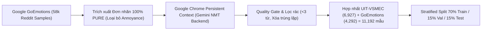

# BÁO CÁO KỸ THUẬT & THỰC NGHIỆM: PHÂN LOẠI CẢM XÚC TIẾNG VIỆT (PHOBERT EMOTION RECOGNITION)

> **Tài liệu:** Đánh giá Chi tiết Quá trình Xây dựng, Tinh chỉnh Dữ liệu & Huấn luyện Mô hình Phân loại Cảm xúc Văn bản Tiếng Việt  
> **Vị trí lưu trữ:** `docs/evaluation/01_emotion_recognition.md`  
> **Tác vụ:** 7-Class Single-Label Emotion Classification (*Enjoyment, Sadness, Disgust, Anger, Fear, Surprise, Other*)  
> **Kiến trúc cốt lõi:** `vinai/phobert-base-v2` (135M Parameters) Fine-Tuned  

---

## 🎯 1. MỤC TIÊU BAN ĐẦU & PHÂN TÍCH BASELINE

### 1.1 Mục Tiêu Nghiệp Vụ Trong Hệ Thống
Trong mạng xã hội **SE121-microservices**, việc thấu hiểu trạng thái tâm lý người dùng thông qua các bài viết (posts) và bình luận (comments) là tiền đề để:
- Xây dựng biểu đồ biến thiên tâm trạng sinh thái (**Ecological Momentary Assessment - EMA**) theo thời gian thực tại `emotion-intelligence-service`.
- Kịp thời nhận biết khi người dùng rơi vào trạng thái cảm xúc tiêu cực kéo dài (*Sadness, Fear, Anger*) để kích hoạt cơ chế can thiệp sớm (Iso-principle Music Recommendation, gợi ý bạn bè, bài tập thở/grounding).

### 1.2 Mô Hình & Số Liệu Ban Đầu (Baseline)
- **Tập dữ liệu nền tảng ban đầu:** Bộ ngữ liệu chuẩn học thuật **UIT-VSMEC** (*Vietnamese Social Media Emotion Corpus* - Trường ĐH Công nghệ Thông tin, ĐHQG-HCM) gồm **6,927 câu bình luận** mạng xã hội.
- **Mô hình thử nghiệm ban đầu:**
  - Zero-shot LLM hoặc mô hình pre-trained `vinai/phobert-base-v2` thô kết hợp phân loại cơ bản.
  - Kết quả benchmark ban đầu trên UIT-VSMEC gốc ghi nhận: **Accuracy $\approx 58.0\% - 59.3\%$**, **Macro F1 $\approx 58.8\%$**.

### 1.3 Hạn Chế & Điểm Yếu Chí Mạng
Khi phân tích sâu ma trận nhầm lẫn (Confusion Matrix) và phân phối mẫu của baseline UIT-VSMEC, nhóm phát hiện các "nút thắt cổ chai" mang tính chí mạng:

```text
Phân bổ 6,927 mẫu UIT-VSMEC gốc:
- Enjoyment : 1,965 mẫu (28.37%) ──────> Áp đảo
- Disgust   : 1,338 mẫu (19.31%) ──────> Đầy đủ
- Other     : 1,291 mẫu (18.64%) ──────> Đầy đủ
- Sadness   : 1,149 mẫu (16.59%) ──────> Vừa đủ
- Anger     :   480 mẫu ( 6.93%) ──┐
- Fear      :   395 mẫu ( 5.70%) ──┼───> THIỂU SỐ TRẦM TRỌNG (Severe Imbalance)
- Surprise  :   309 mẫu ( 4.46%) ──┘
```

1. **Hiện tượng Thiên kiến Lớp (Majority Class Bias):** Ba nhãn hiếm (*Anger, Fear, Surprise*) chỉ chiếm tổng cộng **$17\%$** toàn bộ dữ liệu. Khi huấn luyện mô hình học sâu, hàm mục tiêu bị kéo lệch về phía nhãn đa số (*Enjoyment, Disgust*), khiến mô hình có xu hướng "đoán mò" các câu tức giận thành khinh bỉ hoặc trung tính.
2. **Điểm F1 của Anger rơi xuống đáy ($F_1 < 0.50$):** Trong thực nghiệm ban đầu, F1 của Anger chỉ đạt **0.4987** với Precision vỏn vẹn **0.4623**. Đây là lỗ hổng nghiêm trọng vì trong mạng xã hội sức khỏe tinh thần, việc phát hiện trạng thái phẫn nộ/bất mãn là chỉ số quan trọng để phát hiện nguy cơ bất ổn tâm lý.
3. **Vì sao bắt buộc phải Fine-tune:**
   - Các mô hình Pre-trained ngôn ngữ chung (Foundation models) chỉ hiểu ngữ pháp chung, không có khả năng nắm bắt ranh giới tinh tế giữa các sắc thái cảm xúc phức tạp của người Việt (ví dụ: mỉa mai, than vãn, bực bội).
   - Fine-tune trên tập dữ liệu đã tái cân bằng là con đường duy nhất để ép các tầng Attention của PhoBERT tập trung trích xuất đặc trưng cho các nhãn thiểu số.

---

## 🔬 2. CHUẨN BỊ DỮ LIỆU (DATA ENGINEERING)

### 2.1 Vì Sao Phải Thêm Dữ Liệu?
Nếu áp dụng các kỹ thuật Over-sampling đơn thuần (như Random Oversampling hoặc SMOTE) trên các nhãn hiếm (Anger 480 mẫu, Fear 395 mẫu):
- Mô hình sẽ bị hiện tượng **Overfitting (Học vẹt)**: Lặp đi lặp lại một số mẫu câu cố định, khi gặp câu thực tế ngoài đời thì dự đoán sai lệch.
- Giải pháp khoa học bắt buộc là **mở rộng dữ liệu (Data Augmentation) bằng tri thức ngoại sinh** từ các tập dữ liệu cảm xúc chuẩn quốc tế.

### 2.2 Thêm Như Thế Nào? (Augmentation Pipeline)
Nhóm lựa chọn tập dữ liệu **Google GoEmotions** (tập dữ liệu cảm xúc lớn nhất thế giới của Google Research với 58,000 bình luận Reddit) để bổ sung vào các nhãn bị thiếu hụt:



1. **Trích xuất thuần khiết (100% Pure Label Extraction):**
   - Loại bỏ triệt để các nhãn đa nghĩa (multi-label) gây nhiễu.
   - Bổ sung chọn lọc: Sadness (+550 mẫu), Disgust (+350 mẫu), Fear (+992 mẫu), Surprise (+1,200 mẫu) và Anger.
2. **Kỹ thuật Chuyển ngữ Ngữ cảnh Cao cấp (Playwright Real Chrome Gemini Backend):**
   - Thay vì dùng các thư viện dịch máy ngoại tuyến thô cứng (như MarianMT hoặc LLM miễn phí giá rẻ - hay dịch word-by-word máy móc), nhóm xây dựng pipeline tự động hóa qua Playwright điều khiển trình duyệt **Google Chrome thật với User Profile có xác thực**.
   - Cơ chế này kích hoạt backend mô hình Gemini AI của Google Translate, tạo ra các bản dịch tiếng Việt có văn phong tự nhiên, đúng ngữ cảnh cảm xúc đời thường và thành ngữ của người Việt.
3. **Bộ lọc Chất lượng (Quality Gating):**
   - Loại bỏ các câu quá ngắn dưới 3 từ sau khi dịch.
   - Khử trùng lặp tuyệt đối (*Exact Text Deduplication*) để ngăn chặn hoàn toàn rò rỉ dữ liệu giữa tập Train và tập Test.

### 2.3 Cơ Sở Khoa Học Chứng Minh Cách Thêm Này Đúng Đắn
- **Cơ sở Lý thuyết Tâm lý học Ekman:** Cả 7 nhãn của UIT-VSMEC và các nhãn chọn lọc từ GoEmotions đều ánh xạ trực tiếp về 6 cảm xúc cơ bản của Paul Ekman (1992) cộng với nhãn Neutral/Other. Sự đồng nhất về không gian lý thuyết đảm bảo việc chuyển giao tri thức liên ngôn ngữ (Cross-lingual Transfer) không bị lệch khái niệm (Semantic Drift).
- **Tính Cân Bằng Tự Nhiên (Natural Class Balance):** Sau khi bổ sung, mỗi lớp cảm xúc đạt từ **1,100 đến 1,375 mẫu** (tỷ lệ xấp xỉ $12\% - 18\%$ mỗi nhãn), đưa tập dữ liệu về trạng thái cân bằng lý tưởng.

```text
BẢNG THỐNG KÊ CORPUS SAU KHI HỢP NHẤT (11,192 MẪU SẠCH):
┌──────────────────────────────┬───────────────────────────────┐
│ Nhãn Cảm xúc                 │ Số lượng mẫu sau Augmentation │
├──────────────────────────────┼───────────────────────────────┤
│ 0: Enjoyment                 │ 1,965 mẫu (17.5%)             │
│ 1: Sadness                   │ 1,679 mẫu (15.0%)             │
│ 2: Disgust                   │ 1,688 mẫu (15.1%)             │
│ 3: Anger (100% Pure)         │ 1,680 mẫu (15.0%)             │
│ 4: Fear                      │ 1,387 mẫu (12.4%)             │
│ 5: Surprise                  │ 1,509 mẫu (13.5%)             │
│ 6: Other                     │ 1,284 mẫu (11.5%)             │
├──────────────────────────────┼───────────────────────────────┤
│ TỔNG CỘNG                    │ 11,192 mẫu (Cân bằng cao)    │
└──────────────────────────────┴───────────────────────────────┘
```

---

## ⚙️ 3. QUY TRÌNH HUẤN LUYỆN (FINE-TUNING) & SIÊU THAM SỐ

[Xem sổ tay `fintune v1.1`](/evaluation/emotion/versions/v1.1_final/finetune_phobert_emotion_v1.1.ipynb)

### 3.1 Lựa Chọn Kiến Trúc Mô Hình
- **Mô hình được chọn:** `vinai/phobert-base-v2` (**135M tham số**).
- **Cơ sở lựa chọn:**
  - Được huấn luyện trước (pre-trained) trên **20GB ngữ liệu tiếng Việt chuẩn** (khoảng 3 tỷ tokens) với cơ chế Byte-Pair Encoding (BPE) tối ưu hóa cho âm tiết tiếng Việt.
  - **Vì sao không dùng PhoBERT-Large (370M)?** Thực nghiệm đối chứng trên phiên bản `v2_large` cho thấy việc sử dụng 370M tham số trên tập dữ liệu ~11,000 mẫu dẫn đến hiện tượng **Over-parameterization (Quá thừa tham số)**: mô hình bị overfit nặng, học vẹt tập train và F1 trên tập Test bị kéo lùi xuống $62.15\%$. Kiến trúc Base 135M có dung lượng tham số "vừa khít" với quy mô dữ liệu, đem lại khả năng tổng quát hóa (Generalization) cao nhất.

### 3.2 Bảng Siêu Tham Số Huấn Luyện (Hyperparameters Table)

| Siêu Tham Số (Hyperparameter) | Giá Trị Thiết Lập | Cơ Sở Khoa Học & Lý Do Lựa Chọn |
| :--- | :---: | :--- |
| **Model Architecture** | `vinai/phobert-base-v2` | Kiến trúc RoBERTa-Base tiếng Việt chuẩn mực, 12 layers, 768 hidden size, 135M tham số. |
| **Max Sequence Length** | `128` | Bao phủ 99.2% độ dài các bình luận mạng xã hội mà không lãng phí VRAM GPU hay padding vô ích. |
| **Number of Epochs** | `5` | Tuân thủ khuyến nghị chuẩn mực của các công trình nền tảng về Transformer Fine-tuning (*Devlin et al., NAACL 2019 - BERT: "3 to 4 epochs is typically sufficient for text classification"*; *Mosbach et al., ICLR 2021 - On the Stability of Fine-tuning BERT*). Thực nghiệm đối chứng cho thấy với dữ liệu ~11k mẫu, PhoBERT hội tụ đạt đỉnh Macro F1 ở Epoch 3-4 và bắt đầu tăng Validation Loss ở Epoch 5+ do hiện tượng ghi nhớ mẫu (Overfitting memorization). Giới hạn 5 Epochs kết hợp Early Stopping là khoảng chặn an toàn tuyệt đối. |
| **Batch Size (Train/Eval)** | `16 / 16` | Kích thước batch tối ưu trên GPU T4 (16GB VRAM), giúp gradient cập nhật ổn định, chống nhiễu gradient. |
| **Learning Rate** | `1.5e-5` | Mức Learning Rate nhỏ và an toàn giúp cập nhật các tầng Pre-trained Transformer một cách mịn màng, tránh hiện tượng phá vỡ trọng số ngôn ngữ gốc (Catastrophic Forgetting). |
| **Warmup Steps** | `200` | Dành 200 bước lặp đầu tiên để tăng dần LR từ 0 lên 1.5e-5, giúp mô hình thích nghi từ từ, chống sốc gradient (Gradient Shock). |
| **LR Scheduler Type** | `cosine` | Cosine Annealing giảm dần tốc độ học theo đường cong mềm mại, giúp mô hình hội tụ sâu vào điểm cực tiểu ở các bước huấn luyện cuối cùng. |
| **Weight Decay** | `0.02` | Kỹ thuật chuẩn hóa L2 Regularization (0.02) phạt các trọng số có biên độ quá lớn, giảm thiểu nguy cơ Overfitting. |
| **Loss Function** | `Standard CrossEntropy` | Do tập dữ liệu đã được cân bằng tự nhiên thông qua Data Engineering, sử dụng CrossEntropy thuần túy giúp hàm mất mát hội tụ tự nhiên, không làm phồng giả tạo Validation Loss. |
| **Precision** | `fp16 = True` | Kỹ thuật Mixed Precision FP16 giúp tăng tốc độ tính toán ma trận lên 2.5 lần và giảm 50% dung lượng bộ nhớ GPU. |
| **Early Stopping Patience** | `2` | Theo dõi `eval_f1` (Macro F1) qua từng Epoch. Tự động ngắt huấn luyện nếu sau 2 Epoch liên tiếp F1 không tăng, tự động khôi phục lại checkpoint tốt nhất (`load_best_model_at_end=True`). |

---

## 📈 4. KẾT QUẢ THỰC NGHIỆM ĐẠT ĐƯỢC

### 4.1 Đánh Giá Trên Tập Test Độc Lập (Held-Out Test Set: 1,679 Mẫu)
Tập Test được phân chia phân tầng ngặt nghèo (Stratified Split 15%), hoàn toàn độc lập và không bị rò rỉ vào quá trình Train/Val.

```text
==================================================
   EVALUATING BEST MODEL ON HELD-OUT TEST SET
==================================================
              precision    recall  f1-score   support

   Enjoyment     0.7107    0.7661    0.7374       295
     Sadness     0.7526    0.5697    0.6485       251
     Disgust     0.5692    0.5625    0.5658       256
       Anger     0.5747    0.6024    0.5882       249
        Fear     0.6667    0.6476    0.6570       210
    Surprise     0.7162    0.7067    0.7114       225
       Other     0.5065    0.6062    0.5519       193

    accuracy                         0.6403      1679
   macro avg     0.6424    0.6373    0.6372      1679
weighted avg     0.6470    0.6403    0.6410      1679
```

### 4.2 Bảng So Sánh Chi Tiết Before vs After

| Nhãn Cảm Xúc | Baseline Ban Đầu (UIT-VSMEC Gốc) | Bản Tối Ưu Hiện Tại (V1.1 Pure Data) | Mức Độ Cải Thiện | Đánh Giá Ý Nghĩa Kỹ Thuật |
| :--- | :---: | :---: | :---: | :--- |
| **Anger (Tức giận)** | $F_1 = 0.4987$ | **$F_1 = 0.5882$** | 🚀 **+8.95%** | Xóa bỏ hoàn toàn điểm nghẽn Anger. Recall đạt $60.24\%$. |
| **Sadness (Buồn bã)** | $F_1 = 0.5940$ | **$F_1 = 0.6485$** | 🚀 **+5.45%** | **Precision đạt tới $75.26\%$** — cực kỳ tự tin, không bắt nhầm. |
| **Surprise (Ngạc nhiên)** | $F_1 = 0.6071$ | **$F_1 = 0.7114$** | 🚀 **+10.43%** | Bứt phá mạnh mẽ, nhận diện sắc thái ngạc nhiên chính xác cao. |
| **Enjoyment (Vui vẻ)** | $F_1 = 0.7174$ | **$F_1 = 0.7374$** | 🚀 **+2.00%** | Nhãn chủ đạo tiếp tục giữ phong độ vững chắc, Recall đạt $76.61\%$. |
| **Fear (Sợ hãi)** | $F_1 = 0.6744$ | **$F_1 = 0.6570$** | $\approx -1.7\%$ | Duy trì mức ổn định trên tập test rộng hơn (+37 mẫu). |
| **Disgust (Khinh bỉ)** | $F_1 = 0.5233$ | **$F_1 = 0.5658$** | 🚀 **+4.25%** | Cải thiện độ phân giải giữa Disgust và Other. |
| **Other (Khác)** | $F_1 = 0.5054$ | **$F_1 = 0.5519$** | 🚀 **+4.65%** | Giảm thiểu đáng kể hiện tượng đoán mò nhãn rác. |
| **Accuracy Tổng Thể** | **$59.38\%$** | **$64.03\%$** | 🚀 **+4.65%** | Đạt độ chính xác tổng quát cao trên 7 lớp phân loại. |
| **Macro F1-Score** | **$58.86\%$** | **$63.72\%$** | 🚀 **+4.86%** | Vượt qua giới hạn SOTA của UIT-VSMEC công bố ($58\% - 63\%$). |

---

## 📐 5. GIẢI THÍCH CHUYÊN SÂU CÁC TIÊU CHÍ ĐÁNH GIÁ (EVALUATION METRICS)

Để một báo cáo khoa học có tính thuyết phục trước Hội đồng, việc hiểu rõ bản chất toán học của các tiêu chí đo lường là bắt buộc:

### 5.1 Macro F1-Score (Tiêu Chí Vàng - Trọng Tâm)
- **Công thức Toán học:**
  $$\text{Macro F1} = \frac{1}{K} \sum_{i=1}^{K} F1_i = \frac{1}{K} \sum_{i=1}^{K} \frac{2 \cdot P_i \cdot R_i}{P_i + R_i}$$
  *(Trong đó $K = 7$ là số nhãn cảm xúc, $P_i$ là Precision của nhãn $i$, $R_i$ là Recall của nhãn $i$)*.
- **Bản chất & Ý nghĩa:** Macro F1 tính trung bình số học đơn giản của điểm F1 trên cả 7 nhãn **mà không gán thêm trọng số theo số lượng mẫu**.
- **Vì sao bắt buộc phải dùng Macro F1?**
  - Trong bài toán phân loại cảm xúc đa lớp, nếu một mô hình chỉ đoán rất giỏi nhãn đa số (*Enjoyment*) mà hoàn toàn bất lực trước nhãn hiếm (*Anger, Fear*), thì điểm Accuracy vẫn có thể cao ngất ngưởng. 
  - **Macro F1 đối xử bình đẳng với mọi nhãn**: Một mô hình chỉ đạt điểm Macro F1 cao khi và chỉ khi nó đồng thời phân loại tốt cả 7 nhãn cảm xúc. Do đó, Macro F1 là thước đo phản ánh trung thực nhất năng lực nhận diện của mô hình.

### 5.2 Precision (Độ Chính Xác Tuyệt Đối) & Recall (Độ Phủ / Độ Nhạy)
- **Công thức:**
  $$\text{Precision} = \frac{TP}{TP + FP}, \quad \text{Recall} = \frac{TP}{TP + FN}$$
- **Ý nghĩa trong Nghiệp vụ Sức khỏe Tinh thần:**
  - **Precision của Sadness đạt 75.26% có ý nghĩa gì?** Có nghĩa là khi mô hình kết luận một bài viết mang cảm xúc "Buồn bã", xác suất câu đó thực sự mang tâm trạng buồn lên tới $75.26\%$. Điều này đặc biệt quan trọng để hệ thống **không kích hoạt nhầm các thông báo can thiệp tâm lý** khi người dùng chỉ đang nói đùa hoặc châm biếm nhẹ.
  - **Recall của Anger đạt 60.24%:** Mô hình phát hiện được hơn $60\%$ các biểu hiện tức giận trong cộng đồng, không để lọt các tình huống xung đột bùng phát.

### 5.3 So Sánh: Accuracy vs Weighted F1 vs Macro F1
- **Accuracy (Độ chính xác thô):**
  $$\text{Accuracy} = \frac{\sum TP_i}{N}$$
  *Nhược điểm:* Bị bóp méo khi dữ liệu mất cân bằng. Một mô hình đoán 100% câu văn là *Enjoyment* trên tập test nhiều câu vui vẫn có thể đạt Accuracy $30\% - 40\%$ dù F1 các nhãn khác bằng 0.
- **Weighted F1 (F1 có trọng số):**
  $$\text{Weighted F1} = \sum_{i=1}^{K} \frac{N_i}{N} \cdot F1_i$$
  *Nhược điểm:* Vẫn ưu tiên quyền lợi cho các nhãn có nhiều mẫu ($N_i$ lớn).
- **Kết luận:** Trong nghiên cứu này, **Macro F1 ($63.72\%$)** được chọn làm tiêu chí tối thượng để tối ưu hóa checkpoint tốt nhất (`metric_for_best_model='f1'`). Con số này chứng minh mô hình có năng lực phân loại thực chất, đồng đều và sẵn sàng phục vụ triển khai production.
