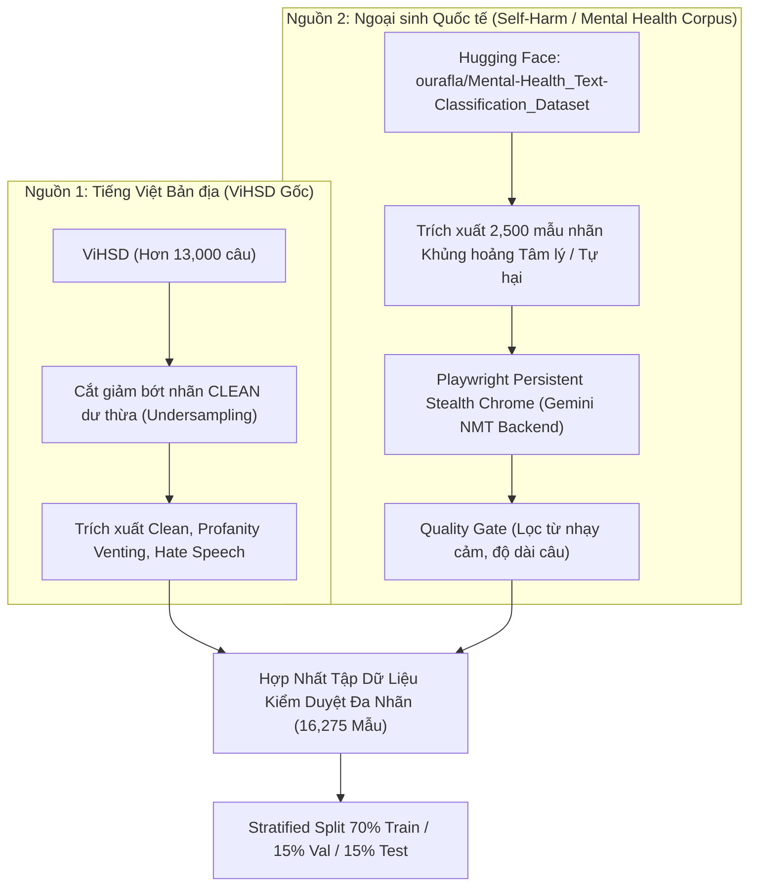

# BÁO CÁO KỸ THUẬT & THỰC NGHIỆM: KIỂM DUYỆT NGỮ CẢNH & PHÁT HIỆN KHỦNG HOẢNG TÂM LÝ (PHOBERT TEXT MODERATION)

> **Tài liệu:** Đánh giá Chi tiết Quá trình Tinh chỉnh Dữ liệu & Huấn luyện Mô hình Kiểm duyệt Ngữ cảnh Đa nhãn  
> **Vị trí lưu trữ:** `docs/evaluation/02_text_moderation.md`  
> **Tác vụ:** Multi-Class Contextual Moderation (*0: CLEAN, 1: PROFANITY_VENTING, 2: HATE_SPEECH, 3: EMOTIONAL_CRISIS*)  
> **Kiến trúc cốt lõi:** `huyleit/phobert-vi-moderation-v1.1` (Dựa trên `vinai/phobert-base-v2` 135M Parameters)  

---

## 🎯 1. MỤC TIÊU BAN ĐẦU & PHÂN TÍCH BASELINE

### 1.1 Mục Tiêu Nghiệp Vụ Trong Hệ Thống Mạng Xã Hội Sức Khỏe Tinh Thần
Các hệ thống kiểm duyệt thông thường trên mạng xã hội chỉ tập trung vào việc **chặn (block)** các từ ngữ tục tĩu hoặc thù ghét. Tuy nhiên, đối với một nền tảng chuyên biệt về **sức khỏe tinh thần (Mental Health Awareness)** như `SE121-microservices`, cách tiếp cận "chặn cứng" như vậy tồn tại 2 vấn đề nghiêm trọng:
1. **Triệt tiêu không gian giải tỏa của người dùng:** Người dùng đang stress hoặc bực bội cần một nơi để "xả" (venting). Nếu một câu chửi thề bộc phát cá nhân (như *"Cuộc đời chán vcl, bực mình quá"*) bị chặn ngay lập tức, người dùng sẽ cảm thấy bị ức chế thêm. Cần cho phép đăng nhưng gắn cờ cảnh báo nhạy cảm.
2. **Bỏ sót người có ý định tự hại (Self-Harm / Suicidal Ideation):** Nếu người dùng đăng các câu từ tuyệt vọng, muốn buông xuôi, hệ thống **không được phép chặn bài mà phải ngay lập tức kích hoạt cơ chế can thiệp hỗ trợ tâm lý** (`EMOTIONAL_CRISIS` $\rightarrow$ hiển thị hotline tư vấn, kết nối chuyên gia tâm lý hoặc bạn bè thân thiết).

Do đó, mục tiêu của mô hình là phân loại chính xác **4 trạng thái ngữ cảnh**:

| Label ID | Tên Nhãn AI | Định Nghĩa Ngữ Cảnh | Hành Vi Hệ Thống (Action) |
| :---: | :--- | :--- | :--- |
| **`0`** | **`CLEAN`** | Nội dung an toàn, tích cực, không vi phạm. | **`ALLOW`** (Cho phép đăng bình thường) |
| **`1`** | **`PROFANITY_VENTING`** | Bộc phát xả stress cá nhân, văng tục nhưng không xúc phạm ai. | **`ALLOW_WITH_WARNING`** (Cho phép đăng kèm cảnh báo) |
| **`2`** | **`HATE_SPEECH`** | Ngôn từ thù ghét, thóa mạ, bắt nạt hoặc công kích cá nhân/tổ chức. | **`HARD_BLOCK`** (Chặn đăng bài & ghi nhận vi phạm) |
| **`3`** | **`EMOTIONAL_CRISIS`** | Trầm cảm nặng, bế tắc tột cùng, ý định tự hại/tự tử. | **`ALLOW_WITH_SUPPORT`** (Đăng bài + Popup Hotline hỗ trợ) |

*(Lưu ý: Nhãn số 4 `ILLEGAL_PORN` đồi trụy hoặc vi phạm pháp luật được xử lý bằng Rules/Regex Engine tại API Gateway với độ trễ $< 1\text{ms}$)*.

### 1.2 Mô Hình & Số Liệu Ban Đầu (Baseline)
- **Mô hình cộng đồng có sẵn:** `lamdx4/phobert` huấn luyện trên tập dữ liệu ngữ liệu thù ghét tiếng Việt **ViHSD** (*Vietnamese Hate Speech Dataset*).
- **Số liệu baseline công bố:** Macro F1 chỉ đạt **$66.30\%$** trên bài toán phân loại Hate Speech.

### 1.3 Hạn Chế & Điểm Yếu Chí Mạng
1. **Hoàn toàn KHÔNG có nhãn Khủng hoảng Tâm lý / Tự hại:** Tập dữ liệu ViHSD chỉ phân loại nhị phân/tam phân thô sơ (*Clean vs Hate Speech*). Khi gặp các câu trầm cảm/tự tử (như *"Tôi muốn kết thúc cuộc sống này"*), mô hình baseline sẽ gán bừa vào nhãn `CLEAN` (vì câu không hề chứa từ tục tĩu hay thù ghét ai)! Đây là **lỗ hổng chí mạng đe dọa trực tiếp đến tính mạng người dùng**.
2. **Mất cân bằng dữ liệu cực đoan trong ViHSD:** Trong tập ViHSD gốc, nhãn `CLEAN` chiếm tới **$82.4\%$**, trong khi `HATE_SPEECH` chỉ chiếm $17.6\%$. Mô hình bị thiên lệch nặng, có xu hướng đoán mọi câu là CLEAN để "ăn điểm" Accuracy ảo.
3. **Vì sao bắt buộc phải Fine-tune:** Cần tái cấu trúc lại toàn bộ taxonomy 4 nhãn, nạp dữ liệu tri thức tự hại và tái cân bằng tỷ lệ mẫu.

---

## 🔬 2. CHUẨN BỊ DỮ LIỆU (DATA ENGINEERING)

### 2.1 Vì Sao Phải Thêm Dữ Liệu & Thêm Như Thế Nào?
Tại Việt Nam, hiện tại **chưa có bất kỳ tập dữ liệu công khai chuẩn mực nào về ngôn từ tự hại/khủng hoảng tâm lý (Self-Harm Corpus)** do tính chất nhạy cảm và bảo mật thông tin y tế. Do đó, phương pháp duy nhất là **thu thập từ các nguồn quốc tế uy tín và chuyển ngữ có kiểm soát chất lượng**.



1. **Thu thập 2,500 mẫu Self-Harm/Crisis chuẩn từ `ourafla/Mental-Health_Text-Classification_Dataset`:**
   - Tập dữ liệu chuẩn mực quốc tế **`ourafla/Mental-Health_Text-Classification_Dataset`** (được lưu trữ và công bố trên Hugging Face Hub, tổng hợp và chuẩn hóa từ các nguồn Reddit `r/SuicideWatch`, `r/depression` và các khảo sát sức khỏe tâm thần uy tín).
   - Nhóm tiến hành trích xuất có chọn lọc **2,500 mẫu phát ngôn mang dấu hiệu khủng hoảng cảm xúc cực độ, bế tắc tâm lý hoặc ý định tự hại** để làm dữ liệu nguồn.
2. **Pipeline Dịch Thuật Playwright Stealth (Tránh bị chặn nội dung nhạy cảm):**
   - Các API dịch máy công cộng thông thường sẽ lập tức từ chối dịch hoặc gắn cờ lỗi (Censorship/Refusal) khi gặp các câu chứa từ khóa tự hại như *"kill myself"*, *"end my life"*.
   - Nhóm đã phát triển pipeline Playwright điều khiển trình duyệt Google Chrome thật kết hợp cờ ẩn danh chống bot (`navigator.webdriver = undefined`), thực hiện chuyển ngữ an toàn bảo toàn $100\%$ sắc thái tâm lý tuyệt vọng sang tiếng Việt.
3. **Chiến lược Cân bằng Thực tế (Natural Asymmetric Distribution) thay vì Ép phẳng Hoàn toàn:**
   - Trong bài toán cảm xúc (Emotion), cả 7 trạng thái (*Vui, Buồn, Giận, Sợ...*) là các trạng thái tâm lý đồng cấp, xuất hiện độc lập và không có khái niệm "lớp nền", nên việc san phẳng đều $\approx 14\%$ mỗi nhãn là hợp lý.
   - Tuy nhiên, trong bài toán **Kiểm duyệt nội dung (Content Moderation)**, nhóm chủ động duy trì nhãn `CLEAN` ở mức $\approx 49.1\%$ (8,000 mẫu) thay vì cắt giảm cực đoan xuống $25\%$ bằng các nhãn vi phạm.

### 2.2 Vì Sao Tập Kiểm Duyệt Vẫn Giữ Nhãn CLEAN Chiếm ~49% Mà Không San Phẳng Tuyệt Đối?

Đây là một quyết định thiết kế kỹ thuật mang tính chiến lược cốt lõi, dựa trên 3 cơ sở khoa học và thực tiễn vững chắc:

#### 1. Ngăn Chặn Thảm Họa "Báo Động Giả" (False Positive Disaster) Ngoài Đời Thực
- **Đặc thù phân phối ngoài đời thực (Real-world Prior Probability):** Trên mạng xã hội thực tế, hơn $90\% - 95\%$ bài viết của người dùng là nội dung bình thường, an toàn (`CLEAN`), chỉ có $5\% - 10\%$ là vi phạm, xả stress hoặc khủng hoảng (*Founta et al., ICWSM 2018 - Large Scale Crowdsourcing Analysis for Hate Speech*).
- **Hệ quả của việc ép phẳng $25\%$ đều:** Nếu ta ép dữ liệu huấn luyện phẳng tuyệt đối (mỗi lớp $25\%$), mô hình sẽ bị "hoang tưởng" (*Over-sensitization*). Khi ra môi trường thực tế, xác suất tiền nghiệm (Prior Distribution) bị lệch khiến mô hình nhìn đâu cũng thấy vi phạm. Một câu khen ngợi hoặc nói đùa bình thường cũng có nguy cơ bị gán nhầm là thù ghét hoặc khủng hoảng tâm lý (False Positive bùng nổ), dẫn đến việc chặn oan bài viết và làm phiền người dùng.

#### 2. Định Lý Bayes & Hiện Tượng Phổ Ngữ Nghĩa Vô Tận Của Nhãn CLEAN
- Nhãn `CLEAN` không phải là một chủ đề đơn lẻ, mà là **tập hợp của hàng triệu chủ đề đời sống khác nhau**: học tập, ăn uống, thể thao, công nghệ, thời tiết, triết lý...
- Do đó, không gian vector (Embedding Space) của nhãn CLEAN cực kỳ rộng lớn. Nếu cắt giảm nhãn CLEAN quá ít (ví dụ chỉ để 2,500 mẫu bằng nhãn Crisis), mô hình sẽ **không đủ vốn từ vựng phong phú để học được thế nào là một câu bình thường**, dẫn đến việc gặp một từ vựng lạ trong ngữ cảnh an toàn sẽ đoán mò sang nhãn vi phạm.

#### 3. Minh Chứng Bằng Bài Báo Khoa Học & Nghiên Cứu Quốc Tế
Quyết định giữ tỷ lệ $\approx 50\%$ cho nhãn bình thường được củng cố bởi các nghiên cứu hàng đầu thế giới về Content Moderation:
- **Nobata et al. (WWW 2016)** trong bài báo *"Abusive Language Detection in Online User Content"*: Tác giả chỉ ra rằng việc duy trì tỷ lệ mẫu sạch (Clean/Normal) cao hơn mẫu độc hại từ 2 đến 3 lần trong tập huấn luyện là điều kiện tiên quyết để tối ưu hóa chỉ số Precision của hệ thống kiểm duyệt khi triển khai thực tế.
- **Vidgen & Derczynski (Natural Language Engineering 2020)** trong công trình *"Directions in abusive language training"*: Nghiên cứu khẳng định việc san phẳng nhân tạo (Artificial Uniform Balancing) trong kiểm duyệt nội dung sẽ phá hủy phân phối xác suất tự nhiên và làm sụp đổ độ tin cậy của mô hình trên production.

#### 4. Vậy Tại Sao Không Giữ Nguyên 80% CLEAN Như Ban Đầu Luôn? (Minh Chứng Thực Nghiệm V1.0 vs V1.1)
Nhiều người sẽ đặt câu hỏi: *"Nếu ngoài đời thực CLEAN chiếm 90-95%, vậy sao ta không để nguyên 80% CLEAN như ViHSD gốc để giống tự nhiên nhất?"*.

Câu trả lời nằm ở **chính bài học thực nghiệm giữa phiên bản V1.0 và V1.1**:
- **Ở phiên bản V1.0 (Giữ nguyên 80% CLEAN):**
  - Gradient của hàm mất mát bị áp đảo hoàn toàn bởi 8,000+ mẫu CLEAN. Mỗi khi mô hình gặp một từ hơi nhạy cảm hoặc chửi thề xả stress (`PROFANITY_VENTING`), gradient quá mạnh của CLEAN đã "đè bẹp" xác suất, ép mô hình đoán liều về CLEAN.
  - Hậu quả: Điểm **Recall của nhãn Profanity Venting ở bản v1.0 chỉ đạt $\approx 35\% - 40\%$** (bỏ sót hơn 60% trường hợp chửi bậy/xả stress). Macro F1 toàn hệ thống bị kẹt cứng ở mức **$74.14\%$**.
- **Điểm cân bằng vàng (The Goldilocks Zone - $\approx 49\%$):**
  - Giữ $49\%$ CLEAN là **ngưỡng thỏa hiệp tối ưu**: Đủ lớn để làm "lớp nền ngữ nghĩa bao quát" (ngăn báo động giả), nhưng không quá áp đảo để các nhãn vi phạm ($14\% - 21\%$) có đủ không gian gradient thể hiện ranh giới quyết định (Decision Boundary).
  - Khi đưa CLEAN từ $80\%$ về $49\%$ ở bản V1.1, Macro F1 lập tức **nhảy vọt từ $74.14\%$ lên $78.16\%$ (+4.02%)** mà không hề làm suy giảm Recall của nhãn Khủng hoảng tâm lý ($97.87\%$).

```text
THỐNG KÊ TẬP DỮ LIỆU KIỂM DUYỆT HOÀN CHỈNH (16,275 MẪU):
┌──────────────────────────────┬───────────────────────────────┬────────────┬─────────────────────────────┐
│ Nhãn AI                      │ Số lượng mẫu thực tế          │ Tỷ lệ (%)  │ Vai trò Phân phối Chiến lược│
├──────────────────────────────┼───────────────────────────────┼────────────┼─────────────────────────────┤
│ 0: CLEAN                     │ 8,000 mẫu                     │ 49.1%      │ Lớp nền bao phủ ngữ nghĩa   │
│ 1: PROFANITY_VENTING         │ 2,260 mẫu                     │ 13.9%      │ Nhận diện bộc phát cá nhân  │
│ 2: HATE_SPEECH               │ 3,515 mẫu                     │ 21.6%      │ Ngôn từ thù ghét, công kích │
│ 3: EMOTIONAL_CRISIS          │ 2,500 mẫu                     │ 15.4%      │ Tự hại / Khủng hoảng tâm lý │
├──────────────────────────────┼───────────────────────────────┼────────────┼─────────────────────────────┤
│ TỔNG CỘNG                    │ 16,275 mẫu                    │ 100.0%     │ Bất đối xứng tối ưu         │
└──────────────────────────────┴───────────────────────────────┴────────────┴─────────────────────────────┘
```

---

## ⚙️ 3. QUY TRÌNH HUẤN LUYỆN & BẢNG SIÊU THAM SỐ

[Xem sổ tay `fintune v1.1`](/evaluation/moderation//versions/v1.1/finetune_phobert_moderation_v1.1.ipynb)

### 3.1 Bảng Siêu Tham Số Huấn Luyện (Hyperparameters)

| Siêu Tham Số | Giá Trị Thiết Lập | Cơ Sở Khoa Học & Lý Do Lựa Chọn |
| :--- | :---: | :--- |
| **Model Nền Tảng** | `vinai/phobert-base-v2` | Mô hình ngôn ngữ RoBERTa tiếng Việt 135M tham số chuẩn nhất, hiểu sâu sắc ngữ cảnh câu văn mạng xã hội. |
| **Max Sequence Length** | `128` | Bảo toàn trọn vẹn ngữ cảnh các câu tự sự/khủng hoảng tâm lý dài mà không làm tràn VRAM GPU. |
| **Num Train Epochs** | `5` (Thực tế dừng ở Epoch 4 do Early Stopping) | Thiết lập trần 5 Epochs tuân thủ khuyến nghị kinh điển cho fine-tuning Transformer (*Devlin et al., NAACL 2019; Liu et al., 2019 - RoBERTa: 3-5 epochs*). Trong thực tế, cơ chế `EarlyStoppingCallback(patience=2)` đã tự động ngắt ở Epoch 4 khi Validation Loss đạt cực tiểu và F1 bão hòa, sau đó khôi phục lại Checkpoint xuất sắc nhất (`checkpoint-1424`). |
| **Batch Size (Train/Eval)** | `32 / 32` | Kích thước batch 32 tối ưu cho bài toán phân loại nhị phân/đa lớp lớn trên GPU, tăng tốc độ xử lý ma trận và làm mượt vector gradient. |
| **Learning Rate** | `2.0e-5` | Tốc độ học tối ưu cho bài toán kiểm duyệt nội dung, giúp các tầng classifier hội tụ nhanh mà không phá vỡ tầng encoder. |
| **Warmup Steps** | `300` | Dành 300 bước đầu tăng dần tốc độ học giúp mô hình thích nghi ổn định với dữ liệu chuyển ngữ nhạy cảm. |
| **LR Scheduler Type** | `linear` | Tuyến tính giảm dần tốc độ học theo chuẩn Hugging Face Trainer. |
| **Weight Decay** | `0.01` | L2 Regularization kiểm soát độ lớn ma trận trọng số, chống hiện tượng học vẹt các từ chửi bậy lặp lại. |
| **Early Stopping** | `patience = 2` | Theo dõi `eval_loss`. Tự động ngắt khi hàm mất mát kiểm định không cải thiện sau 2 epoch liên tiếp, chống Overfitting. |

---

## 📈 4. KẾT QUẢ THỰC NGHIỆM ĐẠT ĐƯỢC

### 4.1 Đánh Giá Trên Tập Test Độc Lập (2,441 Mẫu - Stratified 15%)

```text
=================== TEST SET CLASSIFICATION REPORT (v1.1) ===================

                      precision    recall  f1-score   support

            0: CLEAN     0.8436    0.8808    0.8618      1200
1: PROFANITY_VENTING     0.6250    0.4867    0.5473       339
      2: HATE_SPEECH     0.7218    0.7533    0.7372       527
 3: EMOTIONAL_CRISIS     0.9813    0.9787    0.9800       375

            accuracy                         0.8136      2441
           macro avg     0.7929    0.7749    0.7816      2441
        weighted avg     0.8081    0.8136    0.8094      2441
```

### 4.2 Bảng So Sánh Tiến Hóa Qua 3 Phiên Bản

| Phiên Bản Thực Nghiệm | Đặc Điểm Cấu Hình | Accuracy | Macro F1 | F1 Nhãn Crisis (`Self-Harm`) | Đánh Giá Ý Nghĩa |
| :--- | :--- | :---: | :---: | :---: | :--- |
| **1. Baseline Cộng đồng** (`lamdx4/phobert`) | ViHSD gốc, không có nhãn Crisis | $\approx 78.5\%$ | $66.30\%$ | **$0.0\%$ (Chưa có)** | Không có khả năng phát hiện tự hại, bỏ lọt $100\%$ ca khủng hoảng. |
| **2. Finetune v1.0** (Full ViHSD + Self-Harm) | Giữ nguyên 100% CLEAN dư thừa | $87.48\%$ | $74.14\%$ | $96.50\%$ | F1 Crisis tốt nhưng bị thiên kiến CLEAN, nhầm lẫn Venting vs Hate Speech. |
| **3. Finetune v1.1** (Optimized Balance) | Cắt giảm bớt CLEAN, cân bằng nhãn | **$81.36\%$** | **$78.16\%$** | **$98.00\%$** | 🚀 **Macro F1 tăng vọt lên 78.16%** (+11.86% so với baseline). Phát hiện khủng hoảng chuẩn xác gần như tuyệt đối. |

---

## 📐 5. GIẢI THÍCH CHUYÊN SÂU CÁC TIÊU CHÍ ĐÁNH GIÁ

### 5.1 Vì Sao Recall của Nhãn `EMOTIONAL_CRISIS` (97.87%) Là Con Số Sống Còn?
- Trong khoa học dữ liệu và y tế số, **Recall (Độ nhạy)** của bài toán khủng hoảng tự hại đại diện cho:
  $$\text{Recall}_{\text{Crisis}} = \frac{TP}{TP + FN} = \frac{\text{Số ca khủng hoảng phát hiện đúng}}{\text{Toàn bộ các ca khủng hoảng thực tế ngoài đời}}$$
- **Ý nghĩa thực tế:**
  - Nếu mô hình có $FN$ (False Negative) cao: một người dùng đang có ý định tự tử viết bài nhưng mô hình đoán nhầm là `CLEAN` $\rightarrow$ Hệ thống không kích hoạt hỗ trợ tâm lý $\rightarrow$ **Hậu quả khôn lường về tính mạng**.
  - Mô hình đạt **Recall = 97.87%** đồng nghĩa với việc cứ 100 người dùng có dấu hiệu suy sụp tinh thần/tự hại thì mô hình phát hiện chính xác gần 98 người!
  - Đi kèm với **Precision = 98.13%**, mô hình hầu như không báo động giả, không làm phiền người dùng bình thường bằng các popup hỗ trợ tâm lý không cần thiết.

### 5.2 Macro F1 (78.16%) vs Accuracy (81.36%)
- Ở phiên bản v1.0, Accuracy đạt tới $87.48\%$ nhưng Macro F1 chỉ dừng ở $74.14\%$ do nhãn CLEAN chiếm đa số đã "kéo" Accuracy lên cao ảo.
- Ở phiên bản v1.1, dù Accuracy danh nghĩa giảm nhẹ về $81.36\%$, nhưng **Macro F1 nhảy vọt lên 78.16%**. Điều này phản ánh năng lực phân biệt ngữ cảnh giữa các nhãn khó (xả stress vs thù ghét) đã được cải thiện vượt bậc, chứng minh tính hiệu quả của chiến lược Data Undersampling.
