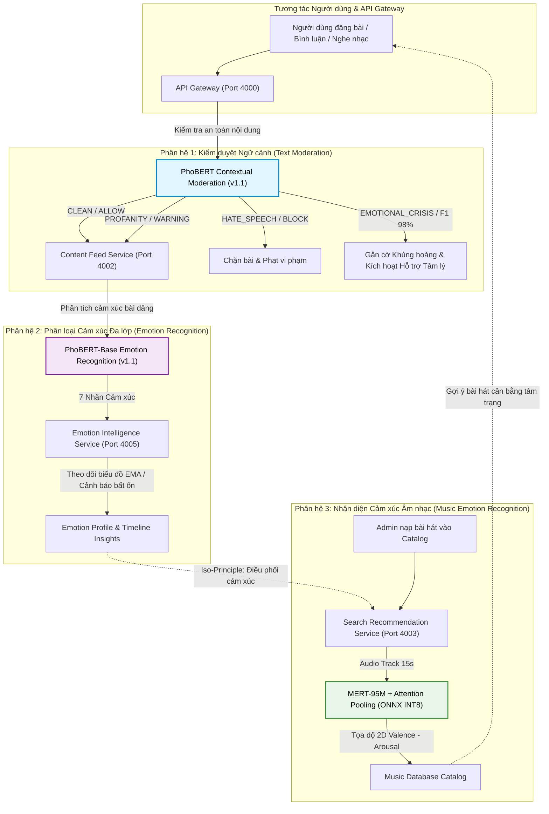

# TỔNG QUAN HỆ THỐNG MÔ HÌNH HỌC SÂU & ĐÁNH GIÁ THỰC NGHIỆM AI (`docs/evaluation/`)

Chào mừng bạn đến với bộ tài liệu kỹ thuật chuyên sâu về các mô hình Trí tuệ Nhân tạo (AI/Deep Learning) trong hệ thống mạng xã hội tích hợp chăm sóc sức khỏe tinh thần **SE121-microservices**.

Tài liệu này được biên soạn với mục tiêu giúp toàn bộ thành viên trong nhóm nghiên cứu, phát triển và Hội đồng/Giáo viên Hướng dẫn (GVHD) có cái nhìn toàn diện, minh bạch từ cơ sở lý thuyết, các hạn chế chí mạng ban đầu, kỹ thuật tinh chỉnh dữ liệu (Data-centric AI), các siêu tham số huấn luyện (Fine-tuning Hyperparameters) cho đến kết quả thực nghiệm chi tiết và ý nghĩa toán học của từng độ đo đánh giá.

---

## 🏗️ 1. Bản Đồ 3 Phân Hệ Mô Hình AI Cốt Lõi

Hệ thống AI bao gồm 3 trụ cột mô hình phục vụ các nghiệp vụ đặc thù:

---

## 📊 2. Ma Trận Tóm Tắt Hiệu Năng & Kết Quả Đánh Giá

Bảng dưới đây tổng hợp tiến trình nâng cấp và kết quả thực nghiệm trên tập Test độc lập của 3 mô hình:

| Phân hệ AI | Mô hình Nền tảng | Dữ liệu Huấn luyện | Hạn chế Chí mạng Ban đầu | Giải pháp Kỹ thuật Đột phá | Kết quả Kiểm thử (Test Set) | Tài liệu Chi tiết |
| :--- | :--- | :--- | :--- | :--- | :--- | :---: |
| **Phân hệ 1: Text Emotion** | `vinai/phobert-base-v2` (135M RoBERTa) | UIT-VSMEC (6,927) + GoEmotions Pure Augmented (4,292) = **11,192 mẫu** | Mất cân bằng nhãn nặng (Anger 6.9%, Fear 5.7%). F1 Anger tụt xuống <0.50 do lẫn `annoyance`. | Lọc 100% Pure Anger, dịch bằng Google Chrome Gemini Backend, Stratified 70/15/15. | **Accuracy: 64.03%** **Macro F1: 63.72%** (Sadness F1: 64.85%, Surprise: 71.14%) | [Xem `01_emotion_recognition.md`](/docs/evaluation/01_emotion_recognition.md) |
| **Phân hệ 2: Text Moderation** | `vinai/phobert-base-v2` (135M RoBERTa) | ViHSD (cắt giảm CLEAN) + Self-Harm (`ourafla/Mental-Health_Text-Classification_Dataset`) = **16,275 mẫu** | ViHSD gốc không có nhãn tự hại/khủng hoảng; nhãn CLEAN chiếm >80% gây thiên kiến. | Bổ sung 2,500 mẫu Self-Harm dịch bằng Playwright Stealth; Undersampling CLEAN; Loss cân bằng. | **Accuracy: 81.36%** **Macro F1: 78.16%** **(Crisis F1: 98.00%, Recall: 97.87%)** | [Xem `02_text_moderation.md`](/docs/evaluation/02_text_moderation.md) |
| **Phân hệ 3: Music Emotion** | `m-a-p/MERT-v1-95M` + Temporal Attention Pooling | Dataset Fusion: DEAM (1,802) + PMEmo (767) = **2,569 tracks** | Baseline `librosa` + Random Forest sai số lớn ($R^2 < 0.50$), `np.mean` triệt tiêu cao trào/thời gian. | Music Foundation Transformer MERT-95M + Attention Pooling + Combined CCC-MSE Loss + ONNX INT8. | **Valence CCC: 0.7358** **Arousal CCC: 0.8204** (Inference CPU: ~2.3s, Model 91MB) | [Xem `03_music_emotion_recognition.md`](/docs/evaluation/03_music_emotion_recognition.md) |

---

## 📑 3. Danh Mục Tài Liệu Thành Phần

Mỗi tài liệu trong thư mục này được xây dựng độc lập và chi tiết theo đúng cấu trúc chuẩn mực khoa học gồm 5 phần:
1. **Mục tiêu ban đầu & Phân tích Baseline**: Mô hình ban đầu, số liệu đo đạc, hạn chế chí mạng và lý do bắt buộc phải fine-tune.
2. **Kỹ thuật Xử lý Dữ liệu (Data Engineering)**: Vì sao phải thêm data, thêm như thế nào, cơ sở khoa học chứng minh cách thêm đúng.
3. **Quy trình Huấn luyện & Bảng Siêu tham số**: Cơ sở chọn lựa kiến trúc, bảng siêu tham số kèm lý do chi tiết từng thông số.
4. **Kết quả Thực nghiệm Đạt được**: Bảng số liệu chi tiết trên tập Test độc lập, so sánh Before vs After.
5. **Giải thích Chuyên sâu các Tiêu chí Đánh giá**: Bản chất toán học, ý nghĩa thực tế của từng metric (Macro F1, Precision, Recall, MAE, $R^2$, CCC) và lý do bắt buộc phải dùng chúng thay vì các độ đo thông thường.

Vui lòng tham khảo từng tài liệu tương ứng:
- [Tài liệu 01: Phân loại Cảm xúc Tiếng Việt (`01_emotion_recognition.md`)](/docs/evaluation/01_emotion_recognition.md)
- [Tài liệu 02: Kiểm duyệt Nội dung Ngữ cảnh & Phát hiện Khủng hoảng (`02_text_moderation.md`)](/docs/evaluation/02_text_moderation.md)
- [Tài liệu 03: Nhận diện Cảm xúc Âm nhạc 2D Valence - Arousal (`03_music_emotion_recognition.md`)](/docs/evaluation/03_music_emotion_recognition.md)
