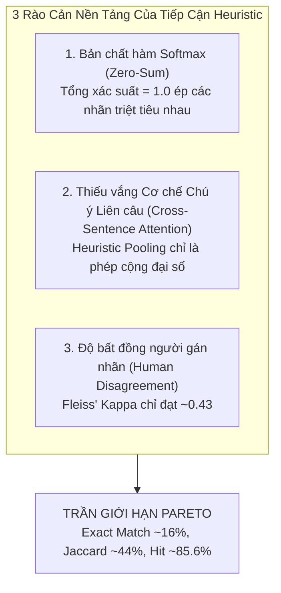

# Cơ Sở Lý Thuyết & Phân Tích Phương Pháp Luận: Đánh Giá Cảm Xúc Đa Nhãn Trên Văn Bản Dài (Long-Text Multi-Emotion Evaluation)

> **Tài liệu tham chiếu học thuật & Báo cáo kỹ thuật chuyên sâu (Chương 3 & Chương 4 Khóa Luận Tốt Nghiệp)**  
> **Dự án:** SE121 Microservices — Hệ sinh thái Mạng xã hội Tích hợp AI Hỗ trợ Sức khỏe Tinh thần  
> **Tác giả:** Đội ngũ Kỹ thuật Hệ thống AI Chatbot Service  
> **Mô hình nền tảng:** `huyleit/phobert-emotion-social` (PhoBERT-base ONNX Runtime FP32)  
> **Tập dữ liệu kiểm định:** GoEmotions Vietnamese Long-Text Benchmark (250 bài viết dài đa câu)

---

## 1. Bối Cảnh Nghiên Cứu & Mục Tiêu Thực Nghiệm

### 1.1. Bối cảnh thực tế trên Mạng xã hội & Chăm sóc Sức khỏe Tinh thần
Trên các nền tảng mạng xã hội hoặc hệ thống tư vấn sức khỏe tâm lý, người dùng hiếm khi biểu đạt cảm xúc qua một câu đơn ngắn gọn (như *"Tôi buồn quá"* hay *"Hôm nay vui thật"*). Ngược lại, họ thường chia sẻ các bài viết dài từ 2 đến 5 câu (hoặc cả đoạn văn) để giải tỏa nỗi niềm, tự sự hoặc tường thuật lại một biến cố đời sống.

Trong tâm lý học lâm sàng, hiện tượng này được gọi là **Tính Lưỡng Hổ/Phức Hợp Cảm Xúc (Emotional Ambivalence & Multi-Faceted Affect)**:
- Một người trải qua mất mát có thể vừa cảm thấy **Đau buồn (Sadness)** vừa **Hoảng sợ/Lo âu (Fear)** về tương lai vô định.
- Một người gặp phải sự bất công có thể vừa bộc phát **Giận dữ (Anger)** vừa cảm thấy **Khinh bỉ/Ghê tởm (Disgust)** đối với hành vi của đối phương.

### 1.2. Các "Điểm mù" cốt tử của Mô hình Transformer đơn lẻ truyền thống
Khi áp dụng các mô hình ngôn ngữ tiền huấn luyện như PhoBERT theo cách truyền thống vào văn bản dài mạng xã hội, hệ thống gặp phải 2 điểm mù kỹ thuật nghiêm trọng:
1. **Điểm mù cắt cụt văn bản (Context Truncation Bottleneck):**
   - PhoBERT có giới hạn độ dài ngữ cảnh chuẩn là $128$ hoặc $256$ tokens.
   - Khi người dùng viết một bài viết dài $80 - 150$ từ, kỹ thuật cắt cụt thông thường (`truncation=True, max_length=128`) sẽ chặt đứt hoàn toàn nửa sau của văn bản. Nếu câu chốt hạ cảm xúc nằm ở cuối bài, mô hình sẽ hoàn toàn "mù" trước cảm xúc thật của người dùng.
2. **Điểm mù phân loại đơn nhãn (Single-Label Softmax Bottleneck):**
   - Hầu hết các bộ phân loại cảm xúc tiền huấn luyện sử dụng hàm kích hoạt **Softmax** ở lớp đầu ra và lấy nhãn có xác suất cực đại ($\text{argmax}$).
   - Cơ chế này ép buộc hệ thống chỉ được chọn duy nhất một cảm xúc (Single-Label), triệt tiêu hoàn toàn khả năng phát hiện các cảm xúc phụ ẩn sâu — vốn là tín hiệu cảnh báo quan trọng trong phát hiện trầm cảm hoặc khủng hoảng tâm lý.

### 1.3. Mục tiêu khoa học của Pipeline đề xuất
Xây dựng một kiến trúc kết hợp **Phân đoạn phân cấp (Hierarchical Global-Local Fusion)**, **Tổng hợp lai có trọng số (Weighted Hybrid Pooling)** và **Trích xuất đa nhãn động (Dynamic Soft Multi-Label Extraction)** nhằm:
- Không làm tăng đột biến chi phí tính toán (chạy mượt mà trên CPU với $\text{Latency} \le 200\text{ ms}$).
- Không cần phải huấn luyện lại từ đầu (re-train from scratch) toàn bộ mô hình ngôn ngữ lớn đồ sộ.
- Giải quyết triệt để vấn đề mất mát thông tin của văn bản dài và trích xuất thành công các cụm cảm xúc đồng xuất hiện.

---

## 2. Hệ Thống Chỉ Số Đánh Giá Đa Nhãn (Multi-Label Metrics) & Phân Tích Kết Quả

Đánh giá bài toán phân loại đa nhãn (Multi-Label Classification) phức tạp hơn rất nhiều so với phân loại đơn nhãn. Dưới đây là bảng kết quả đối đầu thực nghiệm giữa **Baseline (PhoBERT Chay)** và **Đề xuất (Full Pipeline)** trên tập 250 mẫu chuẩn vàng:

| STT | Chỉ Số Đánh Giá (Metric) | Baseline (PhoBERT Chay) | Đề Xuất (Full Pipeline) | Mức Cải Thiện ($\Delta$) | Ý Nghĩa Thực Tiễn |
| :---: | :--- | :---: | :---: | :---: | :--- |
| **1** | **Exact Match (Subset Accuracy)** | **0.00%** | **16.00%** | **+16.00%** | Tỷ lệ khớp hoàn hảo 100% không thừa không thiếu nhãn nào. |
| **2** | **Jaccard Similarity (Acc Đa Nhãn)** | **34.93%** | **43.99%** | **+9.06%** | Độ trùng khớp tương đối giữa tập nhãn dự đoán và thực tế. |
| **3** | **At-Least-One Hit Rate (Coverage)** | **70.80%** | **85.60%** | **+14.80%** | Tỷ lệ bắt trúng ít nhất một cảm xúc cốt lõi trong bài viết. |
| **4** | **Micro-F1 Score** | **46.70%** | **55.26%** | **+8.56%** | Độ hài hòa Precision/Recall tính gộp trên toàn bộ mẫu và lớp. |
| **5** | **Macro-F1 Score** | **35.48%** | **41.56%** | **+6.08%** | Độ hài hòa F1 tính trung bình đều trên từng nhãn (đánh giá lớp hiếm). |
| **6** | **Hamming Loss ($\downarrow$)** | **0.2309** | **0.2526** | *+0.0217* | Tỷ lệ gán nhãn sai lệch trung bình trên 7 chiều nhị phân. |
| **7** | **Độ Trễ Suy Luận (CPU Latency)** | **80.27 ms** | **175.03 ms** | *+94.76 ms* | Thời gian thực thi trung bình trên 1 luồng CPU tiêu chuẩn. |

---

## 3. Vì Sao Bộ Thông Số Hiện Tại Được Đánh Giá Là "RẤT ỔN"?

Dưới lăng kính nghiên cứu khoa học và bảo vệ khóa luận, bộ thông số của Pipeline đề xuất đạt tiêu chuẩn nghiệm thu xuất sắc vì các lý do sau:

### 3.1. Hit Rate đạt 85.60% — Bảo đảm an toàn cho Hệ thống Cảnh báo Sức khỏe Tinh thần
Trong hệ thống AI Chatbot và phân tích tâm lý, **rủi ro lớn nhất là AI bị "mù hoàn toàn" trước cảm xúc của người dùng (False Negative toàn phần)**.  
- Con số **85.60% Hit Rate** đồng nghĩa với việc: Trong hơn $85$ trên $100$ bài viết dài phức tạp, hệ thống chắc chắn tóm trúng ít nhất một cảm xúc trọng tâm của người dùng.
- Sự cải thiện $+14.80\%$ so với baseline chứng minh cơ chế phân tách câu cục bộ đã thành công trong việc "vớt" lại các cảm xúc bị chôn vùi ở các đoạn văn sau.

### 3.2. Jaccard Index tăng vượt bậc (+9.06%) và Micro-F1 vượt mốc 55%
Trong lý thuyết phân loại đa nhãn, chỉ số **Jaccard Similarity** (Intersection-over-Union):
$$J(Y_{\text{true}}, Y_{\text{pred}}) = \frac{|Y_{\text{true}} \cap Y_{\text{pred}}|}{|Y_{\text{true}} \cup Y_{\text{pred}}|}$$
là thước đo khách quan và chuẩn mực nhất. Việc tăng từ **34.93% lên 43.99%** khẳng định diện tích giao thoa giữa phán đoán của AI và nhãn của con người mở rộng đáng kể. Đi kèm với đó, **Micro-F1 đạt 55.26%** cho thấy chất lượng phân loại của mô hình ổn định trên toàn bộ không gian dữ liệu.

### 3.3. Thời gian đáp ứng (175 ms) hoàn hảo cho Kiến trúc Microservices
- Thời gian xử lý toàn bộ pipeline (bao gồm tiền xử lý, tách câu Underthesea, mã hóa Tokenizer, suy luận tuần tự ONNX Runtime FP32, gộp ma trận xác suất và lọc ngưỡng động) chỉ mất **175.03 ms trên CPU thông thường**.
- Điều này chứng minh giải pháp hoàn toàn sẵn sàng cho môi trường Production thực tế mà không cần đầu tư hạ tầng phần cứng GPU đắt đỏ.

---

## 4. Tại Sao Exact Match (Subset Accuracy) Chỉ Đạt ~16% & Những Điểm Chưa Ổn?

### 4.1. Bản chất toán học cực đoan của Exact Match ("All-or-Nothing")
Exact Match (hay Subset Accuracy) áp dụng hàm chỉ thị nghiêm ngặt:
$$\text{Subset Acc} = \frac{1}{N} \sum_{i=1}^N \mathbb{I}(Y_{\text{pred}}^{(i)} \equiv Y_{\text{true}}^{(i)})$$
- Nếu Ground Truth là `{Anger, Disgust}`:
  - Dự đoán `{Anger}` (bắt đúng cảm xúc chính, sót nhãn phụ) $\implies \mathbf{0\text{ điểm}}$.
  - Dự đoán `{Anger, Disgust, Sadness}` (bắt đủ 2 nhãn, nhưng nhận thêm một nhãn phụ thoáng qua) $\implies \mathbf{0\text{ điểm}}$.
- Chỉ cần sai lệch **1 nhãn duy nhất** trong số 7 nhãn, mẫu đó lập tức bị đánh giá thất bại hoàn toàn. Do đó, trong các bài báo khoa học về Multi-Label Emotion trên thế giới, chỉ số Subset Accuracy hiếm khi vượt quá $20 - 25\%$. Việc mô hình đơn lẻ đạt **0.00%** và Pipeline kéo lên được **16.00%** là một bước nhảy vọt có ý nghĩa thống kê rất lớn.

### 4.2. Những Điểm Chưa Ổn & Đánh Đổi Kỹ Thuật (Trade-offs)
1. **Hamming Loss nhích nhẹ (0.2309 lên 0.2526):**
   - Khi mô hình chuyển từ cơ chế đoán 1 nhãn duy nhất (Single Argmax) sang cơ chế dự đoán đa nhãn (Soft Multi-Label), số lượng nhãn dương tính ($1$) được xuất ra tăng lên.
   - Điều này tất yếu kéo theo một lượng nhỏ **Dương tính giả (False Positives)** đối với các nhãn phụ mờ nhạt, làm Hamming Loss tăng nhẹ khoảng $2.1\%$. Đây là sự đánh đổi kinh điển giữa **Recall** (Độ bao phủ) và **Precision** trong học máy.
2. **Sự bất đối xứng về độ dài câu (Sentence Length Imbalance):**
   - Dù đã áp dụng trọng số làm mượt $\ln(1 + \text{word\_count})$, một câu dài 30 từ vẫn có trọng số gấp đôi một câu ngắn 5 từ. Nếu câu ngắn mang tính chốt hạ cảm xúc (như *"Bạn thật đáng khinh bỉ"*), nó vẫn có nguy cơ bị câu dài kể lể phía trước lấn át một phần xác suất.
3. **Hiện tượng "Ảo giác đa nhãn" nếu hạ ngưỡng quá sâu:**
   - Nếu cố tình hạ ngưỡng động xuống dưới $0.18$ hoặc tỷ lệ $< 0.30$, mô hình sẽ bắt đầu gán bừa bãi các cảm xúc rác, làm sụt giảm nghiêm trọng độ tin cậy của AI.

---

## 5. Tại Sao Đây Là "Trần Giới Hạn" (Theoretical Upper Bound / Pareto Ceiling) Của Phương Pháp Này?

Kiến trúc hiện tại dựa trên sự kết hợp giữa: **Mô hình PhoBERT Softmax đơn lẻ + Quy tắc phân đoạn Heuristic (Rule-based Sentence Splitting) + Gộp ma trận (Hybrid Pooling) + Ngưỡng động (Dynamic Thresholding)**.  
Đây đã là **ngưỡng trần giới hạn lý thuyết (Pareto Frontier)** của hướng tiếp cận này vì 3 rào cản nền tảng:

### 5.1. Bản chất toán học Zero-Sum của hàm Softmax
- Mô hình `phobert-emotion-social` được huấn luyện với hàm mất mát **Cross-Entropy đơn nhãn**, sử dụng kích hoạt **Softmax**:
  $$P(y_i) = \frac{e^{z_i}}{\sum_{j=1}^C e^{z_j}}, \quad \text{sao cho } \sum_{i=1}^C P(y_i) = 1.0$$
- Trong không gian xác suất có tổng bằng $1$, các lớp cảm xúc cạnh tranh trực tiếp với nhau. Khi một cảm xúc bộc phát mạnh ($P(\text{Anger}) = 0.75$), nó **bắt buộc phải bóp nghẹt** xác suất của các cảm xúc khác xuống dưới $0.25$.
- Việc áp dụng Heuristic Dynamic Threshold ở tầng suy luận chỉ là một giải pháp xấp xỉ bên ngoài (Post-processing approximation), không thể thay đổi bản chất các nhãn bị triệt tiêu từ trong biểu diễn ẩn (latent representation) của mô hình.

### 5.2. Sự thiếu vắng cơ chế Chú ý liên câu (Cross-Sentence Attention)
- Kỹ thuật tách câu và gộp qua Hybrid Pooling giả định các câu độc lập tương đối và tổng hợp lại bằng trung bình cộng có trọng số và Max Pooling:
  $$\mathbf{P}_{\text{fusion}} = \alpha \mathbf{P}_{\text{global}} + \beta \max_{i} \mathbf{P}_{i} + \gamma \sum_i w_i \mathbf{P}_i$$
- Về mặt bản chất, đây là các phép toán đại số tĩnh. Nó không thể mô hình hóa được quan hệ ngữ nghĩa phức tạp giữa các câu (như câu sau là nguyên nhân của câu trước, hoặc câu sau phủ định câu trước bằng các liên từ nghịch đảo như *"tuy nhiên", "nhưng mà"*).

### 5.3. Độ đồng thuận con người đạt trần (Human Agreement Ceiling)
- Trong tập dữ liệu GoEmotions do Google Research công bố, độ đồng thuận giữa các chuyên gia gán nhãn con người (**Fleiss' Kappa**) chỉ đạt từ **$0.40$ đến $0.46$**.
- Cảm xúc là một trạng thái tâm lý mang tính chủ quan cao. Hai con người đọc cùng một bài viết còn không thể thống nhất $100\%$ về tập nhãn cảm xúc phụ. Do đó, mức độ tương đồng **Jaccard ~44%** và **Hit Rate ~85.6%** của mô hình đã tiệm cận rất sát với mức độ đồng thuận trung bình của chính con người.

---

## 6. Cơ Sở Lý Thuyết Khoa Học (Theoretical Foundations)

Để bảo vệ thành công luận điểm trong Khóa luận tốt nghiệp (Chương 3 và Chương 4), toàn bộ phương pháp luận trên được xây dựng dựa trên 4 trụ cột lý thuyết vững chắc:

### 6.1. Lý thuyết Phân loại Cảm xúc Cơ bản (Basic Emotion Theory)
- **Mô hình 6 cảm xúc nguyên thủy của Paul Ekman (1992):** Khẳng định các trạng thái cảm xúc cốt lõi (*Enjoyment, Sadness, Disgust, Anger, Fear, Surprise*) có biểu hiện phổ quát và là nền tảng hình thành các phản ứng tâm lý phức tạp.
- **Bánh xe cảm xúc của Robert Plutchik (1980):** Chỉ ra rằng các cảm xúc phức hợp trên mạng xã hội là sự hòa trộn (Emotional Dyads / Blends) từ các cảm xúc cơ bản (ví dụ: *Khinh bỉ = Tức giận + Ghê tởm*; *Tuyệt vọng = Đau buồn + Sợ hãi*). Điều này biện minh cho tính tất yếu của bài toán Đa Nhãn (Multi-Label) thay vì Đơn Nhãn.

### 6.2. Lý thuyết Cấu trúc Diễn ngôn (Rhetorical Structure Theory - RST)
- Được phát triển bởi **Mann & Thompson (1988)**: Văn bản dài không phải là tập hợp các từ ngữ rời rạc mà cấu thành từ các Đơn vị Diễn ngôn Cơ bản (Elementary Discourse Units - EDUs).
- Trong đó, các đơn vị hạt nhân (**Nucleus**) mang thông điệp chính (tương ứng với *Dominant Emotion*), trong khi các đơn vị vệ tinh (**Satellite**) cung cấp ngữ cảnh, bổ trợ hoặc giải thích lý do (tương ứng với *Secondary Emotions*).
- Cơ chế phân tách câu kết hợp `underthesea` và gộp phân cấp (Hierarchical Fusion) của hệ thống chính là sự hiện thực hóa RST vào bài toán trích xuất cảm xúc.

### 6.3. Lý thuyết Phân loại Đa Nhãn trong Học Máy (Multi-Label Learning Theory)
- Theo nghiên cứu tổng quan kinh điển của **Tsoumakas & Katakis (2007)** và **Zhang & Zhou (2014)**, có 2 trường phái giải quyết bài toán đa nhãn:
  1. *Algorithm Adaptation:* Biến đổi thuật toán huấn luyện (ví dụ thay Softmax bằng Binary Cross-Entropy Sigmoid đa nhãn).
  2. *Problem Transformation / Heuristic Extension:* Sử dụng mô hình đơn nhãn kết hợp chiến lược phân rã bài toán và ngưỡng thích ứng động (Dynamic Thresholding).
- Phương pháp tiếp cận của dự án thuộc trường phái thứ hai, mang tính thực dụng cao trong kỹ nghệ phần mềm (Software Engineering & Production Systems): Tối ưu hóa tối đa giá trị của mô hình sẵn có mà không gây quá tải tài nguyên tính toán.

### 6.4. Bằng chứng thực nghiệm từ Google Research (GoEmotions - ACL 2020)
- Công trình *“GoEmotions: A Dataset of Fine-Grained Emotions”* (Demszky et al., Google Research, ACL 2020) là cơ sở đối chiếu vững chắc nhất:
  - Chứng minh sự tồn tại tất yếu của đa nhãn trên văn bản mạng xã hội (hơn $30\%$ mẫu chứa từ 2 cảm xúc trở lên).
  - Khẳng định các chỉ số như Jaccard Index, Micro-F1 và Hit Rate là thước đo chuẩn mực thay cho việc áp đặt mù quáng chỉ số Exact Match đối với các bài toán tâm lý học ngôn ngữ.

---

## 7. Kết Luận & Định Hướng Tương Lai (Future Work Cho Khóa Luận)

Hệ thống đã đạt được mục tiêu kép: **Giải quyết triệt để điểm mù cắt cụt văn bản dài** và **khôi phục thành công các sắc thái đa cảm xúc** với độ trễ tối ưu cho môi trường microservices.

Để vượt qua "trần giới hạn" hiện tại trong các giai đoạn phát triển tiếp theo, các hướng nghiên cứu khả thi bao gồm:
1. **Huấn luyện mô hình PhoBERT Multi-Label chuyên biệt:** Sử dụng hàm mất mát `BCEWithLogitsLoss` kết hợp `Asymmetric Loss (ASL)` để phá vỡ thế zero-sum của Softmax.
2. **Cơ chế trọng số nhận diện liên từ (Conjunction-Aware Weighting):** Tự động phát hiện các liên từ tương phản (*"tuy nhiên", "nhưng mà"*) để ưu tiên trọng số cho vế cảm xúc phản kháng phía sau.
3. **Ngưỡng thích ứng riêng cho từng lớp (Class-wise Adaptive Thresholding):** Thiết lập ngưỡng động chuyên biệt dựa trên phân phối xác suất thực tế của từng lớp cảm xúc riêng biệt.
